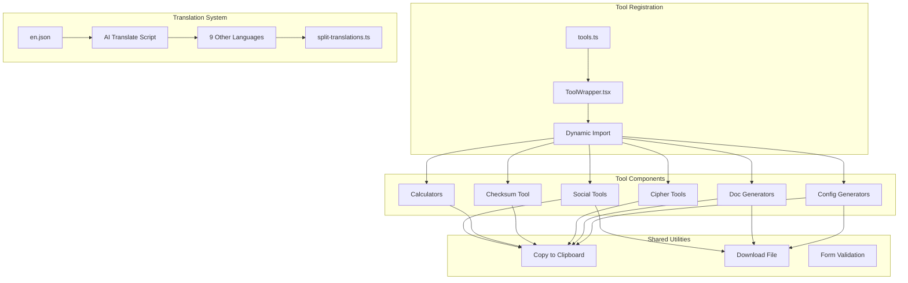

# Design Document: Add Popular Tools Batch 51

## Overview

本设计文档描述了为 U2Tool 项目添加第 51 批热门低竞争工具的技术实现方案。共计 18 个新工具，涵盖开发配置生成器、GitHub 文档生成器、编码加密工具、校验和验证工具、财务计算器和社交媒体工具。

所有工具均采用纯前端实现，无需后端 API，使用 React + TypeScript + Tailwind CSS 技术栈。

## Architecture



## Components and Interfaces

### 1. 开发配置生成器组件

#### DockerfileGenerator
```typescript
interface DockerfileConfig {
  baseImage: string;
  workdir: string;
  copyCommands: string[];
  runCommands: string[];
  exposePort?: number;
  envVars: Record<string, string>;
  entrypoint?: string;
  cmd?: string;
}

function generateDockerfile(config: DockerfileConfig): string
```

#### EslintConfigGenerator
```typescript
interface EslintConfig {
  framework: 'react' | 'vue' | 'angular' | 'node' | 'none';
  styleGuide: 'airbnb' | 'standard' | 'google' | 'none';
  typescript: boolean;
  rules: Record<string, 'off' | 'warn' | 'error'>;
  env: {
    browser: boolean;
    node: boolean;
    es2021: boolean;
  };
}

function generateEslintConfig(config: EslintConfig): string
```

#### PrettierConfigGenerator
```typescript
interface PrettierConfig {
  printWidth: number;
  tabWidth: number;
  useTabs: boolean;
  semi: boolean;
  singleQuote: boolean;
  trailingComma: 'none' | 'es5' | 'all';
  bracketSpacing: boolean;
  arrowParens: 'avoid' | 'always';
  endOfLine: 'lf' | 'crlf' | 'cr' | 'auto';
}

function generatePrettierConfig(config: PrettierConfig): string
```

#### TsconfigGenerator
```typescript
interface TsconfigOptions {
  target: 'ES5' | 'ES6' | 'ES2017' | 'ES2020' | 'ES2022' | 'ESNext';
  module: 'CommonJS' | 'ESNext' | 'NodeNext';
  strict: boolean;
  jsx?: 'react' | 'react-jsx' | 'preserve';
  declaration: boolean;
  outDir: string;
  rootDir: string;
  esModuleInterop: boolean;
  skipLibCheck: boolean;
  forceConsistentCasingInFileNames: boolean;
}

function generateTsconfig(options: TsconfigOptions): string
```

#### EditorconfigGenerator
```typescript
interface EditorconfigOptions {
  root: boolean;
  indentStyle: 'space' | 'tab';
  indentSize: number;
  endOfLine: 'lf' | 'crlf' | 'cr';
  charset: 'utf-8' | 'utf-8-bom' | 'latin1';
  trimTrailingWhitespace: boolean;
  insertFinalNewline: boolean;
  maxLineLength?: number;
}

function generateEditorconfig(options: EditorconfigOptions): string
```

### 2. GitHub 文档生成器组件

#### GithubReadmeGenerator
```typescript
interface ReadmeConfig {
  projectName: string;
  description: string;
  badges: Badge[];
  features: string[];
  installation: string;
  usage: string;
  contributing?: string;
  license: string;
  author: string;
}

interface Badge {
  type: 'npm' | 'license' | 'build' | 'coverage' | 'custom';
  url?: string;
  label?: string;
}

function generateReadme(config: ReadmeConfig): string
```

#### ChangelogGenerator
```typescript
interface ChangelogEntry {
  version: string;
  date: string;
  added: string[];
  changed: string[];
  fixed: string[];
  removed: string[];
  deprecated: string[];
  security: string[];
}

function generateChangelog(entries: ChangelogEntry[]): string
```

#### LicenseGenerator
```typescript
type LicenseType = 'MIT' | 'Apache-2.0' | 'GPL-3.0' | 'BSD-3-Clause' | 'ISC' | 'MPL-2.0' | 'Unlicense';

interface LicenseConfig {
  type: LicenseType;
  year: number;
  author: string;
  projectName?: string;
}

function generateLicense(config: LicenseConfig): string
```

### 3. 编码加密工具组件

#### Rot13Encoder
```typescript
function rot13(text: string): string
// ROT13 is self-inverse: rot13(rot13(x)) === x
```

#### CaesarCipher
```typescript
interface CaesarConfig {
  text: string;
  shift: number; // 1-25
  mode: 'encrypt' | 'decrypt';
}

function caesarCipher(config: CaesarConfig): string
// decrypt is encrypt with shift = 26 - originalShift
```

#### VigenereCipher
```typescript
interface VigenereConfig {
  text: string;
  keyword: string;
  mode: 'encrypt' | 'decrypt';
}

function vigenereCipher(config: VigenereConfig): string
```

### 4. 校验和验证工具

#### ChecksumVerifier
```typescript
interface ChecksumResult {
  md5: string;
  sha1: string;
  sha256: string;
  sha512: string;
}

async function calculateChecksums(file: File): Promise<ChecksumResult>

function verifyChecksum(expected: string, calculated: ChecksumResult): {
  algorithm: string | null;
  match: boolean;
}
```

### 5. 财务计算器组件

#### InflationCalculator
```typescript
interface InflationInput {
  amount: number;
  startYear: number;
  endYear: number;
  annualRate: number; // percentage
}

interface InflationResult {
  adjustedValue: number;
  totalInflation: number;
  purchasingPowerLoss: number;
}

function calculateInflation(input: InflationInput): InflationResult
// Formula: adjustedValue = amount * (1 + rate/100)^years
```

#### BreakEvenCalculator
```typescript
interface BreakEvenInput {
  fixedCosts: number;
  variableCostPerUnit: number;
  sellingPricePerUnit: number;
}

interface BreakEvenResult {
  breakEvenUnits: number;
  breakEvenRevenue: number;
  contributionMargin: number;
}

function calculateBreakEven(input: BreakEvenInput): BreakEvenResult
// Formula: breakEvenUnits = fixedCosts / (sellingPrice - variableCost)
```

#### MarginCalculator
```typescript
interface MarginInput {
  cost: number;
  sellingPrice: number;
}

interface MarginResult {
  profit: number;
  profitMargin: number; // percentage
  markup: number; // percentage
}

function calculateMargin(input: MarginInput): MarginResult
// profitMargin = (sellingPrice - cost) / sellingPrice * 100
// markup = (sellingPrice - cost) / cost * 100
```

#### MarkupCalculator
```typescript
interface MarkupInput {
  cost: number;
  markupPercentage: number;
}

interface MarkupResult {
  sellingPrice: number;
  profit: number;
  profitMargin: number;
}

function calculateMarkup(input: MarkupInput): MarkupResult
// sellingPrice = cost * (1 + markup/100)
```

### 6. 社交媒体工具组件

#### HashtagGenerator
```typescript
interface HashtagConfig {
  topic: string;
  platform: 'instagram' | 'twitter' | 'tiktok' | 'linkedin' | 'all';
  count: number;
}

interface HashtagResult {
  hashtags: string[];
  popular: string[];
  niche: string[];
}

function generateHashtags(config: HashtagConfig): HashtagResult
```

#### EmailSignatureGenerator
```typescript
interface SignatureConfig {
  name: string;
  title: string;
  company: string;
  email: string;
  phone?: string;
  website?: string;
  socialLinks: {
    linkedin?: string;
    twitter?: string;
    github?: string;
  };
  style: 'professional' | 'modern' | 'minimal';
}

interface SignatureResult {
  html: string;
  plainText: string;
}

function generateEmailSignature(config: SignatureConfig): SignatureResult
```

## Data Models

### Tool Configuration Model
```typescript
interface Tool {
  slug: string;
  category: ToolCategory;
  icon: string;
  component: string;
  popular?: boolean;
}

// New tools to add
const batch51Tools: Tool[] = [
  // Config Generators
  { slug: 'dockerfile-generator', category: 'development', icon: '🐳', component: 'DockerfileGenerator' },
  { slug: 'eslint-config-generator', category: 'development', icon: '📏', component: 'EslintConfigGenerator' },
  { slug: 'prettier-config-generator', category: 'development', icon: '✨', component: 'PrettierConfigGenerator' },
  { slug: 'tsconfig-generator', category: 'development', icon: '🔷', component: 'TsconfigGenerator' },
  { slug: 'editorconfig-generator', category: 'development', icon: '📝', component: 'EditorconfigGenerator' },
  
  // Doc Generators
  { slug: 'github-readme-generator', category: 'generators', icon: '📖', component: 'GithubReadmeGenerator' },
  { slug: 'changelog-generator', category: 'generators', icon: '📋', component: 'ChangelogGenerator' },
  { slug: 'license-generator', category: 'generators', icon: '📜', component: 'LicenseGenerator' },
  
  // Cipher Tools
  { slug: 'rot13-encoder', category: 'encoding', icon: '🔄', component: 'Rot13Encoder' },
  { slug: 'caesar-cipher', category: 'encoding', icon: '🏛️', component: 'CaesarCipher' },
  { slug: 'vigenere-cipher', category: 'encoding', icon: '🔐', component: 'VigenereCipher' },
  
  // Checksum Tool
  { slug: 'checksum-verifier', category: 'security', icon: '✅', component: 'ChecksumVerifier' },
  
  // Calculators
  { slug: 'inflation-calculator', category: 'finance', icon: '📈', component: 'InflationCalculator' },
  { slug: 'break-even-calculator', category: 'finance', icon: '⚖️', component: 'BreakEvenCalculator' },
  { slug: 'margin-calculator', category: 'finance', icon: '💹', component: 'MarginCalculator' },
  { slug: 'markup-calculator', category: 'finance', icon: '🏷️', component: 'MarkupCalculator' },
  
  // Social Tools
  { slug: 'hashtag-generator', category: 'generators', icon: '#️⃣', component: 'HashtagGenerator' },
  { slug: 'email-signature-generator', category: 'generators', icon: '✉️', component: 'EmailSignatureGenerator' },
];
```

### Translation Model
```typescript
interface ToolTranslation {
  name: string;
  description: string;
  seo_title: string;
  seo_description: string;
  detailed_description: string;
  usage_steps: string[];
  usage_examples: string[];
}
```

## Correctness Properties

*A property is a characteristic or behavior that should hold true across all valid executions of a system-essentially, a formal statement about what the system should do. Properties serve as the bridge between human-readable specifications and machine-verifiable correctness guarantees.*

### Property 1: Config Generator Output Validity
*For any* valid configuration input to a config generator (Dockerfile, ESLint, Prettier, TSConfig, EditorConfig), the generated output SHALL be syntactically valid for its respective format.
**Validates: Requirements 1.2, 1.4, 1.6, 1.8, 1.10**

### Property 2: Cipher Round-Trip Consistency
*For any* plaintext and key/shift value, encrypting then decrypting with the same parameters SHALL return the original plaintext.
**Validates: Requirements 3.2, 3.4, 3.6, 3.7**

### Property 3: ROT13 Self-Inverse
*For any* text string, applying ROT13 twice SHALL return the original text (ROT13 is its own inverse).
**Validates: Requirements 3.2**

### Property 4: Checksum Determinism
*For any* file content, calculating checksums multiple times SHALL always produce identical hash values.
**Validates: Requirements 4.2**

### Property 5: Calculator Mathematical Correctness
*For any* valid numeric inputs to financial calculators, the calculated results SHALL match the expected mathematical formulas:
- Inflation: `adjustedValue = amount * (1 + rate/100)^years`
- Break-even: `units = fixedCosts / (sellingPrice - variableCost)`
- Margin: `margin = (sellingPrice - cost) / sellingPrice * 100`
- Markup: `sellingPrice = cost * (1 + markup/100)`
**Validates: Requirements 5.2, 5.4, 5.6, 5.8**

### Property 6: Generator Output Contains Input
*For any* README, Changelog, or License generator input, the generated output SHALL contain all user-provided content (project name, entries, author info).
**Validates: Requirements 2.2, 2.4, 2.6**

### Property 7: Tool Registration Completeness
*For any* new tool added to the system, the tool SHALL be registered in tools.ts, have a dynamic import in ToolWrapper.tsx, and have translations in all 10 language files.
**Validates: Requirements 7.1, 7.2, 7.3, 7.4**

### Property 8: Hashtag Format Validity
*For any* generated hashtag, it SHALL start with '#' and contain only alphanumeric characters (no spaces or special characters except underscore).
**Validates: Requirements 6.2**

## Error Handling

### Input Validation Errors
- Empty required fields: Display inline error message
- Invalid numeric values: Show "Please enter a valid number" message
- File too large (>100MB for checksum): Show size limit warning
- Invalid file type: Show supported formats message

### Calculation Errors
- Division by zero (break-even with zero margin): Display "Cannot calculate - margin is zero"
- Negative values where not allowed: Display "Please enter positive values"
- Overflow in calculations: Cap at reasonable maximum and show warning

### Generation Errors
- Missing required fields: Highlight missing fields
- Invalid characters in output: Sanitize or escape appropriately

### Copy/Download Errors
- Clipboard API not available: Show fallback "Select all" option
- Download failed: Show retry button with error message

## Testing Strategy

### Unit Tests
Unit tests will cover specific examples and edge cases:

1. **Config Generators**
   - Test with minimal config
   - Test with all options filled
   - Test special characters in values

2. **Cipher Tools**
   - Test empty string
   - Test non-alphabetic characters (should pass through unchanged)
   - Test uppercase and lowercase preservation

3. **Calculators**
   - Test zero values
   - Test very large numbers
   - Test decimal precision

4. **Checksum**
   - Test known file hashes
   - Test empty file
   - Test large file handling

### Property-Based Tests
Property tests will use a property-based testing library (e.g., fast-check) with minimum 100 iterations per test:

1. **Cipher Round-Trip Test**
   - Tag: **Feature: add-popular-tools-batch51, Property 2: Cipher Round-Trip Consistency**
   - Generate random strings and keys
   - Verify encrypt(decrypt(text, key), key) === text

2. **ROT13 Self-Inverse Test**
   - Tag: **Feature: add-popular-tools-batch51, Property 3: ROT13 Self-Inverse**
   - Generate random strings
   - Verify rot13(rot13(text)) === text

3. **Calculator Formula Test**
   - Tag: **Feature: add-popular-tools-batch51, Property 5: Calculator Mathematical Correctness**
   - Generate random valid inputs
   - Verify output matches formula calculation

4. **Hashtag Format Test**
   - Tag: **Feature: add-popular-tools-batch51, Property 8: Hashtag Format Validity**
   - Generate random topics
   - Verify all hashtags match pattern /^#[a-zA-Z0-9_]+$/

### Integration Tests
- Test tool registration in tools.ts
- Test dynamic import in ToolWrapper.tsx
- Test translation completeness across all languages
