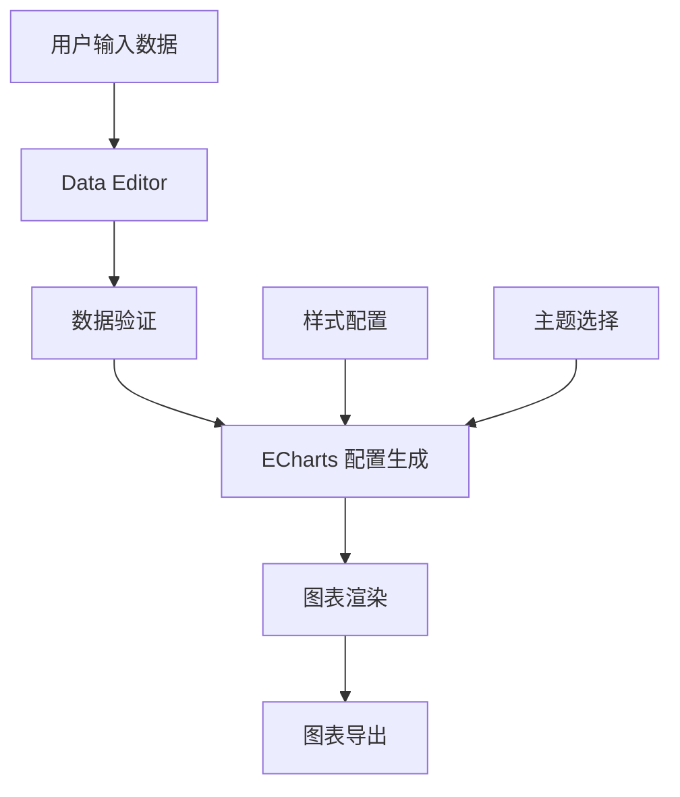

# Design Document: Chart Tools

## Overview

本设计文档描述了图表工具分类的技术实现方案。图表工具使用 Apache ECharts 作为底层渲染引擎，提供柱状图、折线图、饼图和雷达图的在线生成功能。所有图表工具共享统一的数据编辑器组件和导出功能，确保一致的用户体验。

## Architecture

### 技术栈
- **前端框架**: Next.js 14 (App Router)
- **图表库**: ECharts (echarts-for-react)
- **国际化**: next-intl
- **样式**: Tailwind CSS

### 组件架构

```
src/components/tools/
├── BarChartGenerator.tsx      # 柱状图生成器（已实现）
├── LineChartGenerator.tsx     # 折线图生成器
├── PieChartGenerator.tsx      # 饼图生成器
└── RadarChartGenerator.tsx    # 雷达图生成器
```

### 数据流



## Components and Interfaces

### 1. 数据类型定义

```typescript
// 通用数据行接口
interface DataRow {
  id: string;
  category: string;
  value: number;
}

// 多系列数据行（用于折线图、雷达图）
interface MultiSeriesDataRow {
  id: string;
  category: string;
  values: number[];
}

// 饼图数据行
interface PieDataRow {
  id: string;
  name: string;
  value: number;
  color?: string;
}

// 雷达图指标
interface RadarIndicator {
  name: string;
  max: number;
}

// 颜色主题
interface ColorTheme {
  name: string;
  colors: string[];
}

// 图表配置
interface ChartConfig {
  title: string;
  subtitle?: string;
  theme: string;
  showLegend: boolean;
  showGrid: boolean;
}
```

### 2. 组件接口

#### LineChartGenerator
- 支持多数据系列
- 线条样式：实线、虚线、点线
- 平滑曲线选项
- 区域填充选项

#### PieChartGenerator
- 支持普通饼图和环形图
- 百分比标签显示
- 自定义每个扇区颜色
- 玫瑰图变体

#### RadarChartGenerator
- 自定义指标名称和最大值
- 多数据系列对比
- 填充透明度调节
- 形状选项（多边形/圆形）

## Data Models

### 图表数据存储

所有图表数据使用 React useState 进行本地状态管理，不涉及后端存储。

```typescript
// 柱状图/折线图数据模型
const [data, setData] = useState<DataRow[]>([]);

// 饼图数据模型
const [pieData, setPieData] = useState<PieDataRow[]>([]);

// 雷达图数据模型
const [indicators, setIndicators] = useState<RadarIndicator[]>([]);
const [seriesData, setSeriesData] = useState<number[][]>([]);
```

### 颜色主题预设

```typescript
const colorThemes = {
  default: ['#5470c6', '#91cc75', '#fac858', '#ee6666', '#73c0de'],
  ocean: ['#0077b6', '#00b4d8', '#90e0ef', '#48cae4', '#023e8a'],
  sunset: ['#ff6b6b', '#feca57', '#ff9ff3', '#54a0ff', '#5f27cd'],
  forest: ['#2d6a4f', '#40916c', '#52b788', '#74c69d', '#95d5b2'],
};
```


## Correctness Properties

*A property is a characteristic or behavior that should hold true across all valid executions of a system-essentially, a formal statement about what the system should do. Properties serve as the bridge between human-readable specifications and machine-verifiable correctness guarantees.*

### Property 1: 数据变化正确反映到图表配置

*For any* 有效的数据行数组和图表配置，当数据或配置发生变化时，生成的 ECharts 配置对象应该正确反映这些变化。

**Validates: Requirements 2.2, 2.3, 2.4**

### Property 2: 数据行增删操作保持数据完整性

*For any* 数据行数组，添加一行后数组长度应增加 1，删除一行后（当长度 > 1 时）数组长度应减少 1，且其他行数据保持不变。

**Validates: Requirements 6.3, 6.4**

### Property 3: 数值输入验证

*For any* 输入字符串，当用于数值字段时，非数值输入应被转换为 0 或被拒绝，有效数值输入应被正确解析。

**Validates: Requirements 2.7, 6.5**

### Property 4: CSV 导入解析正确性

*For any* 有效的 CSV 格式字符串，解析后应生成正确的数据行数组，其中每行包含正确的类别名称和数值。

**Validates: Requirements 6.6**

### Property 5: 图表配置选项正确应用

*For any* 图表配置（标题、图例显示、网格线显示），生成的 ECharts 配置对象应该正确包含这些设置。

**Validates: Requirements 8.1, 8.3, 8.4**

### Property 6: 导出文件名格式正确

*For any* 图表类型和导出时间，生成的文件名应包含图表类型标识和时间戳。

**Validates: Requirements 7.4**

### Property 7: 多系列数据正确处理

*For any* 多系列数据数组，图表配置应为每个系列生成独立的数据系列配置。

**Validates: Requirements 3.2, 5.3**

### Property 8: 饼图百分比计算正确

*For any* 饼图数据数组，所有扇区的百分比之和应等于 100%（允许浮点误差）。

**Validates: Requirements 4.3**

## Error Handling

### 输入验证错误
- 空数据：显示提示信息，要求至少输入一行数据
- 无效数值：自动转换为 0，或显示输入错误提示
- CSV 格式错误：显示解析错误信息，保留原有数据

### 导出错误
- 图表未渲染：禁用导出按钮
- 导出失败：显示错误提示，建议用户重试

### 渲染错误
- ECharts 配置错误：捕获异常，显示默认图表或错误信息

## Testing Strategy

### 单元测试
- 测试数据行增删改操作
- 测试 CSV 解析功能
- 测试 ECharts 配置生成函数
- 测试数值验证函数

### 属性测试
- 使用 fast-check 进行属性测试
- 每个属性测试运行至少 100 次迭代
- 测试标签格式：**Feature: chart-tools, Property {number}: {property_text}**

### 集成测试
- 测试组件渲染
- 测试用户交互流程
- 测试导出功能

### 测试框架
- 单元测试：Vitest
- 属性测试：fast-check
- 组件测试：React Testing Library
