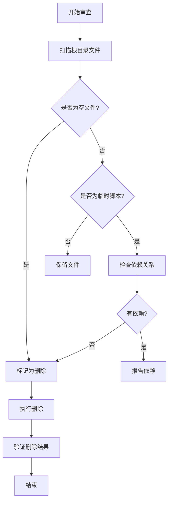

# Design Document: Code Cleanup and Optimization

## Overview

本设计文档描述了对项目进行全面合规审查和代码清理优化的技术方案。基于 Next.js 16 最佳实践和项目规范，系统性地清理不需要的文件、冗余代码，并优化代码质量和加载性能。

## Architecture

### 系统架构

```
┌─────────────────────────────────────────────────────────────┐
│                    Code Cleanup System                       │
├─────────────────────────────────────────────────────────────┤
│  ┌─────────────────┐  ┌─────────────────┐  ┌─────────────┐ │
│  │  File Cleanup   │  │  Compliance     │  │ Optimization│ │
│  │  Module         │  │  Checker        │  │ Module      │ │
│  └────────┬────────┘  └────────┬────────┘  └──────┬──────┘ │
│           │                    │                   │        │
│           ▼                    ▼                   ▼        │
│  ┌─────────────────────────────────────────────────────────┐│
│  │                    Analysis Engine                       ││
│  │  - File dependency analysis                              ││
│  │  - Code pattern detection                                ││
│  │  - CSS usage analysis                                    ││
│  │  - Dependency graph analysis                             ││
│  └─────────────────────────────────────────────────────────┘│
└─────────────────────────────────────────────────────────────┘
```

### 清理流程



## Components and Interfaces

### 1. File Cleanup Module

负责识别和清理不需要的文件。

```typescript
interface FileCleanupModule {
  // 扫描目录中的空文件
  scanEmptyFiles(directory: string): string[];
  
  // 扫描临时脚本文件
  scanTemporaryScripts(directory: string): string[];
  
  // 检查文件依赖关系
  checkDependencies(filePath: string): string[];
  
  // 安全删除文件
  safeDelete(filePath: string): boolean;
}
```

### 2. Compliance Checker Module

负责检查代码是否符合规范。

```typescript
interface ComplianceChecker {
  // 检查调试语句
  checkDebugStatements(directory: string): DebugStatement[];
  
  // 检查 'use client' 指令使用
  checkClientDirectives(directory: string): DirectiveIssue[];
  
  // 运行 ESLint 检查
  runLintCheck(): LintResult;
  
  // 运行 TypeScript 类型检查
  runTypeCheck(): TypeCheckResult;
}

interface DebugStatement {
  file: string;
  line: number;
  type: 'console.log' | 'debugger';
  content: string;
}

interface DirectiveIssue {
  file: string;
  issue: 'missing_directive' | 'unnecessary_directive';
  reason: string;
}
```

### 3. Optimization Module

负责优化代码和依赖。

```typescript
interface OptimizationModule {
  // 分析未使用的依赖
  analyzeUnusedDependencies(): UnusedDependency[];
  
  // 分析 CSS 使用情况
  analyzeCSSUsage(): CSSAnalysisResult;
  
  // 生成优化报告
  generateReport(): OptimizationReport;
}

interface UnusedDependency {
  name: string;
  type: 'dependency' | 'devDependency';
  reason: string;
}
```

## Data Models

### 清理任务模型

```typescript
interface CleanupTask {
  id: string;
  type: 'delete_file' | 'move_file' | 'remove_dependency';
  target: string;
  reason: string;
  status: 'pending' | 'completed' | 'skipped';
  dependencies: string[];
}
```

### 审查报告模型

```typescript
interface AuditReport {
  timestamp: Date;
  filesScanned: number;
  issuesFound: Issue[];
  cleanupTasks: CleanupTask[];
  recommendations: string[];
}

interface Issue {
  severity: 'error' | 'warning' | 'info';
  category: 'file' | 'code' | 'dependency' | 'style';
  message: string;
  location?: string;
}
```

## Correctness Properties

*A property is a characteristic or behavior that should hold true across all valid executions of a system—essentially, a formal statement about what the system should do. Properties serve as the bridge between human-readable specifications and machine-verifiable correctness guarantees.*

### Property 1: No Debug Statements in Production Code

*For any* TypeScript or TSX file in the src directory, there should be no `console.log` or `debugger` statements in the code.

**Validates: Requirements 3.1, 3.2**

### Property 2: File Deletion Safety

*For any* file marked for deletion, there should be no other files in the codebase that import or reference it.

**Validates: Requirements 1.4, 2.5**

### Property 3: Client Directive Correctness

*For any* component file with the `'use client'` directive, the component should use at least one of: React hooks, event handlers, or browser APIs.

**Validates: Requirements 6.2**

### Property 4: Server Component Default

*For any* component file without the `'use client'` directive, the component should not use React hooks, event handlers, or browser APIs.

**Validates: Requirements 6.1**

### Property 5: Unused Dependency Detection

*For any* dependency listed in package.json, if it is not imported anywhere in the src directory, it should be flagged as potentially unused.

**Validates: Requirements 5.2**

## Error Handling

### 文件操作错误

- 文件不存在：跳过并记录警告
- 权限不足：报告错误并停止该任务
- 文件被占用：等待并重试，最多 3 次

### 依赖检查错误

- 解析失败：使用正则表达式作为后备方案
- 循环依赖：检测并报告，不阻塞清理

## Testing Strategy

### 单元测试

- 测试文件扫描逻辑
- 测试依赖检查逻辑
- 测试 CSS 分析逻辑

### 属性测试

使用 fast-check 进行属性测试：

1. **Property 1**: 扫描所有 .ts/.tsx 文件，验证无调试语句
2. **Property 2**: 对于每个待删除文件，验证无引用
3. **Property 3**: 对于每个 'use client' 组件，验证使用了客户端特性
4. **Property 4**: 对于每个服务端组件，验证未使用客户端特性
5. **Property 5**: 对于每个依赖，验证是否被导入

### 集成测试

- 测试完整的清理流程
- 测试报告生成
- 测试回滚机制

## Implementation Notes

### 待清理文件清单

基于审查结果，以下文件需要清理：

**根目录空文件：**
- `0` - 空文件，直接删除
- `Markdown` - 空文件，直接删除

**根目录临时脚本：**
- `check-translations.js` - 简单调试脚本，删除

**scripts 目录一次性脚本：**
- `scripts/seo-descriptions-batch2.ts` - 已执行的批量脚本
- `scripts/seo-descriptions-batch3.ts` - 已执行的批量脚本
- `scripts/seo-descriptions-batch4.ts` - 已执行的批量脚本

### Next.js 最佳实践检查项

1. ✅ Server Components 默认使用
2. ✅ Client Components 仅在必要时使用
3. ✅ 动态导入用于代码分割
4. ✅ 图片优化已配置
5. ✅ 缓存头部已设置
6. ✅ Middleware 已优化（不导入翻译文件）

### 代码质量检查结果

1. ✅ 无 console.log 调试语句
2. ✅ 无 debugger 语句
3. ✅ TypeScript 类型定义完整
4. ✅ 组件注释清晰
