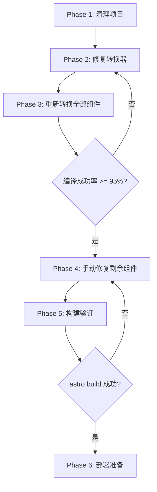

# 设计文档：完成 Astro + Svelte 迁移

## 概述

本设计文档描述了系统性完成 U2Tool Astro 迁移的技术方案。核心策略是修复转换器脚本 `convert-react-to-svelte.ts` 中的 7 类系统性缺陷，然后重新转换全部 500+ 组件，而非逐个修补 227 个损坏的输出文件。

当前转换器已有 ~1,700 行代码，具备 AST 解析（ts-morph）、Hook 转换、JSX 模板转换等核心能力。问题不在于架构设计，而在于模板转换阶段的 6 个具体函数存在边界情况处理不完整。

## 架构

### 修复策略：增量修复转换器 + 全量重新转换



### 转换器修复范围

转换器的核心转换流程（`transformJsxToSvelteTemplate` 函数）按顺序执行 10 个转换步骤。需要修复的步骤标记为 ⚠️：

1. JSX 注释转换 ✅
2. className → class ✅
3. dangerouslySetInnerHTML → {@html} ✅
4. 事件处理器转换 ✅
5. ⚠️ 条件渲染 `&&` → `{#if}` （Block_Tag 配对问题）
6. ⚠️ 三元表达式 → `{#if}/{:else}/{/if}` （不完整转换）
7. ⚠️ `.map()` → `{#each}` （不完整转换）
8. 输入绑定转换 ✅
9. setter 调用转换 ✅
10. ref.current 转换 ✅

**新增步骤（在步骤 10 之后）：**
11. ⚠️ 自闭合非空元素修复
12. ⚠️ TypeScript 泛型清理
13. ⚠️ 正则表达式保护

## 组件与接口

### 1. 清理脚本 (`scripts/cleanup-migration.ts`)

```typescript
interface CleanupConfig {
  scriptsDir: string;        // astro-u2tool/scripts/
  rootDir: string;           // astro-u2tool/
  preserveFiles: string[];   // 保留的文件列表
}

function cleanupMigration(config: CleanupConfig): {
  deletedScripts: string[];
  deletedReports: string[];
  deletedBackups: string[];
  deletedTemp: string[];
}
```

### 2. 转换器修复 - 新增/修改的函数

#### 2.1 自闭合标签修复函数

```typescript
// 新增函数：在 transformJsxToSvelteTemplate 的最后阶段调用
function fixSelfClosingNonVoidElements(template: string): string

// HTML void elements 白名单（允许自闭合）
const VOID_ELEMENTS = new Set([
  'area', 'base', 'br', 'col', 'embed', 'hr', 'img', 'input',
  'link', 'meta', 'param', 'source', 'track', 'wbr'
]);

// 逻辑：匹配 <tagName ... /> 模式
// 如果 tagName 不在 VOID_ELEMENTS 中，转换为 <tagName ...></tagName>
// 如果 tagName 在 VOID_ELEMENTS 中，保持 <tagName ... /> 或转为 <tagName ...>
```

#### 2.2 Block_Tag 平衡验证函数

```typescript
// 新增函数：在模板生成完成后调用，验证并修复 block tag 配对
function validateAndFixBlockTags(template: string): {
  template: string;
  fixes: string[];  // 描述修复了什么
}

// 逻辑：
// 1. 统计 {#if} 和 {/if} 数量，如果不匹配则尝试修复
// 2. 统计 {#each} 和 {/each} 数量，如果不匹配则尝试修复
// 3. 使用栈结构验证嵌套正确性
```

#### 2.3 改进的条件渲染转换

修改现有 `transformConditionalAnd` 函数：
- 问题：多次迭代（while 循环最多 10 次）可能导致已转换的 `{#if}` 被再次处理
- 修复：在迭代中跳过已经是 Svelte block tag 的内容

#### 2.4 改进的三元表达式转换

修改现有 `transformTernary` 函数：
- 问题：嵌套三元表达式处理不完整
- 修复：递归处理分支中的三元表达式

#### 2.5 改进的 .map() 转换

修改现有 `transformArrayMap` 函数：
- 问题：某些 `.map()` 模式未被匹配（如回调体中包含多行 JSX）
- 修复：改进 `parseMapCallback` 对复杂回调体的处理

#### 2.6 TypeScript 泛型保护

```typescript
// 新增函数：在模板转换前预处理，保护 TypeScript 泛型不被误识别
function protectTypeScriptGenerics(template: string): {
  template: string;
  placeholders: Map<string, string>;  // placeholder → original
}

function restoreTypeScriptGenerics(
  template: string, 
  placeholders: Map<string, string>
): string
```

#### 2.7 正则表达式保护

```typescript
// 新增函数：保护正则表达式字面量不被误解析
function protectRegexLiterals(template: string): {
  template: string;
  placeholders: Map<string, string>;
}

function restoreRegexLiterals(
  template: string,
  placeholders: Map<string, string>
): string
```

### 3. 批量重新转换脚本 (`scripts/batch-reconvert.ts`)

```typescript
interface ReconvertConfig {
  sourceDir: string;      // 原始 React 组件目录
  targetDir: string;      // Svelte 输出目录
  compileCheck: boolean;  // 是否对每个输出运行 Svelte 编译检查
}

interface ReconvertReport {
  total: number;
  success: number;
  failed: Array<{
    file: string;
    errors: string[];
  }>;
  successRate: number;
}

function batchReconvert(config: ReconvertConfig): ReconvertReport
```

### 4. 编译检查工具 (`scripts/svelte-compile-check.ts`)

```typescript
interface CompileCheckResult {
  file: string;
  success: boolean;
  errors: Array<{
    message: string;
    line: number;
    column: number;
  }>;
}

function checkSvelteCompile(filePath: string): CompileCheckResult
function batchCompileCheck(dir: string): CompileCheckResult[]
```


## 数据模型

### 转换器错误分类

| 错误类型 | 当前数量 | 根因函数 | 修复方案 |
|---------|---------|---------|---------|
| "attempted to close element not open" (textarea/canvas/select/div/path 等) | ~99 | 缺少 `fixSelfClosingNonVoidElements` | 新增自闭合标签修复步骤 |
| "Unexpected block closing tag" | 47 | `transformConditionalAnd` 多次迭代 | 改进迭代逻辑，跳过已转换内容 |
| "Unexpected token" | 29 | TypeScript 泛型/正则表达式误识别 | 新增预处理保护步骤 |
| 残留 `.map()` | 37 | `transformArrayMap` 匹配不完整 | 改进回调体解析 |
| `{#if}/{/if}` 不匹配 | 27 | `transformConditionalAnd` + `transformTernary` | 新增后处理验证步骤 |
| `{#each}/{/each}` 不匹配 | 26 | `transformArrayMap` | 新增后处理验证步骤 |
| 残留 `className=` | 3 | `transformClassName` 时序问题 | 确保在所有转换后再次执行 |
| JSX 三元残留 | 2 | `transformTernary` 嵌套处理不完整 | 递归处理嵌套三元 |
| 残留 `useState` | 1 | `extractUseState` 未匹配 | 改进 Hook 提取逻辑 |

### 自闭合标签处理规则

```typescript
// HTML Void Elements - 允许自闭合
const VOID_ELEMENTS = new Set([
  'area', 'base', 'br', 'col', 'embed', 'hr', 'img', 'input',
  'link', 'meta', 'param', 'source', 'track', 'wbr'
]);

// 常见需要修复的非空元素（在 React 中常被自闭合）
// textarea, canvas, select, option, div, span, button, label, a,
// table, thead, tbody, tr, td, th, ul, ol, li, p, h1-h6,
// section, article, aside, nav, header, footer, main, form

// SVG 元素 - 不允许自闭合
// path, circle, rect, line, polyline, polygon, ellipse, image,
// text, tspan, g, defs, clipPath, mask, pattern, use, symbol
```

### 转换器修改后的执行流程

```
transformJsxToSvelteTemplate(jsx):
  1. 预处理：保护正则表达式和 TypeScript 泛型
  2. transformJsxComments
  3. transformClassName
  4. transformDangerouslySetInnerHTML
  5. transformEventHandlers
  6. transformConditionalAnd (改进版，带迭代保护)
  7. transformTernary (改进版，支持递归嵌套)
  8. transformArrayMap (改进版，更完整的匹配)
  9. transformInputBindings
  10. transformSetterCalls
  11. transformRefCurrent
  12. transformFragments
  13. 后处理：fixSelfClosingNonVoidElements
  14. 后处理：restoreRegexLiterals + restoreTypeScriptGenerics
  15. 后处理：validateAndFixBlockTags
  16. 后处理：再次执行 transformClassName (兜底)
```


## 正确性属性

*正确性属性是一种在系统所有有效执行中都应成立的特征或行为——本质上是关于系统应该做什么的形式化陈述。属性是人类可读规范与机器可验证正确性保证之间的桥梁。*

### Property 1: 非空元素自闭合修复

*For any* 非空 HTML 元素标签名（textarea, canvas, select, div, span, button, path, circle 等）和任意属性集合，如果输入包含自闭合形式 `<tagName attrs />`, 则 `fixSelfClosingNonVoidElements` 的输出 SHALL 包含 `<tagName attrs></tagName>` 且所有原始属性被保留。

**Validates: Requirements 2.1, 2.3, 2.4**

### Property 2: 空元素保持不变

*For any* HTML void element 标签名（br, hr, img, input, meta 等）和任意属性集合，`fixSelfClosingNonVoidElements` SHALL 不为其添加闭合标签，输出保持 `<tagName attrs />` 或 `<tagName attrs>` 形式。

**Validates: Requirements 2.2**

### Property 3: Block Tag 平衡不变量

*For any* 有效的 React JSX 模板输入，经过 `transformJsxToSvelteTemplate` 转换后的 Svelte 模板中，`{#if}` 标签的数量 SHALL 等于 `{/if}` 标签的数量，且 `{#each}` 标签的数量 SHALL 等于 `{/each}` 标签的数量。

**Validates: Requirements 3.1, 3.2, 3.3, 3.4, 3.5**

### Property 4: 三元表达式完整转换

*For any* 包含 JSX 三元表达式 `{cond ? <A/> : <B/>}` 的模板（包括嵌套三元），`transformTernary` 的输出 SHALL 包含对应的 `{#if cond}...{:else}...{/if}` 结构，且不残留 JSX 三元语法。

**Validates: Requirements 4.1, 4.2**

### Property 5: React 语法零残留

*For any* 经过完整转换流程的 Svelte 模板，模板部分 SHALL 不包含 `.map(` 调用、`className=` 属性、或 JSX 三元表达式模式（`? <` 后跟 `: <`）。

**Validates: Requirements 4.5, 4.6, 5.3, 5.6**

### Property 6: TypeScript 泛型与正则表达式保护

*For any* 模板表达式中包含的 TypeScript 泛型语法（如 `<typeof X>`, `<string>`）或正则表达式字面量（如 `/pattern/g`），经过转换后这些表达式 SHALL 保持语义不变，不被误识别为 HTML 标签或自闭合标签语法。

**Validates: Requirements 5.1, 5.2**

### Property 7: React Fragment 干净移除

*For any* 包含 React Fragment（`<>...</>` 或 `<React.Fragment>...</React.Fragment>`）的模板，`transformFragments` SHALL 移除 Fragment 标签而不改变内部内容的结构。

**Validates: Requirements 6.3**

## 错误处理

### 转换器错误处理

1. **无法解析的 JSX**：当 ts-morph 无法解析 React 组件的 JSX return 时，转换器在输出文件中插入 `<!-- TODO: 手动转换 -->` 注释，并在迁移报告中记录
2. **编译检查失败**：重新转换后仍编译失败的组件被记录到报告的 `failed` 数组中，包含文件路径和具体错误信息
3. **Block Tag 不平衡**：`validateAndFixBlockTags` 尝试自动修复，如果无法修复则在报告中标记为需要手动处理
4. **未知 HTML 标签**：对于不在 VOID_ELEMENTS 集合中的未知标签，默认按非空元素处理（添加闭合标签），这是更安全的默认行为

### 构建错误处理

1. **组件导入失败**：如果 Svelte 组件存在语法错误，Astro 构建会报告具体文件和行号
2. **翻译缺失**：组件内的 `t()` 函数在翻译键缺失时返回 `MISSING: tools.xxx` 字符串，不会导致构建失败
3. **第三方库缺失**：使用动态 `import()` 的组件在库不可用时显示错误提示，不影响其他组件

## 测试策略

### 属性测试（Property-Based Testing）

使用 Vitest + fast-check 进行属性测试。每个属性测试运行至少 100 次迭代。

**测试配置**：
```typescript
import { fc } from '@fast-check/vitest';
// 或
import fc from 'fast-check';
```

**生成器设计**：
- `arbNonVoidTagName`: 从非空元素列表中随机选择标签名
- `arbVoidTagName`: 从空元素列表中随机选择标签名
- `arbHtmlAttributes`: 生成随机 HTML 属性字符串（class, id, style 等）
- `arbCondition`: 生成随机 JavaScript 条件表达式
- `arbJsxSnippet`: 生成简单的 JSX 片段（`<div>text</div>` 等）

**属性测试标注格式**：
```
Feature: complete-astro-migration, Property N: property_text
```

### 单元测试

- 针对每种错误类型编写具体的输入/输出示例测试
- 测试边界情况：空输入、嵌套深度极大、属性中包含特殊字符
- 测试 ECharts 组件的特殊转换逻辑

### 集成测试

- 选取 20 个代表性 React 组件（覆盖所有错误类型），验证端到端转换正确性
- 运行 `astro build` 验证构建成功
- 抽样检查生成的 HTML 页面内容