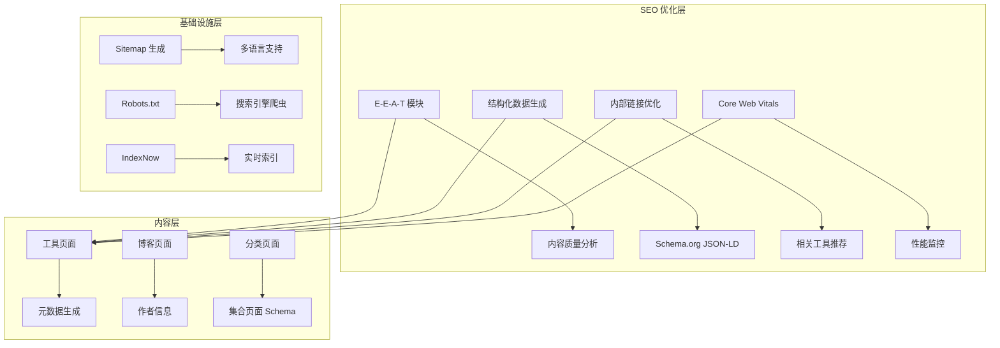

# Design Document: Comprehensive SEO Review

## Overview

本设计文档描述了对 U2Tool 网站进行全面 SEO 优化的技术方案。优化目标是提高网站在搜索引擎中的排名，同时避免 AI 工具开发带来的 SEO 负面影响。

### 设计原则

1. **渐进增强** - 在现有 SEO 基础设施上进行增强，不破坏已有功能
2. **可测量性** - 所有优化都应该可以通过工具测量效果
3. **可维护性** - 优化方案应该易于维护和更新
4. **性能优先** - 优化不应该影响页面加载性能

### 技术栈

- Next.js 14+ (App Router)
- TypeScript
- next-intl (国际化)
- Schema.org JSON-LD (结构化数据)
- Vitest (测试)

## Architecture

### 系统架构图



### 模块职责

| 模块 | 职责 | 文件位置 |
|------|------|----------|
| E-E-A-T 模块 | 管理专家信息、作者信息、信任信号 | `src/lib/eeat.ts` |
| 内容质量分析 | 检测 AI 内容特征、计算独特性分数 | `src/lib/content-analyzer.ts` |
| 结构化数据生成 | 生成各类 Schema.org JSON-LD | `src/lib/seo.ts` |
| 内部链接优化 | 计算相关工具、生成推荐 | `src/lib/internal-links.ts` |
| Core Web Vitals | 监控和报告性能指标 | `src/lib/web-vitals.ts` |

## Components and Interfaces

### 1. E-E-A-T 增强组件

```typescript
// src/lib/eeat.ts

/**
 * 专家/作者信息接口
 */
interface ExpertInfo {
  name: string;
  role: string;
  credentials: string[];
  avatar?: string;
  socialProfiles?: {
    twitter?: string;
    linkedin?: string;
    github?: string;
  };
}

/**
 * 组织信息接口
 */
interface OrganizationInfo {
  name: string;
  description: string;
  foundedYear: number;
  logo: string;
  contactEmail: string;
  socialProfiles: Record<string, string>;
}

/**
 * 生成专家 Schema.org JSON-LD
 */
function generateExpertJsonLd(expert: ExpertInfo): JsonLdData;

/**
 * 生成增强的组织 Schema.org JSON-LD
 */
function generateEnhancedOrganizationJsonLd(org: OrganizationInfo): JsonLdData;
```

### 2. 内容质量增强组件

```typescript
// src/lib/content-quality.ts

/**
 * 内容质量评估结果
 */
interface ContentQualityResult {
  uniquenessScore: number;      // 0-100
  depthScore: number;           // 0-100
  readabilityScore: number;     // 0-100
  keywordRelevance: number;     // 0-100
  overallScore: number;         // 0-100
  suggestions: string[];
}

/**
 * 评估内容质量
 */
function evaluateContentQuality(
  content: string,
  targetKeywords: string[]
): ContentQualityResult;

/**
 * 生成内容改进建议
 */
function generateContentSuggestions(
  result: ContentQualityResult
): string[];
```

### 3. 增强的结构化数据组件

```typescript
// src/lib/seo-enhanced.ts

/**
 * 生成带评分的 SoftwareApplication Schema
 */
function generateSoftwareApplicationWithRating(params: {
  name: string;
  description: string;
  category: string;
  locale: string;
  slug: string;
  rating?: {
    value: number;
    count: number;
  };
  author?: ExpertInfo;
  dateModified?: string;
}): JsonLdData;

/**
 * 生成 Article Schema（用于博客）
 */
function generateArticleJsonLd(params: {
  headline: string;
  description: string;
  author: ExpertInfo;
  datePublished: string;
  dateModified: string;
  image: string;
  locale: string;
  slug: string;
}): JsonLdData;
```

### 4. 内部链接增强组件

```typescript
// src/lib/internal-links-enhanced.ts

/**
 * 语义相关性配置
 */
interface SemanticRelevanceConfig {
  sameCategory: number;      // 同分类权重
  relatedKeywords: number;   // 相关关键词权重
  popularBonus: number;      // 热门工具加成
  recentBonus: number;       // 最近更新加成
}

/**
 * 获取语义相关工具（增强版）
 */
function getEnhancedRelatedTools(
  slug: string,
  config?: Partial<SemanticRelevanceConfig>
): Tool[];

/**
 * 生成上下文相关的锚文本
 */
function generateContextualAnchorText(
  tool: Tool,
  context: 'related' | 'category' | 'popular',
  locale: string
): string;
```

### 5. Core Web Vitals 优化组件

```typescript
// src/lib/performance.ts

/**
 * 性能优化配置
 */
interface PerformanceConfig {
  lazyLoadThreshold: number;    // 懒加载阈值（像素）
  prefetchDelay: number;        // 预取延迟（毫秒）
  criticalCss: boolean;         // 是否提取关键 CSS
}

/**
 * 获取关键资源列表
 */
function getCriticalResources(pageType: PageType): string[];

/**
 * 生成资源提示标签
 */
function generateResourceHints(resources: string[]): ResourceHint[];
```

## Data Models

### 1. SEO 配置数据模型

```typescript
// src/types/seo.ts

/**
 * 页面 SEO 配置
 */
interface PageSeoConfig {
  title: string;
  description: string;
  keywords: string[];
  canonical: string;
  alternates: Record<string, string>;
  openGraph: OpenGraphConfig;
  twitter: TwitterConfig;
  structuredData: JsonLdData[];
}

/**
 * 工具 SEO 配置
 */
interface ToolSeoConfig extends PageSeoConfig {
  toolName: string;
  category: string;
  author?: ExpertInfo;
  dateModified: string;
  rating?: {
    value: number;
    count: number;
  };
  faq: FAQItem[];
  howTo: HowToStep[];
}
```

### 2. 内容质量数据模型

```typescript
/**
 * 内容分析结果
 */
interface ContentAnalysis {
  id: string;
  locale: string;
  analyzedAt: string;
  metrics: {
    uniqueness: number;
    templateSimilarity: number;
    sentenceVariety: number;
    keywordDensity: number;
  };
  flags: ContentFlag[];
  suggestions: string[];
}

/**
 * 内容标记
 */
interface ContentFlag {
  type: 'repetitive' | 'template-like' | 'keyword-stuffing' | 'too-short' | 'ai-pattern';
  severity: 'info' | 'warning' | 'error';
  message: string;
  location?: string;
}
```

### 3. 性能指标数据模型

```typescript
/**
 * Core Web Vitals 指标
 */
interface WebVitalsMetrics {
  LCP: number;    // Largest Contentful Paint (ms)
  INP: number;    // Interaction to Next Paint (ms)
  CLS: number;    // Cumulative Layout Shift
  FCP: number;    // First Contentful Paint (ms)
  TTFB: number;   // Time to First Byte (ms)
}

/**
 * 性能报告
 */
interface PerformanceReport {
  url: string;
  pageType: PageType;
  metrics: WebVitalsMetrics;
  rating: 'good' | 'needs-improvement' | 'poor';
  timestamp: string;
}
```


## Correctness Properties

*A property is a characteristic or behavior that should hold true across all valid executions of a system—essentially, a formal statement about what the system should do. Properties serve as the bridge between human-readable specifications and machine-verifiable correctness guarantees.*

### Property 1: Structured Data Completeness

*For any* tool page, the generated JSON-LD structured data SHALL contain:
- SoftwareApplication schema with name, description, category, and offers
- HowTo schema with at least 3 steps
- FAQ schema with at least 3 questions
- BreadcrumbList schema with correct hierarchy

*For any* page with author information, the JSON-LD SHALL include Person schema with name and credentials.

*For any* Organization schema, it SHALL include name, url, logo, and contactPoint.

**Validates: Requirements 1.3, 1.5, 6.1, 6.2, 6.4, 6.5**

### Property 2: Content Quality Analysis

*For any* tool description content:
- Uniqueness score SHALL be above 70%
- Template similarity SHALL be below 40%
- If template similarity exceeds 40%, a warning flag SHALL be generated

*For any* set of similar tools (same category), the content descriptions SHALL have less than 60% similarity to each other.

*For any* FAQ content, the questions SHALL contain the tool name or tool-specific terminology.

**Validates: Requirements 2.1, 2.2, 2.3, 2.4, 2.5**

### Property 3: Internal Link Structure

*For any* tool page:
- Related tools count SHALL be at least 6
- Breadcrumb navigation SHALL be present with at least 3 levels (Home > Category > Tool)
- Category page link SHALL be present
- At least 2 sibling tools from the same category SHALL be linked

*For any* page in the site, the click depth from homepage SHALL be at most 3.

**Validates: Requirements 4.1, 4.2, 4.3, 4.4**

### Property 4: Multi-language SEO Completeness

*For any* page path, hreflang tags SHALL be generated for all 10 supported languages (en, zh, es, pt, ja, ru, fr, ar, de, ko).

*For any* hreflang implementation, x-default SHALL point to the English version.

*For any* sitemap entry, alternates SHALL be included for all language versions.

*For any* two language versions of the same page, the content similarity SHALL be below 80% (indicating actual translation, not duplication).

*For any* language version, keywords SHALL be in the target language.

**Validates: Requirements 5.1, 5.2, 5.3, 5.4, 5.5**

### Property 5: Technical SEO Infrastructure

*For any* sitemap generation:
- All tool pages SHALL be included
- All category pages SHALL be included
- Priority values SHALL be between 0 and 1
- changeFrequency SHALL be a valid value

*For any* robots.txt generation:
- Major search engine crawlers (Googlebot, Bingbot, Baiduspider) SHALL be allowed
- API routes SHALL be disallowed
- Sitemap URL SHALL be included

*For any* page with a canonical URL, the canonical SHALL match the current page URL pattern.

**Validates: Requirements 8.1, 8.2, 8.3**

### Property 6: Content Depth Requirements

*For any* tool page:
- Detailed description word count SHALL be at least 200 words
- Usage steps SHALL be present with at least 3 steps
- Usage examples SHALL be present with at least 2 examples
- FAQ section SHALL be present with at least 3 questions

**Validates: Requirements 9.1, 9.2, 9.3, 9.5**

### Property 7: Resource Hints Implementation

*For any* page render, the HTML head SHALL contain:
- At least one preconnect hint for external resources
- DNS prefetch hints for analytics domains

**Validates: Requirements 3.5**

### Property 8: IndexNow Submission

*For any* IndexNow submission request:
- The URL list SHALL not be empty
- The API key SHALL be valid (non-empty string)
- The response SHALL be logged for monitoring

**Validates: Requirements 12.2**

### Property 9: Viewport Meta Tags

*For any* page, the viewport meta tag SHALL:
- Include width=device-width
- Include initial-scale=1
- Allow user scaling (user-scalable not set to no)

**Validates: Requirements 10.3**

## Error Handling

### 1. 结构化数据生成错误

```typescript
/**
 * 结构化数据生成错误处理
 */
try {
  const jsonLd = generateSoftwareApplicationJsonLd(params);
  return jsonLd;
} catch (error) {
  // 记录错误但不阻止页面渲染
  console.error('Failed to generate structured data:', error);
  // 返回最小化的有效 JSON-LD
  return generateMinimalJsonLd(params);
}
```

### 2. 内容分析错误

```typescript
/**
 * 内容分析错误处理
 */
function analyzeContentSafely(content: string): ContentAnalysisResult {
  try {
    return analyzeContentUniqueness(content);
  } catch (error) {
    console.error('Content analysis failed:', error);
    // 返回默认结果，不阻止流程
    return {
      uniquenessScore: 50,
      templateSimilarity: 50,
      sentenceVariety: 50,
      keywordDensity: 0,
      flags: [{
        type: 'error',
        severity: 'warning',
        message: 'Content analysis failed, using default values'
      }]
    };
  }
}
```

### 3. 翻译加载错误

```typescript
/**
 * 翻译加载错误处理
 */
async function loadTranslationsSafely(locale: string): Promise<Messages> {
  try {
    return await loadToolMessages(locale, slug);
  } catch (error) {
    console.error(`Failed to load translations for ${locale}:`, error);
    // 回退到英文
    return await loadToolMessages('en', slug);
  }
}
```

### 4. IndexNow 提交错误

```typescript
/**
 * IndexNow 提交错误处理
 */
async function submitToIndexNow(urls: string[]): Promise<SubmitResult> {
  try {
    const response = await fetch(INDEXNOW_ENDPOINT, {
      method: 'POST',
      body: JSON.stringify({ urls, key: API_KEY }),
    });
    
    if (!response.ok) {
      throw new Error(`IndexNow submission failed: ${response.status}`);
    }
    
    return { success: true, submittedCount: urls.length };
  } catch (error) {
    console.error('IndexNow submission error:', error);
    // 记录失败的 URL 以便重试
    await logFailedSubmission(urls, error);
    return { success: false, error: error.message };
  }
}
```

## Testing Strategy

### 测试方法概述

本项目采用双重测试策略：
- **单元测试**: 验证特定示例和边界情况
- **属性测试**: 验证跨所有输入的通用属性

### 测试框架

- **Vitest**: 单元测试和属性测试框架
- **fast-check**: 属性测试库

### 单元测试

```typescript
// src/lib/seo.test.ts

describe('SEO Module', () => {
  describe('generateSoftwareApplicationJsonLd', () => {
    it('should generate valid SoftwareApplication schema', () => {
      const result = generateSoftwareApplicationJsonLd({
        name: 'JSON Formatter',
        description: 'Format and validate JSON',
        category: 'formatters',
        locale: 'en',
        slug: 'json-formatter',
      });
      
      expect(result['@type']).toBe('SoftwareApplication');
      expect(result.name).toBe('JSON Formatter');
      expect(result.offers.price).toBe('0');
    });
  });
  
  describe('generateHreflangLinks', () => {
    it('should generate links for all supported languages', () => {
      const links = generateHreflangLinks('/tools/json-formatter');
      
      expect(Object.keys(links)).toHaveLength(11); // 10 languages + x-default
      expect(links['x-default']).toContain('/en/');
    });
  });
});
```

### 属性测试

```typescript
// src/lib/seo.property.test.ts

import { fc } from '@fast-check/vitest';
import { test } from 'vitest';

/**
 * Feature: comprehensive-seo-review, Property 1: Structured Data Completeness
 * Validates: Requirements 1.3, 1.5, 6.1, 6.2, 6.4, 6.5
 */
test.prop([
  fc.record({
    name: fc.string({ minLength: 1, maxLength: 100 }),
    description: fc.string({ minLength: 10, maxLength: 500 }),
    category: fc.constantFrom('formatters', 'encoders', 'generators', 'converters'),
    locale: fc.constantFrom('en', 'zh', 'es', 'pt', 'ja', 'ru', 'fr', 'ar', 'de', 'ko'),
    slug: fc.string({ minLength: 1, maxLength: 50 }).filter(s => /^[a-z0-9-]+$/.test(s)),
  })
])('structured data contains required fields', (params) => {
  const jsonLd = generateSoftwareApplicationJsonLd(params);
  
  expect(jsonLd['@context']).toBe('https://schema.org');
  expect(jsonLd['@type']).toBe('SoftwareApplication');
  expect(jsonLd.name).toBe(params.name);
  expect(jsonLd.description).toBe(params.description);
  expect(jsonLd.offers).toBeDefined();
  expect(jsonLd.offers.price).toBe('0');
});

/**
 * Feature: comprehensive-seo-review, Property 2: Content Quality Analysis
 * Validates: Requirements 2.1, 2.2, 2.3, 2.4, 2.5
 */
test.prop([
  fc.string({ minLength: 100, maxLength: 2000 })
])('content analysis returns valid scores', (content) => {
  const result = analyzeContentUniqueness(content);
  
  expect(result.uniquenessScore).toBeGreaterThanOrEqual(0);
  expect(result.uniquenessScore).toBeLessThanOrEqual(100);
  expect(result.templateSimilarity).toBeGreaterThanOrEqual(0);
  expect(result.templateSimilarity).toBeLessThanOrEqual(100);
  expect(result.sentenceVariety).toBeGreaterThanOrEqual(0);
  expect(result.sentenceVariety).toBeLessThanOrEqual(100);
});

/**
 * Feature: comprehensive-seo-review, Property 4: Multi-language SEO Completeness
 * Validates: Requirements 5.1, 5.2, 5.3, 5.4, 5.5
 */
test.prop([
  fc.string({ minLength: 1, maxLength: 100 }).filter(s => s.startsWith('/'))
])('hreflang links include all languages', (path) => {
  const links = generateHreflangLinks(path);
  
  const expectedLocales = ['en', 'zh', 'es', 'pt', 'ja', 'ru', 'fr', 'ar', 'de', 'ko', 'x-default'];
  
  for (const locale of expectedLocales) {
    expect(links[locale]).toBeDefined();
    expect(links[locale]).toContain(path);
  }
  
  // x-default should point to English
  expect(links['x-default']).toContain('/en');
});

/**
 * Feature: comprehensive-seo-review, Property 5: Technical SEO Infrastructure
 * Validates: Requirements 8.1, 8.2, 8.3
 */
test.prop([
  fc.constantFrom('en', 'zh', 'es', 'pt', 'ja', 'ru', 'fr', 'ar', 'de', 'ko'),
  fc.string({ minLength: 1, maxLength: 50 }).filter(s => /^[a-z0-9-]+$/.test(s))
])('canonical URL is correctly formatted', (locale, slug) => {
  const canonical = getCanonicalUrl(locale, `/tools/${slug}`);
  
  expect(canonical).toMatch(/^https:\/\//);
  expect(canonical).toContain(`/${locale}/`);
  expect(canonical).toContain(`/tools/${slug}`);
  expect(canonical).not.toMatch(/\/$/); // No trailing slash
});

/**
 * Feature: comprehensive-seo-review, Property 3: Internal Link Structure
 * Validates: Requirements 4.1, 4.2, 4.3, 4.4
 */
test.prop([
  fc.constantFrom(...tools.map(t => t.slug))
])('related tools returns at least 6 tools', (slug) => {
  const relatedTools = getSemanticRelatedTools(slug, 6);
  
  expect(relatedTools.length).toBeGreaterThanOrEqual(Math.min(6, tools.length - 1));
  expect(relatedTools.every(t => t.slug !== slug)).toBe(true);
});
```

### 测试配置

```typescript
// vitest.config.ts 中添加属性测试配置

export default defineConfig({
  test: {
    // 属性测试运行 100 次迭代
    fuzz: {
      numRuns: 100,
    },
  },
});
```

### 测试覆盖要求

| 模块 | 单元测试覆盖 | 属性测试覆盖 |
|------|-------------|-------------|
| src/lib/seo.ts | 90% | 9 properties |
| src/lib/content-analyzer.ts | 85% | 2 properties |
| src/lib/internal-links.ts | 80% | 1 property |
| src/lib/faq.ts | 75% | 1 property |
| src/lib/metadata-validator.ts | 85% | 2 properties |
