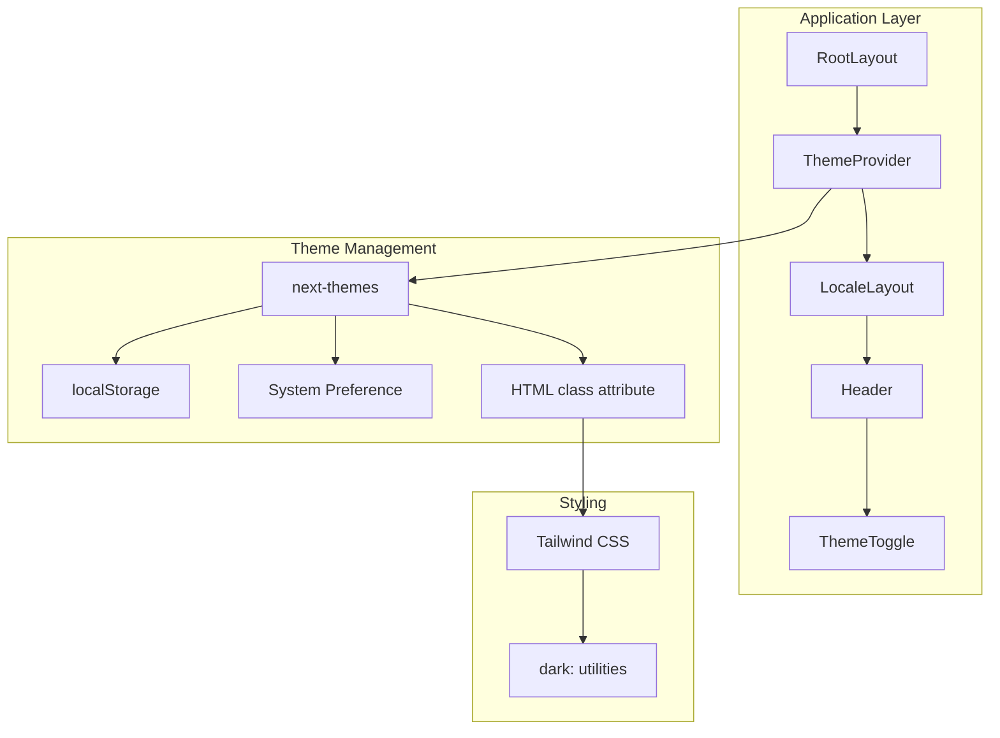

# Design Document: Dark Mode Toggle

## Overview

本设计文档描述了网站主题切换功能的技术实现方案。该功能使用 `next-themes` 库来管理主题状态，与 Tailwind CSS 的 dark mode 功能集成，提供白天、黑夜和跟随系统三种主题模式。

## Architecture

### 技术选型

- **next-themes**: 专为 Next.js 设计的主题管理库，支持 SSR、无 FOUC、localStorage 持久化
- **Tailwind CSS**: 使用 `class` 策略的 dark mode，通过在 HTML 元素上添加 `dark` 类来切换样式

### 架构图



## Components and Interfaces

### 1. ThemeProvider 配置

在根布局中配置 `ThemeProvider`，包装整个应用。

```typescript
// src/app/[locale]/layout.tsx
import { ThemeProvider } from 'next-themes';

export default function LocaleLayout({ children }) {
  return (
    <html lang={locale} suppressHydrationWarning>
      <body>
        <ThemeProvider
          attribute="class"
          defaultTheme="system"
          enableSystem={true}
          disableTransitionOnChange={false}
        >
          {children}
        </ThemeProvider>
      </body>
    </html>
  );
}
```

### 2. ThemeToggle 组件

主题切换按钮组件，显示在 Header 中。

```typescript
// src/components/ThemeToggle.tsx
'use client';

import { useTheme } from 'next-themes';
import { useState, useEffect, useRef } from 'react';

interface ThemeOption {
  value: 'light' | 'dark' | 'system';
  label: string;
  icon: React.ReactNode;
}

export default function ThemeToggle() {
  const { theme, setTheme, resolvedTheme } = useTheme();
  const [mounted, setMounted] = useState(false);
  const [dropdownOpen, setDropdownOpen] = useState(false);
  const dropdownRef = useRef<HTMLDivElement>(null);

  // 防止 hydration mismatch
  useEffect(() => {
    setMounted(true);
  }, []);

  // 点击外部关闭下拉菜单
  useEffect(() => {
    const handleClickOutside = (e: MouseEvent) => {
      if (dropdownRef.current && !dropdownRef.current.contains(e.target as Node)) {
        setDropdownOpen(false);
      }
    };
    document.addEventListener('mousedown', handleClickOutside);
    return () => document.removeEventListener('mousedown', handleClickOutside);
  }, []);

  const themeOptions: ThemeOption[] = [
    { value: 'light', label: 'Light', icon: <SunIcon /> },
    { value: 'dark', label: 'Dark', icon: <MoonIcon /> },
    { value: 'system', label: 'System', icon: <ComputerIcon /> },
  ];

  const getCurrentIcon = () => {
    if (!mounted) return <SunIcon />; // 默认图标，避免 hydration 问题
    if (theme === 'system') return <ComputerIcon />;
    return resolvedTheme === 'dark' ? <MoonIcon /> : <SunIcon />;
  };

  const handleThemeChange = (newTheme: string) => {
    setTheme(newTheme);
    setDropdownOpen(false);
  };

  return (
    <div className="relative" ref={dropdownRef}>
      <button
        onClick={() => setDropdownOpen(!dropdownOpen)}
        className="p-2 rounded-lg bg-gray-800 hover:bg-gray-700 transition-colors"
        aria-label="Toggle theme"
        aria-expanded={dropdownOpen}
        aria-haspopup="true"
      >
        {getCurrentIcon()}
      </button>
      
      {dropdownOpen && (
        <div className="absolute right-0 top-full mt-2 w-36 bg-gray-800 border border-gray-700 rounded-lg shadow-xl">
          {themeOptions.map((option) => (
            <button
              key={option.value}
              onClick={() => handleThemeChange(option.value)}
              className={`w-full flex items-center gap-2 px-4 py-2 text-sm hover:bg-gray-700 
                ${theme === option.value ? 'text-blue-400' : 'text-gray-300'}`}
            >
              {option.icon}
              {option.label}
            </button>
          ))}
        </div>
      )}
    </div>
  );
}
```

### 3. 图标组件

```typescript
// 太阳图标 (Light Mode)
const SunIcon = () => (
  <svg className="w-5 h-5" fill="none" stroke="currentColor" viewBox="0 0 24 24">
    <path strokeLinecap="round" strokeLinejoin="round" strokeWidth={2} 
      d="M12 3v1m0 16v1m9-9h-1M4 12H3m15.364 6.364l-.707-.707M6.343 6.343l-.707-.707m12.728 0l-.707.707M6.343 17.657l-.707.707M16 12a4 4 0 11-8 0 4 4 0 018 0z" />
  </svg>
);

// 月亮图标 (Dark Mode)
const MoonIcon = () => (
  <svg className="w-5 h-5" fill="none" stroke="currentColor" viewBox="0 0 24 24">
    <path strokeLinecap="round" strokeLinejoin="round" strokeWidth={2} 
      d="M20.354 15.354A9 9 0 018.646 3.646 9.003 9.003 0 0012 21a9.003 9.003 0 008.354-5.646z" />
  </svg>
);

// 电脑图标 (System Mode)
const ComputerIcon = () => (
  <svg className="w-5 h-5" fill="none" stroke="currentColor" viewBox="0 0 24 24">
    <path strokeLinecap="round" strokeLinejoin="round" strokeWidth={2} 
      d="M9.75 17L9 20l-1 1h8l-1-1-.75-3M3 13h18M5 17h14a2 2 0 002-2V5a2 2 0 00-2-2H5a2 2 0 00-2 2v10a2 2 0 002 2z" />
  </svg>
);
```

## Data Models

### Theme State

```typescript
interface ThemeState {
  theme: 'light' | 'dark' | 'system';  // 用户选择的主题
  resolvedTheme: 'light' | 'dark';      // 实际应用的主题
}
```

### localStorage Schema

```typescript
// Key: 'theme'
// Value: 'light' | 'dark' | 'system'
```

## CSS 样式更新

### globals.css 更新

```css
:root {
  /* Light mode variables */
  --foreground-rgb: 0, 0, 0;
  --background-start-rgb: 255, 255, 255;
  --background-end-rgb: 245, 245, 245;
  --color-primary: #3b82f6;
  --color-gray-700: #374151;
  --color-gray-800: #1f2937;
  --color-gray-900: #111827;
}

.dark {
  /* Dark mode variables */
  --foreground-rgb: 255, 255, 255;
  --background-start-rgb: 0, 0, 0;
  --background-end-rgb: 0, 0, 0;
}

body {
  color: rgb(var(--foreground-rgb));
  background: linear-gradient(
    to bottom,
    transparent,
    rgb(var(--background-end-rgb))
  ) rgb(var(--background-start-rgb));
}
```

### Tailwind 配置

```typescript
// tailwind.config.ts
const config: Config = {
  darkMode: 'class',  // 使用 class 策略
  // ...
}
```


## Correctness Properties

*A property is a characteristic or behavior that should hold true across all valid executions of a system-essentially, a formal statement about what the system should do. Properties serve as the bridge between human-readable specifications and machine-verifiable correctness guarantees.*

### Property 1: Theme Icon Consistency

*For any* theme state (light, dark, or system), the Theme_Toggle SHALL display the corresponding icon: sun for light, moon for dark (or resolved dark), computer for system mode.

**Validates: Requirements 1.3**

### Property 2: Theme Selection Closes Dropdown

*For any* theme option selected from the dropdown menu, the dropdown SHALL close immediately after selection and the theme state SHALL update to the selected value.

**Validates: Requirements 1.4**

### Property 3: Theme Persistence Round-Trip

*For any* valid theme value (light, dark, system), storing the theme to localStorage and then reading it back SHALL return the same theme value.

**Validates: Requirements 2.1, 2.2**

### Property 4: System Theme Resolution

*For any* system color scheme preference (light or dark), when System_Mode is selected, the resolved theme SHALL match the system preference.

**Validates: Requirements 2.4**

### Property 5: HTML Class Application

*For any* resolved theme (light or dark), the HTML element SHALL have the correct class applied: 'dark' class for dark mode, no 'dark' class for light mode.

**Validates: Requirements 3.4**

## Error Handling

### localStorage Unavailable

当 localStorage 不可用时（如隐私模式或禁用 cookies）：
- next-themes 会自动回退到内存存储
- 主题选择在当前会话中仍然有效
- 页面刷新后会重置为默认主题（system）

### Hydration Mismatch Prevention

为防止服务端和客户端渲染不一致：
- 使用 `mounted` 状态延迟渲染主题相关的动态内容
- 在 HTML 元素上添加 `suppressHydrationWarning` 属性
- next-themes 会在客户端注入脚本来提前设置主题类

### 无效主题值处理

如果 localStorage 中存储了无效的主题值：
- next-themes 会自动回退到 defaultTheme（system）
- 不会抛出错误或导致应用崩溃

## Testing Strategy

### Unit Tests

单元测试用于验证特定示例和边界情况：

1. **ThemeToggle 组件渲染测试**
   - 验证组件正确渲染
   - 验证下拉菜单包含三个选项
   - 验证 aria-label 属性存在

2. **主题图标显示测试**
   - 验证 light 主题显示太阳图标
   - 验证 dark 主题显示月亮图标
   - 验证 system 主题显示电脑图标

3. **下拉菜单交互测试**
   - 验证点击按钮打开下拉菜单
   - 验证点击外部关闭下拉菜单
   - 验证选择选项后关闭下拉菜单

### Property-Based Tests

属性测试用于验证跨所有输入的通用属性：

1. **Property 3: Theme Persistence Round-Trip**
   - 使用 fast-check 生成随机主题值
   - 验证存储和读取的一致性
   - 最少运行 100 次迭代

2. **Property 5: HTML Class Application**
   - 对于任意主题选择，验证 HTML 类正确应用
   - 测试 light → dark → system 的各种切换序列

### Testing Configuration

```typescript
// vitest.config.ts
export default defineConfig({
  test: {
    environment: 'jsdom',
    setupFiles: ['./src/test/setup.ts'],
  },
});
```

### Property Test Example

```typescript
import { fc } from 'fast-check';

// Feature: dark-mode-toggle, Property 3: Theme Persistence Round-Trip
describe('Theme Persistence', () => {
  it('should persist and restore theme correctly', () => {
    fc.assert(
      fc.property(
        fc.constantFrom('light', 'dark', 'system'),
        (theme) => {
          localStorage.setItem('theme', theme);
          const restored = localStorage.getItem('theme');
          return restored === theme;
        }
      ),
      { numRuns: 100 }
    );
  });
});
```

## Implementation Notes

### 依赖安装

```bash
npm install next-themes
```

### 文件修改清单

1. `src/app/[locale]/layout.tsx` - 添加 ThemeProvider
2. `src/components/ThemeToggle.tsx` - 新建主题切换组件
3. `src/components/layout/Header.tsx` - 集成 ThemeToggle
4. `src/app/globals.css` - 添加 light mode CSS 变量
5. `tailwind.config.ts` - 确认 darkMode: 'class' 配置
6. `src/messages/*.json` - 添加主题相关翻译

### 国际化支持

需要在所有语言文件中添加以下翻译键：

```json
{
  "theme": {
    "toggle": "Toggle theme",
    "light": "Light",
    "dark": "Dark",
    "system": "System"
  }
}
```
