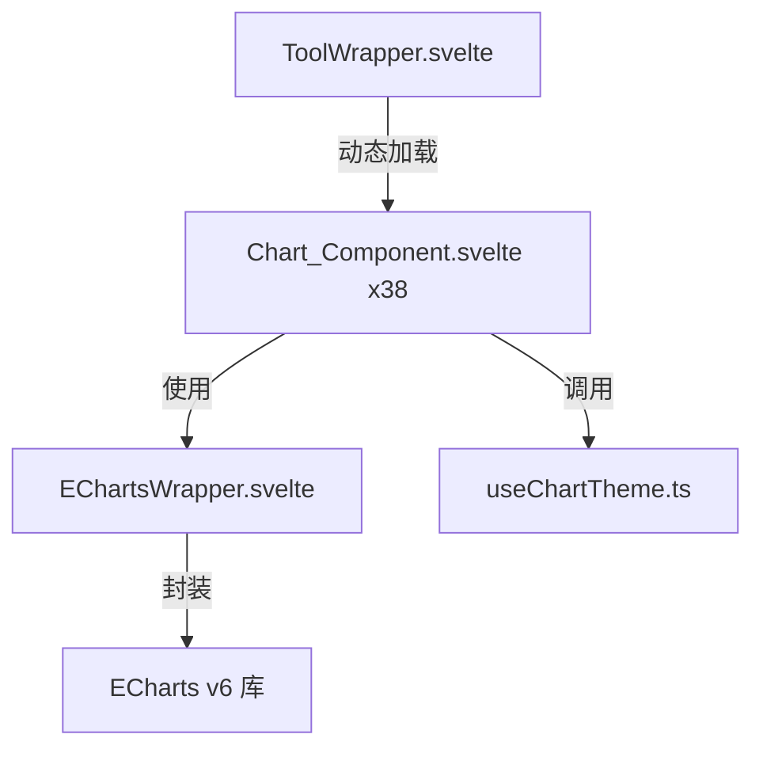

# Design Document: Fix Chart Tools Loading

## Overview

本设计修复 u2tool 项目中 38 个 ECharts 图表工具无法加载的三个根本问题：

1. **$state(() => ...) 误用** — Svelte 5 的 `$state(value)` 直接存储传入值。当传入箭头函数时，存储的是函数本身而非其返回值，导致后续 `.map()` 等数组方法调用失败。
2. **EChartsWrapper 清理逻辑** — `onMount` 返回的清理函数在 Svelte 5 中不保证执行，需要使用 `onDestroy` 确保 ResizeObserver 断开连接。
3. **ToolWrapper 已弃用 API** — `<svelte:component this={...}>` 在 Svelte 5 runes 模式下已弃用，需改用直接组件渲染。

修复策略是最小化变更：只修改有问题的代码行，不重构组件结构。

## Architecture

修复涉及三层组件：



修复方向：
- **ToolWrapper** → 替换 `<svelte:component>` 为 Svelte 5 动态组件语法
- **38 个 Chart_Component** → 17 个组件修复 `$state(() => ...)` 为 `$state(...)`
- **EChartsWrapper** → 确保 ResizeObserver 在 `onDestroy` 中清理

## Components and Interfaces

### 1. ToolWrapper.svelte（修复后）

变更：将 `<svelte:component this={loadedComponent}>` 替换为 Svelte 5 的动态渲染语法。

```svelte
<!-- 修复前 -->
<svelte:component this={loadedComponent} {locale} {translations} />

<!-- 修复后 -->
{@const Component = loadedComponent}
<Component {locale} {translations} />
```

接口不变：
```typescript
interface Props {
  slug: string;
  locale: string;
  translations: Record<string, unknown>;
}
```

### 2. EChartsWrapper.svelte（修复后）

变更：将 ResizeObserver 的清理从 `onMount` 返回值移到 `onDestroy`。

```svelte
<script lang="ts">
  // 修复前：onMount 返回清理函数（Svelte 5 中不可靠）
  onMount(() => {
    // ...init...
    const resizeObserver = new ResizeObserver(() => { chartInstance?.resize(); });
    resizeObserver.observe(containerEl);
    return () => { resizeObserver.disconnect(); }; // ← 不可靠
  });

  // 修复后：用模块级变量 + onDestroy
  let resizeObserver: ResizeObserver | undefined;

  onMount(() => {
    // ...init...
    resizeObserver = new ResizeObserver(() => { chartInstance?.resize(); });
    resizeObserver.observe(containerEl);
  });

  onDestroy(() => {
    resizeObserver?.disconnect();
    if (chartInstance) {
      chartInstance.dispose();
      chartInstance = undefined;
    }
  });
</script>
```

导出接口不变：
```typescript
export function getEchartsInstance(): EChartsInstance | undefined;
```

### 3. Chart_Component（17 个组件的修复模式）

变更模式统一：移除 `$state()` 中的箭头函数包装。

```typescript
// 修复前
let data = $state(() => defaultDataValues.map(item => ({ ... })));

// 修复后
let data = $state(defaultDataValues.map(item => ({ ... })));
```

```typescript
// 修复前（调用函数的情况）
let xAxisData = $state(() => getInitialXAxis());

// 修复后
let xAxisData = $state(getInitialXAxis());
```

## Data Models

无数据模型变更。所有组件的 Props 接口、数据结构和 ECharts option 格式保持不变。

修复仅影响 `$state` 初始化时的值类型：
- 修复前：`$state` 存储 `() => T[]` 类型（函数）
- 修复后：`$state` 存储 `T[]` 类型（数组）


## Correctness Properties

*A property is a characteristic or behavior that should hold true across all valid executions of a system — essentially, a formal statement about what the system should do. Properties serve as the bridge between human-readable specifications and machine-verifiable correctness guarantees.*

基于 prework 分析，本修复的可测试属性如下：

### Property 1: 无 $state 箭头函数残留

*For any* of the 17 affected Chart_Component source files, scanning the file content for the pattern `$state(() =>` SHALL yield zero matches.

**Validates: Requirements 1.1, 1.3**

### Property 2: 所有图表组件无错误加载

*For any* of the 38 chart tool slugs, dynamically importing the component module SHALL resolve successfully without throwing errors, and the module SHALL export a default Svelte component.

**Validates: Requirements 4.1**

### Property 3: ToolWrapper 无已弃用 API

*For the* ToolWrapper.svelte source file, scanning for the pattern `<svelte:component` SHALL yield zero matches.

**Validates: Requirements 3.1**

## Error Handling

- **EChartsWrapper**: 如果 `containerEl` 在 mount 时不可用，跳过初始化（已有 `if (!containerEl) return` 守卫）
- **EChartsWrapper**: `getEchartsInstance()` 在实例未初始化时返回 `undefined`，调用方已有防御性检查
- **ToolWrapper**: slug 不在 ToolImportMap 中时显示错误信息
- **ToolWrapper**: 动态 import 失败时 catch 错误并显示错误信息
- **Chart_Component**: `exportChart` 函数已有 `chartRef` 和 `echartInstance` 的空值检查

无需新增错误处理逻辑，现有的防御性编程已覆盖所有边界情况。

## Testing Strategy

### 静态分析测试（主要验证手段）

由于本修复是代码模式修正（不涉及新功能逻辑），最有效的验证方式是静态分析：

1. **$state 模式扫描**: 扫描 17 个文件，断言不存在 `$state(() =>` 模式
2. **svelte:component 扫描**: 扫描 ToolWrapper.svelte，断言不存在 `<svelte:component` 模式
3. **onMount 返回值扫描**: 扫描 EChartsWrapper.svelte，断言 `onMount` 回调不返回清理函数

### 构建验证

运行 `npm run build` 确保所有组件编译通过，无 TypeScript 类型错误。

### 手动冒烟测试

修复完成后，建议用户手动验证：
- 打开任意图表工具页面，确认图表正常渲染
- 修改图表数据，确认实时更新
- 导出 PNG/SVG，确认下载正常

### Property-Based Testing

由于本修复是代码模式修正而非逻辑变更，property-based testing 的价值有限。Property 1 和 Property 3 本质上是静态断言，可用简单的文件扫描脚本验证。Property 2 可通过遍历所有 38 个 chart slug 并尝试动态 import 来验证。

如果需要实现自动化测试，推荐使用 Vitest：
- 测试框架: Vitest（项目已使用）
- 静态扫描测试: 读取文件内容 + 正则匹配
- 动态 import 测试: 遍历 ToolImportMap 中的 chart 相关 slug
