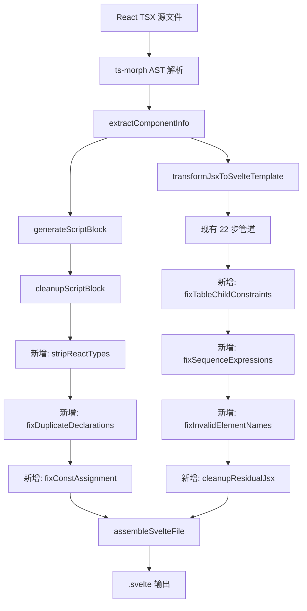

# 设计文档：修复剩余 29 个 Svelte 编译失败组件

## 概述

本设计描述修复转换器 `convert-react-to-svelte.ts` 以处理 29 个编译失败组件的 8 种错误模式。核心策略是在转换器的现有管道中增加/修改转换步骤，然后通过 `batch-reconvert.ts` 重新转换全部 507 个组件。

29 个失败组件的错误分布：
- Unexpected token / js_parse_error: 19 个（含 React 类型残留导致的解析错误）
- Table 子元素约束 (node_invalid_placement): 2 个
- 变量重复声明: 2 个
- Expected token: 2 个
- Invalid element name (tag_invalid_name): 2 个
- Sequence expression: 1 个
- Constant assignment: 1 个

## 架构

### 修复策略

修复分为两个层面：
1. **Script 块修复** — 在 `cleanupScriptBlock` 和 `generateScriptBlock` 中处理 React 类型残留、变量重复声明、const 赋值问题
2. **Template 块修复** — 在 `transformJsxToSvelteTemplate` 管道中处理 table 约束、序列表达式、无效标签名、未完整转换的 JSX 语法



## 组件与接口

### 1. React 类型清除函数 (Script 块)

```typescript
/**
 * 清除 script 块中所有 React 特有的类型注解
 * 在 cleanupScriptBlock 末尾调用
 */
function stripReactTypes(script: string): string

// 处理模式:
// - React.ChangeEvent<HTMLInputElement> → Event
// - React.ChangeEvent<HTMLTextAreaElement> → Event
// - React.ChangeEvent<HTMLSelectElement> → Event
// - React.DragEvent<HTMLElement> → DragEvent
// - React.DragEvent → DragEvent
// - React.MouseEvent<HTMLElement> → MouseEvent
// - React.MouseEvent → MouseEvent
// - React.TouchEvent → TouchEvent
// - React.KeyboardEvent → KeyboardEvent
// - React.FormEvent → Event
// - React.ReactElement[] → any[]（或移除类型注解）
// - React.ReactNode → any
// - React.FC<Props> → 移除
```

受影响组件: Base64ImageConverter, BicSwiftLookup, FaviconGenerator, GifSplitter, ImageToIco, SvgToImage, TreemapChartGenerator 等

### 2. 变量重复声明修复函数 (Script 块)

```typescript
/**
 * 检测并修复 script 块中的变量重复声明
 * 当 props 解构中的变量名与内部声明冲突时，重命名内部变量
 */
function fixDuplicateDeclarations(script: string, propsVarNames: string[]): string

// 处理模式:
// - props 中有 locale，内部又 let locale = $state('en')
//   → 重命名为 let selectedLocale = $state('en')
// - 函数内部 const newItems 声明两次（函数体被重复）
//   → 移除重复的函数体
```

受影响组件: FakeDataGenerator (locale), MeetingAgendaBuilder (newItems)

### 3. Const 赋值修复函数 (Script 块)

```typescript
/**
 * 检测 const 声明的变量后续被赋值的情况，将 const 改为 let
 */
function fixConstAssignment(script: string): string

// 处理模式:
// - const x = $state(...); 后续有 x = newValue;
//   → let x = $state(...);
```

受影响组件: WordCloudGenerator

### 4. Table 子元素约束修复函数 (Template 块)

```typescript
/**
 * 修复 <table> 内直接包含 {#if}/{#each}/文本节点的问题
 * 将这些节点包裹在 <tbody> 中
 */
function fixTableChildConstraints(template: string): string

// 处理模式:
// - <table>{#if ...}...<tr>...</tr>...{/if}</table>
//   → <table><tbody>{#if ...}<tr>...</tr>{/if}</tbody></table>
// - <table>{#each ...}...<tr>...</tr>...{/each}</table>
//   → <table><tbody>{#each ...}<tr>...</tr>{/each}</tbody></table>
// - <table> 文本 </table>
//   → <table><tbody></tbody></table>（移除文本）
```

受影响组件: CsvViewer, HtmlTableGenerator

### 5. 序列表达式修复函数 (Template 块)

```typescript
/**
 * 修复属性值中的逗号序列表达式
 * Svelte runes 模式不允许未括号包裹的序列表达式
 */
function fixSequenceExpressions(template: string): string

// 处理模式:
// - onchange={(e) => rule = rule.key, e.target.value}
//   → onchange={(e) => { rule = rule.key; e.target.value; }}
//   或更准确地修复为正确的逻辑
```

受影响组件: EslintConfigGenerator

### 6. 无效元素名修复函数 (Template 块)

```typescript
/**
 * 修复模板中无效的元素/组件名称
 * 处理残留的 JSX 表达式被误识别为标签名的情况
 */
function fixInvalidElementNames(template: string): string

// 处理模式:
// - 残留的 JSX 表达式片段被解析为标签名
// - 未完整转换的三元表达式导致的无效标签
```

受影响组件: PortScanner, TypingSpeedTest

### 7. 残留 JSX 清理函数 (Template 块)

```typescript
/**
 * 清理模板中残留的 JSX 语法片段
 * 作为最终的安全网步骤
 */
function cleanupResidualJsx(template: string): string

// 处理模式:
// - 残留的 {renderText()} 等 JSX 函数调用（如果函数返回 JSX）
// - 未转换的 JSX 三元表达式片段
// - 残留的 React 特有属性（如 ref={...}）
```

## 数据模型

### 29 个失败组件完整错误清单

| # | 组件 | 错误类型 | 具体错误 | 修复函数 |
|---|------|---------|---------|---------|
| 1 | Base64ImageConverter | js_parse_error | React 类型残留 | stripReactTypes |
| 2 | BicSwiftLookup | js_parse_error | React 类型残留 | stripReactTypes |
| 3 | BraSizeCalculator | js_parse_error | 未转换的 JSX 语法 | cleanupResidualJsx |
| 4 | ChangelogGenerator | js_parse_error | 未转换的 JSX 语法 | cleanupResidualJsx |
| 5 | ChangelogGeneratorAdvanced | js_parse_error | 未转换的 JSX 语法 | cleanupResidualJsx |
| 6 | CountdownTimer | js_parse_error | 未转换的 JSX 语法 | cleanupResidualJsx |
| 7 | CsvViewer | node_invalid_placement | table 子元素约束 | fixTableChildConstraints |
| 8 | DatabaseSchemaVisualizer | js_parse_error | 未转换的 JSX 语法 | cleanupResidualJsx |
| 9 | EslintConfigGenerator | attribute_invalid_sequence_expression | 序列表达式 | fixSequenceExpressions |
| 10 | FakeDataGenerator | js_parse_error | 变量重复声明 (locale) | fixDuplicateDeclarations |
| 11 | FaviconGenerator | js_parse_error | React 类型残留 | stripReactTypes |
| 12 | GifSplitter | js_parse_error | React 类型残留 | stripReactTypes |
| 13 | HabitTracker | js_parse_error | 未转换的 JSX 语法 | cleanupResidualJsx |
| 14 | HtmlTableGenerator | node_invalid_placement | table 子元素约束 | fixTableChildConstraints |
| 15 | ImageToIco | js_parse_error | React 类型残留 | stripReactTypes |
| 16 | MeetingAgendaBuilder | js_parse_error | 变量重复声明 (newItems) | fixDuplicateDeclarations |
| 17 | MeetingRoomFinder | js_parse_error | 未转换的 JSX 语法 | cleanupResidualJsx |
| 18 | PortScanner | tag_invalid_name | 无效元素名 | fixInvalidElementNames |
| 19 | RegexVisualizer | js_parse_error | 未转换的 JSX 语法 | cleanupResidualJsx |
| 20 | RingSizeCalculator | expected_token | 缺少 `}` | validateAndFixBlockTags 改进 |
| 21 | ScientificCalculator | js_parse_error | 子组件函数 + JSX 残留 | cleanupResidualJsx |
| 22 | SvgToImage | js_parse_error | React 类型残留 | stripReactTypes |
| 23 | TaxCalculator | js_parse_error | 未转换的 JSX 语法 | cleanupResidualJsx |
| 24 | ToolSkeleton | js_parse_error | 未转换的 JSX 语法 | cleanupResidualJsx |
| 25 | TreeChartGenerator | expected_token | 缺少 `>` | 泛型保护改进 |
| 26 | TreemapChartGenerator | js_parse_error | React.ReactElement[] 类型 | stripReactTypes |
| 27 | TypingSpeedTest | tag_invalid_name | 无效元素名 + 子组件 | fixInvalidElementNames |
| 28 | WordCloudGenerator | constant_assignment | const 赋值 | fixConstAssignment |
| 29 | XmlValidator | expected_token | 缺少 `}` | validateAndFixBlockTags 改进 |

### React 类型映射表

```typescript
const REACT_TYPE_MAP: Record<string, string> = {
  'React.ChangeEvent<HTMLInputElement>': 'Event',
  'React.ChangeEvent<HTMLTextAreaElement>': 'Event',
  'React.ChangeEvent<HTMLSelectElement>': 'Event',
  'React.ChangeEvent<HTMLInputElement | HTMLSelectElement | HTMLTextAreaElement>': 'Event',
  'React.DragEvent<HTMLElement>': 'DragEvent',
  'React.DragEvent': 'DragEvent',
  'React.MouseEvent<HTMLCanvasElement>': 'MouseEvent',
  'React.MouseEvent<HTMLElement>': 'MouseEvent',
  'React.MouseEvent': 'MouseEvent',
  'React.TouchEvent': 'TouchEvent',
  'React.KeyboardEvent': 'KeyboardEvent',
  'React.FormEvent': 'Event',
  'React.ReactElement[]': 'any[]',
  'React.ReactElement': 'any',
  'React.ReactNode': 'any',
};
```

### 转换器管道修改后的完整流程

```
generateScriptBlock(info, result):
  ... 现有逻辑 ...
  cleanupScriptBlock(script, info, result):
    ... 现有清理 ...
    → 新增: stripReactTypes(script)
    → 新增: fixDuplicateDeclarations(script, propsVarNames)
    → 新增: fixConstAssignment(script)

transformJsxToSvelteTemplate(jsx, result):
  Step 0-22: 现有管道不变
  → 新增 Step 23: fixTableChildConstraints(template)
  → 新增 Step 24: fixSequenceExpressions(template)
  → 新增 Step 25: fixInvalidElementNames(template)
  → 新增 Step 26: cleanupResidualJsx(template)
```


## 正确性属性

*正确性属性是一种在系统所有有效执行中都应成立的特征或行为——本质上是关于系统应该做什么的形式化陈述。属性是人类可读规范与机器可验证正确性保证之间的桥梁。*

### Property 1: React 类型注解完全清除

*For any* script 块字符串，如果其中包含一个或多个 `React.ChangeEvent`、`React.DragEvent`、`React.MouseEvent`、`React.TouchEvent`、`React.KeyboardEvent`、`React.FormEvent`、`React.ReactElement` 或 `React.ReactNode` 类型注解，经过 `stripReactTypes` 处理后，输出 SHALL 不包含任何以 `React.` 开头的类型引用，且每个 React 事件类型 SHALL 被替换为对应的原生 DOM 事件类型。

**Validates: Requirements 1.1, 1.2, 1.3, 1.4, 1.5, 1.6, 1.7, 1.8, 1.9**

### Property 2: Table 子元素约束修复

*For any* Svelte 模板字符串，如果 `<table>` 标签内直接包含 `{#if}`、`{#each}` 块或文本节点，经过 `fixTableChildConstraints` 处理后，这些块 SHALL 被包裹在 `<tbody>` 中，且 `<table>` 的直接子元素 SHALL 仅为 `<caption>`、`<colgroup>`、`<thead>`、`<tbody>`、`<tfoot>` 之一。

**Validates: Requirements 3.1, 3.2, 3.3**

### Property 3: 无重复变量声明

*For any* script 块字符串，如果其中包含通过 `$props()` 解构的变量名，且同一变量名在后续代码中被再次声明，经过 `fixDuplicateDeclarations` 处理后，输出 SHALL 不包含同一作用域内的重复 `let`/`const`/`var` 声明。

**Validates: Requirements 4.1, 4.2, 4.3**

### Property 4: 花括号平衡不变量

*For any* 经过完整转换管道处理的 Svelte 模板字符串，模板中 `{` 的数量 SHALL 等于 `}` 的数量（排除字符串字面量和 HTML 注释内的花括号）。

**Validates: Requirements 5.1, 5.3**

### Property 5: 序列表达式安全

*For any* Svelte 模板字符串，如果属性值中包含逗号序列表达式（形如 `attr={expr1, expr2}`），经过 `fixSequenceExpressions` 处理后，所有属性值中的序列表达式 SHALL 被括号包裹或重构为非序列表达式。

**Validates: Requirements 6.1, 6.2**

### Property 6: Const 赋值修复

*For any* script 块字符串，如果其中包含 `const x = $state(...)` 声明且后续代码中存在 `x = ...` 赋值语句，经过 `fixConstAssignment` 处理后，该声明 SHALL 使用 `let` 而非 `const`。

**Validates: Requirements 8.1, 8.2**

## 错误处理

### 转换器错误处理策略

1. **无法识别的 React 类型**: 如果遇到 `React.` 开头但不在映射表中的类型，`stripReactTypes` 将其替换为 `any` 并在 `result.todos` 中记录警告
2. **复杂的重复声明**: 如果重复声明出现在嵌套作用域中（如 for 循环内），`fixDuplicateDeclarations` 跳过处理并记录 TODO
3. **Table 结构过于复杂**: 如果 `<table>` 内的嵌套结构无法通过简单包裹修复，记录 TODO 并保持原样
4. **修复后仍编译失败**: 如果某个组件在所有修复步骤后仍然编译失败，`batch-reconvert.ts` 将其记录在报告的 `failed` 数组中，不影响其他组件的转换

### 回归保护

- 所有新增函数都是追加到现有管道末尾，不修改现有步骤的逻辑
- 新增函数仅在检测到特定模式时才进行转换，对不匹配的输入保持原样
- 批量重新转换后验证之前成功的 478 个组件仍然通过编译

## 测试策略

### 属性测试 (Property-Based Testing)

使用 Vitest + fast-check 进行属性测试。每个属性测试运行至少 100 次迭代。

**测试库**: `fast-check` (已在项目中使用)

**生成器设计**:
- `arbReactType`: 从 REACT_TYPE_MAP 的键中随机选择一个 React 类型
- `arbFunctionSignature`: 生成包含随机 React 类型注解的函数签名
- `arbTableTemplate`: 生成包含 `{#if}`/`{#each}` 块的 `<table>` 模板
- `arbPropsAndVars`: 生成 props 变量名列表和可能冲突的内部变量声明
- `arbSequenceExpr`: 生成包含逗号序列表达式的属性值

**属性测试标注格式**:
```
Feature: fix-remaining-svelte-failures, Property N: property_text
```

### 单元测试

针对每种错误类型编写具体的输入/输出示例测试：
- 每个失败组件的错误模式至少一个测试用例
- 边界情况：空输入、嵌套深度极大、多种错误同时出现
- 回归测试：确保已成功转换的组件模式不受影响

### 集成测试

- 运行 `batch-reconvert.ts` 验证全部 507 个组件编译通过
- 验证迁移报告中 `failed` 数组为空
