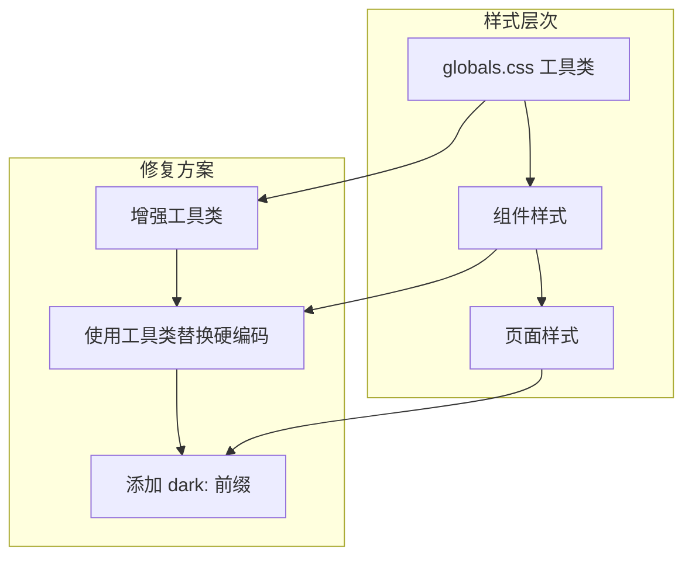

# Design Document: Light Mode Fix

## Overview

本设计文档描述了修复网站浅色模式可读性问题的技术方案。核心问题是大量工具组件使用了硬编码的深色样式，需要系统性地添加浅色模式支持。

## Architecture

### 修复策略

采用分层修复策略：

1. **全局样式层** - 增强 `globals.css` 中的工具类
2. **组件层** - 批量修复工具组件
3. **页面层** - 修复页面级样式



### 颜色方案

#### 浅色模式 (Light Mode)
| 元素 | 背景色 | 文字色 | 边框色 |
|------|--------|--------|--------|
| 页面背景 | white | gray-900 | - |
| 卡片/面板 | gray-50/gray-100 | gray-900 | gray-200 |
| 输入框 | gray-100 | gray-900 | gray-200 |
| 代码块 | gray-100 | gray-800 | gray-200 |
| 按钮(次要) | gray-200 | gray-900 | gray-300 |

#### 深色模式 (Dark Mode)
| 元素 | 背景色 | 文字色 | 边框色 |
|------|--------|--------|--------|
| 页面背景 | black | white | - |
| 卡片/面板 | gray-800/gray-900 | white | gray-700 |
| 输入框 | gray-900 | gray-100 | gray-700 |
| 代码块 | gray-900 | gray-100 | gray-700 |
| 按钮(次要) | gray-700 | white | gray-600 |

## Components and Interfaces

### 1. 增强的工具类 (globals.css)

```css
/* 基础工具类 - 支持 light/dark 模式 */
.tool-textarea {
  @apply w-full h-48 bg-gray-100 dark:bg-gray-900 
         border border-gray-200 dark:border-gray-700 
         rounded-lg p-4 font-mono text-sm 
         text-gray-900 dark:text-gray-100 
         focus:outline-none focus:border-blue-500 resize-none;
}

.tool-input {
  @apply w-full px-3 py-2 bg-gray-100 dark:bg-gray-900 
         border border-gray-200 dark:border-gray-700 
         rounded-lg text-gray-900 dark:text-gray-100
         focus:outline-none focus:border-blue-500;
}

.tool-select {
  @apply w-full px-3 py-2 bg-gray-100 dark:bg-gray-900 
         border border-gray-200 dark:border-gray-700 
         rounded-lg text-gray-900 dark:text-gray-100
         focus:outline-none focus:border-blue-500;
}

.tool-panel {
  @apply p-4 bg-gray-100 dark:bg-gray-800 
         border border-gray-200 dark:border-gray-700 rounded-lg;
}

.tool-result {
  @apply p-4 bg-gray-100 dark:bg-gray-900 
         border border-gray-200 dark:border-gray-700 
         rounded-lg text-gray-900 dark:text-gray-100;
}

.tool-code {
  @apply font-mono text-sm break-all text-green-600 dark:text-green-400;
}

.tool-label {
  @apply block text-sm font-medium text-gray-700 dark:text-gray-300 mb-2;
}

.tool-error {
  @apply p-3 bg-red-100 dark:bg-red-900/50 
         border border-red-300 dark:border-red-700 
         rounded-lg text-red-700 dark:text-red-300 text-sm;
}

.tool-tab {
  @apply px-4 py-2 rounded-lg text-sm transition-colors;
}

.tool-tab-active {
  @apply bg-blue-600 text-white;
}

.tool-tab-inactive {
  @apply bg-gray-200 dark:bg-gray-800 text-gray-900 dark:text-white 
         hover:bg-gray-300 dark:hover:bg-gray-700;
}

/* 按钮样式 */
.btn-primary {
  @apply px-4 py-2 bg-blue-600 text-white rounded-lg 
         hover:bg-blue-700 transition-all duration-200 font-medium;
}

.btn-secondary {
  @apply px-4 py-2 bg-gray-200 dark:bg-gray-700 
         text-gray-900 dark:text-white rounded-lg 
         hover:bg-gray-300 dark:hover:bg-gray-600 
         transition-all duration-200 font-medium;
}
```

### 2. 组件修复模式

#### 模式 A: 使用工具类替换硬编码样式

```tsx
// 修复前
<textarea className="w-full h-48 p-3 bg-gray-800 border border-gray-700 rounded-lg" />

// 修复后
<textarea className="tool-textarea" />
```

#### 模式 B: 添加 dark: 前缀

```tsx
// 修复前
<div className="p-4 bg-gray-800 rounded-lg">

// 修复后
<div className="p-4 bg-gray-100 dark:bg-gray-800 rounded-lg">
```

#### 模式 C: 完整的双模式样式

```tsx
// 修复前
<div className="bg-gray-900 text-white border-gray-700">

// 修复后
<div className="bg-gray-100 dark:bg-gray-900 text-gray-900 dark:text-white border-gray-200 dark:border-gray-700">
```

### 3. 需要修复的组件列表

根据代码分析，以下组件需要修复：

**高优先级（常用工具）**:
- HtmlEntityConverter.tsx
- CsvToJson.tsx
- RobotsTxtGenerator.tsx
- FileHash.tsx
- CsvViewer.tsx
- JsonToCsv.tsx
- XmlFormatter.tsx
- YamlJson.tsx

**中优先级（图表工具）**:
- PolarBarChartGenerator.tsx
- 其他图表生成器组件

**低优先级（其他工具）**:
- 其余使用硬编码样式的组件

## Data Models

### 样式映射表

```typescript
// 硬编码样式到双模式样式的映射
const styleMapping = {
  'bg-gray-800': 'bg-gray-100 dark:bg-gray-800',
  'bg-gray-900': 'bg-gray-100 dark:bg-gray-900',
  'bg-gray-700': 'bg-gray-200 dark:bg-gray-700',
  'border-gray-700': 'border-gray-200 dark:border-gray-700',
  'border-gray-600': 'border-gray-300 dark:border-gray-600',
  'text-white': 'text-gray-900 dark:text-white',
  'text-gray-300': 'text-gray-600 dark:text-gray-300',
  'text-gray-400': 'text-gray-500 dark:text-gray-400',
};
```

## Correctness Properties

*A property is a characteristic or behavior that should hold true across all valid executions of a system-essentially, a formal statement about what the system should do. Properties serve as the bridge between human-readable specifications and machine-verifiable correctness guarantees.*

### Property 1: Light Mode Background Consistency

*For any* tool component rendered in light mode, the background color SHALL be a light color (white, gray-50, gray-100, or gray-200) and NOT a dark color (gray-700, gray-800, gray-900, or black).

**Validates: Requirements 1.2, 2.1**

### Property 2: Text Contrast Ratio

*For any* text element in the application, the contrast ratio between the text color and its background SHALL be at least 4.5:1 in both light mode and dark mode.

**Validates: Requirements 1.4, 2.2, 4.4, 5.2**

### Property 3: Dark Prefix Completeness

*For any* Tailwind class using a dark background color (bg-gray-700, bg-gray-800, bg-gray-900, bg-black), there SHALL be a corresponding light mode variant (either as a base class or the dark class should be prefixed with `dark:`).

**Validates: Requirements 2.4**

### Property 4: Form Element Visibility

*For any* form element (input, textarea, select) in light mode, the element SHALL have a visible border (border-gray-200 or border-gray-300) and a light background.

**Validates: Requirements 4.1, 4.2**

### Property 5: Button Style Consistency

*For any* secondary button, the background color SHALL be gray-200 in light mode and gray-700 in dark mode, with appropriate text colors for contrast.

**Validates: Requirements 6.2**

## Error Handling

### 样式冲突处理

当组件同时使用工具类和自定义样式时：
- 自定义样式应该覆盖工具类
- 确保自定义样式也包含双模式支持

### 渐进式修复

- 优先修复高频使用的工具组件
- 使用工具类减少重复代码
- 保持向后兼容性

## Testing Strategy

### Unit Tests

1. **CSS 类存在性测试**
   - 验证 globals.css 包含所有必需的工具类
   - 验证每个工具类都有 light 和 dark 变体

2. **组件渲染测试**
   - 验证组件在 light mode 下正确渲染
   - 验证组件在 dark mode 下正确渲染

### Property-Based Tests

1. **Property 1: Light Mode Background Consistency**
   - 遍历所有工具组件
   - 在 light mode 下检查背景色
   - 验证没有深色背景

2. **Property 3: Dark Prefix Completeness**
   - 扫描所有 TSX 文件
   - 查找使用深色背景类的元素
   - 验证都有对应的 light mode 样式

### Visual Regression Tests

- 使用 Playwright 截图对比
- 在 light mode 和 dark mode 下分别截图
- 验证视觉一致性

### Testing Configuration

```typescript
// vitest.config.ts
export default defineConfig({
  test: {
    environment: 'jsdom',
    setupFiles: ['./src/test/setup.ts'],
  },
});
```

## Implementation Notes

### 修复顺序

1. 首先增强 `globals.css` 中的工具类
2. 修复 loading 组件（用户首先看到）
3. 修复高频使用的工具组件
4. 批量修复剩余组件

### 批量修复脚本

可以使用正则表达式批量替换：

```bash
# 示例：替换硬编码的 bg-gray-800
find src/components/tools -name "*.tsx" -exec sed -i '' \
  's/bg-gray-800/bg-gray-100 dark:bg-gray-800/g' {} \;
```

### 验证方法

修复后需要：
1. 在浏览器中切换到 light mode
2. 检查每个修复的组件
3. 确保文字可读、背景正确

