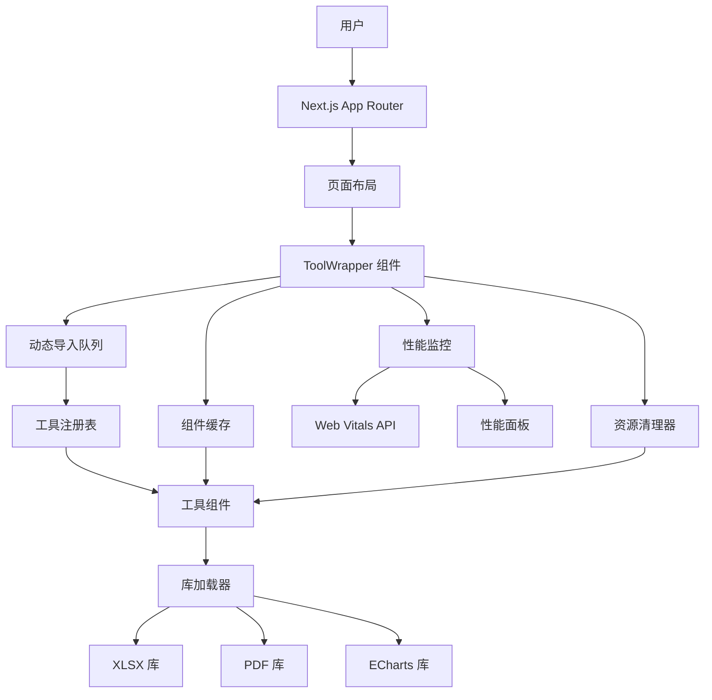
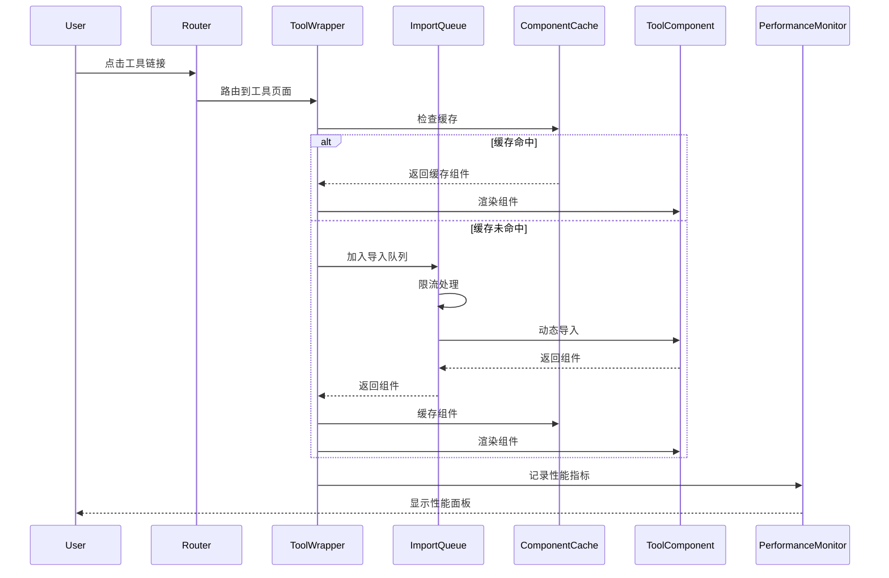

# Design Document: Page Unresponsive Fix

## Overview

本设计文档针对 U2Tool 应用的"页面无响应"问题提供系统性的解决方案。问题的核心在于：当用户频繁切换工具时，浏览器主线程被长时间阻塞，导致界面冻结和"页面无响应"警告。

虽然已完成多项优化（React Hooks 依赖修复、定时器泄漏修复、代码分割优化），但问题仍然存在，这表明根本原因可能是：

1. **架构层面问题**：402 个工具的动态导入定义集中在单个 ToolRegistry 文件中
2. **累积效应**：每次工具切换都会增加内存压力和主线程负担
3. **并发导入问题**：快速切换工具时，多个动态导入同时执行导致主线程阻塞
4. **资源清理不彻底**：工具卸载时未完全释放资源

### 设计目标

1. **诊断优先**：建立可靠的性能监控系统，准确识别根本原因
2. **渐进式修复**：采用分阶段策略，每个阶段都可独立验证和回滚
3. **性能目标**：
   - 单次任务执行时间 < 50ms
   - 工具加载时间 < 1s (90th percentile)
   - INP (Interaction to Next Paint) < 200ms
   - 连续操作 20 次后内存增长 < 50MB
4. **用户体验**：即使在性能问题发生时，也要保持应用可用性

### 技术栈

- **框架**: Next.js 16 (App Router + Turbopack)
- **React**: React 18 (Concurrent Mode)
- **部署**: Vercel Platform
- **监控**: Web Vitals API + Custom Performance Monitor
- **大型库**: XLSX, PDF-lib, ECharts

## Architecture

### 系统架构图



### 核心组件设计

#### 1. 动态导入队列 (ImportQueue)

**问题**：当前所有动态导入都是并发执行的，快速切换工具时会导致主线程阻塞。

**解决方案**：实现一个导入队列，限制并发导入数量，并支持取消低优先级导入。


```typescript
class ImportQueue {
  private queue: ImportTask[] = [];
  private activeImports: Set<string> = new Set();
  private maxConcurrent: number = 2; // 最多同时 2 个导入
  
  async enqueue(toolSlug: string, priority: 'high' | 'low'): Promise<Component> {
    // 如果已经在导入，返回现有 Promise
    if (this.activeImports.has(toolSlug)) {
      return this.findActiveImport(toolSlug);
    }
    
    // 创建导入任务
    const task = new ImportTask(toolSlug, priority);
    this.queue.push(task);
    
    // 按优先级排序
    this.queue.sort((a, b) => b.priority - a.priority);
    
    // 处理队列
    this.processQueue();
    
    return task.promise;
  }
  
  private async processQueue() {
    // 如果达到并发上限，等待
    if (this.activeImports.size >= this.maxConcurrent) {
      return;
    }
    
    // 取出最高优先级任务
    const task = this.queue.shift();
    if (!task) return;
    
    this.activeImports.add(task.toolSlug);
    
    try {
      // 使用 requestIdleCallback 在空闲时导入
      await this.importWithIdleCallback(task);
    } finally {
      this.activeImports.delete(task.toolSlug);
      this.processQueue(); // 继续处理队列
    }
  }
  
  cancelLowPriority() {
    // 取消所有低优先级任务
    this.queue = this.queue.filter(task => {
      if (task.priority === 'low') {
        task.cancel();
        return false;
      }
      return true;
    });
  }
}
```

#### 2. 工具注册表拆分 (ToolRegistry Split)

**问题**：当前 ToolWrapper.tsx 包含 402 个工具的动态导入定义，文件过大（~15KB）。

**解决方案**：按分类拆分为多个注册表文件，按需加载。

```typescript
// src/components/tools/registries/index.ts
export const registryMap = {
  'text': () => import('./text-tools-registry'),
  'image': () => import('./image-tools-registry'),
  'converter': () => import('./converter-tools-registry'),
  'calculator': () => import('./calculator-tools-registry'),
  'generator': () => import('./generator-tools-registry'),
  'chart': () => import('./chart-tools-registry'),
  // ... 其他分类
};

// src/components/tools/registries/text-tools-registry.ts
export const textToolsRegistry = {
  'word-counter': () => import('../WordCounter'),
  'text-to-slug': () => import('../TextToSlug'),
  // ... 其他文本工具
};
```

**ToolWrapper 修改**：

```typescript
async function loadToolComponent(slug: string, category: string) {
  // 1. 加载对应分类的注册表
  const registryLoader = registryMap[category];
  if (!registryLoader) {
    throw new Error(`Unknown category: ${category}`);
  }
  
  const registry = await registryLoader();
  
  // 2. 从注册表中加载工具组件
  const componentLoader = registry[slug];
  if (!componentLoader) {
    throw new Error(`Tool not found: ${slug}`);
  }
  
  return await componentLoader();
}
```

#### 3. 组件缓存 (ComponentCache)

**问题**：每次切换工具都会重新导入组件，即使之前已经加载过。

**解决方案**：实现 LRU 缓存，缓存最近使用的工具组件。

```typescript
class ComponentCache {
  private cache: Map<string, CachedComponent> = new Map();
  private maxSize: number = 10; // 最多缓存 10 个组件
  private accessOrder: string[] = []; // LRU 顺序
  
  get(slug: string): Component | null {
    const cached = this.cache.get(slug);
    if (!cached) return null;
    
    // 更新访问顺序
    this.updateAccessOrder(slug);
    
    return cached.component;
  }
  
  set(slug: string, component: Component) {
    // 如果缓存已满，移除最久未使用的
    if (this.cache.size >= this.maxSize) {
      const lruSlug = this.accessOrder.shift();
      if (lruSlug) {
        this.cache.delete(lruSlug);
      }
    }
    
    this.cache.set(slug, {
      component,
      timestamp: Date.now(),
      memorySize: this.estimateMemorySize(component)
    });
    
    this.updateAccessOrder(slug);
  }
  
  clear() {
    this.cache.clear();
    this.accessOrder = [];
  }
  
  private updateAccessOrder(slug: string) {
    // 移除旧位置
    const index = this.accessOrder.indexOf(slug);
    if (index > -1) {
      this.accessOrder.splice(index, 1);
    }
    // 添加到末尾（最近使用）
    this.accessOrder.push(slug);
  }
}
```


#### 4. 性能监控系统 (PerformanceMonitor)

**问题**：缺乏实时性能监控，无法准确定位问题。

**解决方案**：实现一个 Client Component 性能监控系统，集成 Web Vitals API。

```typescript
'use client';

import { useEffect, useState } from 'react';
import { onCLS, onFID, onLCP, onINP, onTTFB } from 'web-vitals';

interface PerformanceMetrics {
  toolLoadTime: number;
  memoryUsage: number;
  longTasks: LongTask[];
  webVitals: WebVitalsMetrics;
}

export function PerformanceMonitor() {
  const [metrics, setMetrics] = useState<PerformanceMetrics>({
    toolLoadTime: 0,
    memoryUsage: 0,
    longTasks: [],
    webVitals: {}
  });
  
  useEffect(() => {
    // 监控 Web Vitals
    onCLS((metric) => updateMetric('CLS', metric.value));
    onFID((metric) => updateMetric('FID', metric.value));
    onLCP((metric) => updateMetric('LCP', metric.value));
    onINP((metric) => updateMetric('INP', metric.value));
    onTTFB((metric) => updateMetric('TTFB', metric.value));
    
    // 监控 Long Tasks
    if ('PerformanceObserver' in window) {
      const observer = new PerformanceObserver((list) => {
        for (const entry of list.getEntries()) {
          if (entry.duration > 50) {
            recordLongTask(entry);
          }
        }
      });
      observer.observe({ entryTypes: ['longtask'] });
      
      return () => observer.disconnect();
    }
    // eslint-disable-next-line react-hooks/exhaustive-deps
  }, []);
  
  useEffect(() => {
    // 监控内存使用
    const interval = setInterval(() => {
      if ('memory' in performance) {
        const memory = (performance as any).memory;
        setMetrics(prev => ({
          ...prev,
          memoryUsage: memory.usedJSHeapSize / 1024 / 1024 // MB
        }));
      }
    }, 5000);
    
    return () => clearInterval(interval);
  }, []);
  
  return (
    <div className="performance-panel">
      {/* 性能指标可视化 */}
    </div>
  );
}
```

#### 5. 库加载器 (LibraryLoader)

**问题**：大型库（XLSX、PDF、ECharts）的加载和使用不够优化。

**解决方案**：实现统一的库加载器，支持缓存和共享实例。

```typescript
class LibraryLoader {
  private static instances: Map<string, any> = new Map();
  private static loading: Map<string, Promise<any>> = new Map();
  
  static async loadXLSX() {
    return this.loadLibrary('xlsx', async () => {
      const XLSX = await import('xlsx');
      return XLSX;
    });
  }
  
  static async loadPDF() {
    return this.loadLibrary('pdf-lib', async () => {
      const { PDFDocument } = await import('pdf-lib');
      return { PDFDocument };
    });
  }
  
  static async loadECharts() {
    return this.loadLibrary('echarts', async () => {
      // 使用 Tree-shaking 导入
      const echarts = await import('echarts/core');
      const { BarChart, LineChart } = await import('echarts/charts');
      const { GridComponent } = await import('echarts/components');
      const { CanvasRenderer } = await import('echarts/renderers');
      
      echarts.use([BarChart, LineChart, GridComponent, CanvasRenderer]);
      return echarts;
    });
  }
  
  private static async loadLibrary<T>(
    name: string,
    loader: () => Promise<T>
  ): Promise<T> {
    // 如果已加载，直接返回
    if (this.instances.has(name)) {
      return this.instances.get(name);
    }
    
    // 如果正在加载，等待
    if (this.loading.has(name)) {
      return this.loading.get(name);
    }
    
    // 开始加载
    const loadingPromise = loader();
    this.loading.set(name, loadingPromise);
    
    try {
      const instance = await loadingPromise;
      this.instances.set(name, instance);
      return instance;
    } finally {
      this.loading.delete(name);
    }
  }
  
  static releaseLibrary(name: string) {
    this.instances.delete(name);
  }
}
```

#### 6. 资源清理器 (ResourceCleaner)

**问题**：工具卸载时资源清理不彻底。

**解决方案**：实现统一的资源清理机制。

```typescript
class ResourceCleaner {
  private static cleanupCallbacks: Map<string, (() => void)[]> = new Map();
  
  static registerCleanup(toolSlug: string, callback: () => void) {
    if (!this.cleanupCallbacks.has(toolSlug)) {
      this.cleanupCallbacks.set(toolSlug, []);
    }
    this.cleanupCallbacks.get(toolSlug)!.push(callback);
  }
  
  static cleanup(toolSlug: string) {
    const callbacks = this.cleanupCallbacks.get(toolSlug);
    if (callbacks) {
      callbacks.forEach(cb => {
        try {
          cb();
        } catch (error) {
          console.error(`Cleanup error for ${toolSlug}:`, error);
        }
      });
      this.cleanupCallbacks.delete(toolSlug);
    }
  }
  
  static cleanupAll() {
    this.cleanupCallbacks.forEach((callbacks, toolSlug) => {
      this.cleanup(toolSlug);
    });
  }
}
```

## Components and Interfaces

### 核心接口定义

```typescript
// 工具组件接口
interface ToolComponent {
  slug: string;
  category: string;
  render(): ReactElement;
  cleanup?(): void;
}

// 导入任务接口
interface ImportTask {
  toolSlug: string;
  priority: 'high' | 'low';
  promise: Promise<Component>;
  cancel(): void;
}

// 性能指标接口
interface PerformanceMetrics {
  toolLoadTime: number;
  memoryUsage: number;
  longTasks: LongTask[];
  webVitals: {
    CLS?: number;
    FID?: number;
    LCP?: number;
    INP?: number;
    TTFB?: number;
  };
}

// Long Task 接口
interface LongTask {
  name: string;
  duration: number;
  startTime: number;
  attribution?: string;
}

// 缓存组件接口
interface CachedComponent {
  component: Component;
  timestamp: number;
  memorySize: number;
}

// 库加载器接口
interface LibraryLoader {
  loadXLSX(): Promise<typeof import('xlsx')>;
  loadPDF(): Promise<{ PDFDocument: any }>;
  loadECharts(): Promise<typeof import('echarts/core')>;
  releaseLibrary(name: string): void;
}
```

### 组件交互流程



## Data Models

### 性能数据模型

```typescript
// 性能快照
interface PerformanceSnapshot {
  timestamp: number;
  toolSlug: string;
  metrics: {
    loadTime: number;
    renderTime: number;
    memoryBefore: number;
    memoryAfter: number;
    longTasks: LongTask[];
  };
}

// 性能报告
interface PerformanceReport {
  sessionId: string;
  startTime: number;
  endTime: number;
  snapshots: PerformanceSnapshot[];
  summary: {
    totalToolSwitches: number;
    averageLoadTime: number;
    maxMemoryUsage: number;
    longTaskCount: number;
    webVitals: WebVitalsMetrics;
  };
}
```

### 导入队列数据模型

```typescript
// 导入任务状态
enum ImportTaskStatus {
  PENDING = 'pending',
  LOADING = 'loading',
  COMPLETED = 'completed',
  CANCELLED = 'cancelled',
  FAILED = 'failed'
}

// 导入任务
interface ImportTask {
  id: string;
  toolSlug: string;
  category: string;
  priority: 'high' | 'low';
  status: ImportTaskStatus;
  startTime?: number;
  endTime?: number;
  error?: Error;
}
```

### 缓存数据模型

```typescript
// 缓存条目
interface CacheEntry {
  key: string;
  component: Component;
  size: number;
  accessCount: number;
  lastAccess: number;
  createdAt: number;
}

// 缓存统计
interface CacheStats {
  size: number;
  maxSize: number;
  hitRate: number;
  missRate: number;
  evictionCount: number;
}
```

