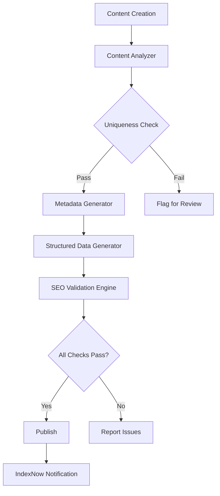

# Design Document: SEO Audit & AI-Safe Optimization

## Overview

本设计文档描述了SEO审查和AI内容风险规避的技术实现方案。目标是在现有SEO基础上，通过增强E-E-A-T信号、提升内容独特性、优化用户体验来快速提升搜索排名，同时规避AI生成内容可能带来的SEO负面影响。

## Architecture

### 系统架构

```
┌─────────────────────────────────────────────────────────────────┐
│                        SEO Optimization Layer                    │
├─────────────────────────────────────────────────────────────────┤
│  ┌─────────────┐  ┌─────────────┐  ┌─────────────┐              │
│  │   Content   │  │  Metadata   │  │ Performance │              │
│  │  Analyzer   │  │  Generator  │  │  Monitor    │              │
│  └─────────────┘  └─────────────┘  └─────────────┘              │
│         │                │                │                      │
│  ┌─────────────────────────────────────────────────────────┐    │
│  │                    SEO Validation Engine                 │    │
│  │  ┌──────────┐ ┌──────────┐ ┌──────────┐ ┌──────────┐   │    │
│  │  │Uniqueness│ │ Metadata │ │Structured│ │  Mobile  │   │    │
│  │  │ Checker  │ │ Validator│ │  Data    │ │ Checker  │   │    │
│  │  └──────────┘ └──────────┘ └──────────┘ └──────────┘   │    │
│  └─────────────────────────────────────────────────────────┘    │
├─────────────────────────────────────────────────────────────────┤
│                        Existing SEO Infrastructure               │
│  ┌─────────┐ ┌─────────┐ ┌─────────┐ ┌─────────┐ ┌─────────┐   │
│  │ Sitemap │ │ Robots  │ │ JSON-LD │ │IndexNow │ │   RSS   │   │
│  └─────────┘ └─────────┘ └─────────┘ └─────────┘ └─────────┘   │
└─────────────────────────────────────────────────────────────────┘
```

### 数据流



## Components and Interfaces

### 1. Content Analyzer (`src/lib/content-analyzer.ts`)

负责分析内容独特性和AI内容风险。

```typescript
interface ContentAnalysisResult {
  uniquenessScore: number;      // 0-100, 独特性分数
  templateSimilarity: number;   // 0-100, 与模板的相似度
  sentenceVariety: number;      // 0-100, 句式多样性
  keywordDensity: number;       // 关键词密度
  flags: ContentFlag[];         // 问题标记
}

interface ContentFlag {
  type: 'repetitive' | 'template-like' | 'keyword-stuffing' | 'too-short';
  severity: 'warning' | 'error';
  message: string;
  location?: string;
}

// 分析工具描述的独特性
function analyzeContentUniqueness(
  content: string,
  templatePatterns: string[]
): ContentAnalysisResult;

// 检测AI生成内容的特征
function detectAIContentPatterns(content: string): ContentFlag[];

// 计算句式多样性
function calculateSentenceVariety(content: string): number;
```

### 2. Metadata Validator (`src/lib/metadata-validator.ts`)

验证SEO元数据的完整性和正确性。

```typescript
interface MetadataValidationResult {
  isValid: boolean;
  errors: MetadataError[];
  warnings: MetadataWarning[];
}

interface MetadataError {
  field: string;
  message: string;
  expected?: string;
  actual?: string;
}

// 验证页面元数据
function validatePageMetadata(
  locale: string,
  path: string,
  metadata: Metadata
): MetadataValidationResult;

// 验证hreflang标签完整性
function validateHreflangTags(
  locale: string,
  path: string,
  alternates: Record<string, string>
): MetadataValidationResult;

// 验证canonical URL
function validateCanonicalUrl(
  locale: string,
  path: string,
  canonical: string
): MetadataValidationResult;
```

### 3. Structured Data Validator (`src/lib/structured-data-validator.ts`)

验证JSON-LD结构化数据的有效性。

```typescript
interface StructuredDataValidationResult {
  isValid: boolean;
  errors: SchemaError[];
  warnings: SchemaWarning[];
  schemaTypes: string[];
}

// 验证JSON-LD数据
function validateJsonLd(jsonLd: object | object[]): StructuredDataValidationResult;

// 验证特定Schema类型
function validateSchemaType(
  data: object,
  expectedType: string
): StructuredDataValidationResult;
```

### 4. Mobile Optimization Checker (`src/lib/mobile-checker.ts`)

检查移动端优化状态。

```typescript
interface MobileCheckResult {
  isOptimized: boolean;
  touchTargetSize: { passed: boolean; issues: string[] };
  fontSize: { passed: boolean; issues: string[] };
  viewport: { passed: boolean; issues: string[] };
  inputTypes: { passed: boolean; issues: string[] };
}

// 检查触摸目标大小
function checkTouchTargetSize(element: HTMLElement): boolean;

// 检查字体大小
function checkFontSize(element: HTMLElement): boolean;

// 检查输入类型
function checkInputTypes(form: HTMLFormElement): { passed: boolean; issues: string[] };
```

### 5. SEO Audit Script (`scripts/seo-audit.ts`)

综合SEO审计脚本。

```typescript
interface SEOAuditReport {
  timestamp: string;
  summary: {
    totalPages: number;
    passedPages: number;
    failedPages: number;
    warnings: number;
  };
  contentAnalysis: ContentAnalysisResult[];
  metadataValidation: MetadataValidationResult[];
  structuredDataValidation: StructuredDataValidationResult[];
  mobileOptimization: MobileCheckResult[];
  recommendations: string[];
}

// 运行完整SEO审计
async function runSEOAudit(options: AuditOptions): Promise<SEOAuditReport>;

// 生成审计报告
function generateAuditReport(results: SEOAuditReport): string;
```

## Data Models

### Content Analysis Data

```typescript
interface ToolContent {
  slug: string;
  locale: string;
  name: string;
  description: string;
  seoTitle: string;
  seoDescription: string;
  faqs: FAQ[];
  lastModified: Date;
}

interface FAQ {
  question: string;
  answer: string;
}
```

### Validation Results

```typescript
interface ValidationSummary {
  category: 'content' | 'metadata' | 'structured-data' | 'mobile' | 'performance';
  status: 'pass' | 'fail' | 'warning';
  score: number;
  details: string[];
}
```

## Correctness Properties

*A property is a characteristic or behavior that should hold true across all valid executions of a system-essentially, a formal statement about what the system should do. Properties serve as the bridge between human-readable specifications and machine-verifiable correctness guarantees.*

### Property 1: Content Uniqueness

*For any* tool description in the system, the uniqueness score compared to template patterns SHALL be at least 60%, and the sentence variety score SHALL be at least 50%.

**Validates: Requirements 1.1, 1.2, 1.4, 10.1, 10.2, 10.5**

### Property 2: Metadata Completeness

*For any* page in the system across all 10 supported languages, the page SHALL have:
- A valid canonical URL pointing to itself
- Complete hreflang tags for all 10 languages plus x-default
- Title length <= 60 characters
- Description length between 120-160 characters

**Validates: Requirements 4.1, 4.2, 9.1, 9.2**

### Property 3: Performance Metrics

*For any* tool page in the system, the Core Web Vitals SHALL meet:
- LCP < 2.5 seconds
- INP < 200 milliseconds
- CLS < 0.1

**Validates: Requirements 3.1, 3.2, 3.3**

### Property 4: Mobile Optimization

*For any* interactive element on the page:
- Touch targets SHALL be at least 44x44 pixels
- Base font size SHALL be at least 16px
- Form inputs SHALL use appropriate input types for mobile keyboards

**Validates: Requirements 6.1, 6.2, 6.3, 6.4**

### Property 5: Structured Data Validity

*For any* page with JSON-LD structured data:
- The JSON-LD SHALL be valid JSON
- The @type SHALL be a valid Schema.org type
- Required properties for each type SHALL be present
- BreadcrumbList SHALL be present on tool pages

**Validates: Requirements 4.3, 4.4, 7.4, 9.3**

### Property 6: Internal Linking Quality

*For any* tool page, the related tools section SHALL:
- Display at least 4 related tools
- Use tool names as anchor text
- Include tools from the same category

**Validates: Requirements 7.1, 7.2**

### Property 7: Translation Fallback

*For any* missing translation key, the system SHALL:
- Fall back to English content
- Log a warning message

**Validates: Requirements 9.5**

### Property 8: Batch Submission Efficiency

*For any* URL submission batch:
- Batch size SHALL not exceed 10,000 URLs
- Failed submissions SHALL retry with exponential backoff (1s, 2s, 4s, 8s, 16s)

**Validates: Requirements 8.3, 8.4**

## Error Handling

### Content Analysis Errors

```typescript
class ContentAnalysisError extends Error {
  constructor(
    message: string,
    public readonly toolSlug: string,
    public readonly locale: string,
    public readonly flags: ContentFlag[]
  ) {
    super(message);
    this.name = 'ContentAnalysisError';
  }
}
```

### Validation Errors

```typescript
class ValidationError extends Error {
  constructor(
    message: string,
    public readonly category: string,
    public readonly details: string[]
  ) {
    super(message);
    this.name = 'ValidationError';
  }
}
```

### Error Recovery

1. **Content Analysis Failure**: Log error, flag for manual review, continue with other tools
2. **Metadata Validation Failure**: Report specific issues, suggest fixes
3. **Structured Data Failure**: Log error, exclude invalid data from page
4. **Performance Threshold Exceeded**: Log warning, suggest optimization strategies

## Testing Strategy

### Unit Tests

- Test content uniqueness calculation with known inputs
- Test metadata validation with valid and invalid metadata
- Test structured data validation against Schema.org specs
- Test mobile optimization checks with mock elements

### Property-Based Tests

使用 `fast-check` 库进行属性测试，每个测试运行至少100次迭代。

```typescript
// Property 1: Content Uniqueness
// Feature: seo-audit-ai-safe, Property 1: Content Uniqueness
fc.assert(
  fc.property(
    fc.string({ minLength: 100 }),
    (content) => {
      const result = analyzeContentUniqueness(content, templatePatterns);
      return result.uniquenessScore >= 0 && result.uniquenessScore <= 100;
    }
  ),
  { numRuns: 100 }
);

// Property 2: Metadata Completeness
// Feature: seo-audit-ai-safe, Property 2: Metadata Completeness
fc.assert(
  fc.property(
    fc.constantFrom(...SEO_LOCALES),
    fc.string(),
    (locale, path) => {
      const metadata = generateMetadata(locale, path);
      const result = validatePageMetadata(locale, path, metadata);
      return result.isValid;
    }
  ),
  { numRuns: 100 }
);
```

### Integration Tests

- Test full SEO audit workflow
- Test IndexNow submission with mock API
- Test sitemap generation with all tools

### E2E Tests

- Test page load performance with Lighthouse
- Test mobile responsiveness with viewport simulation
- Test structured data with Google Rich Results Test
