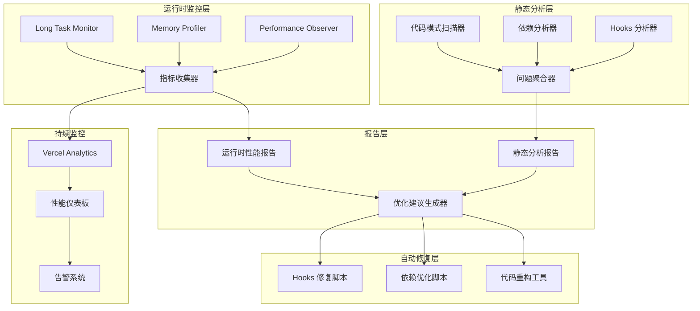

# Design Document: Frontend Performance Audit

## Overview

本设计文档描述了 U2Tool 前端性能审查系统的技术架构和实现方案。该系统旨在系统性地诊断和修复导致"页面无响应"警告的所有性能问题，包括 React Hooks 滥用、内存泄漏、长任务阻塞、第三方库性能问题等。

设计采用分层架构：
1. **静态分析层**：扫描代码识别潜在问题
2. **运行时监控层**：收集实时性能指标
3. **报告和可视化层**：生成可操作的优化建议
4. **自动修复层**：提供脚本自动修复常见问题

## Architecture

### 系统架构图



### 技术栈选择

| 组件 | 技术选择 | 理由 |
|------|---------|------|
| 静态分析 | TypeScript Compiler API + ESLint | 可以解析 AST 并识别代码模式 |
| 依赖分析 | webpack-bundle-analyzer | 可视化 bundle 大小和依赖关系 |
| 运行时监控 | Performance Observer API | 浏览器原生 API，零开销 |
| 内存分析 | Chrome DevTools Protocol | 精确的内存快照和泄漏检测 |
| 错误追踪 | Sentry | 成熟的错误追踪和性能监控平台 |
| 性能监控 | Vercel Analytics + Web Vitals | 与部署平台集成，真实用户数据 |

## Components and Interfaces

### 1. React Hooks 分析器

**职责**：扫描所有组件文件，识别 React Hooks 的不当使用。

**接口**：

```typescript
interface HooksAnalyzer {
  /**
   * 分析指定目录下的所有组件文件
   * @param directory 要扫描的目录路径
   * @returns 分析结果
   */
  analyzeDirectory(directory: string): Promise<HooksAnalysisResult>;
  
  /**
   * 分析单个文件
   * @param filePath 文件路径
   * @returns 文件的分析结果
   */
  analyzeFile(filePath: string): Promise<FileAnalysisResult>;
}

interface HooksAnalysisResult {
  totalFiles: number;
  totalIssues: number;
  issuesByType: {
    infiniteLoopRisk: HooksIssue[];
    unnecessaryRerender: HooksIssue[];
    staleClosure: HooksIssue[];
    missingCleanup: HooksIssue[];
  };
}

interface HooksIssue {
  file: string;
  line: number;
  column: number;
  hookType: 'useEffect' | 'useMemo' | 'useCallback';
  severity: 'critical' | 'warning' | 'info';
  message: string;
  suggestion: string;
  autoFixable: boolean;
}
```

**实现细节**：

1. 使用 TypeScript Compiler API 解析源代码为 AST
2. 遍历 AST 查找 Hook 调用节点
3. 分析依赖数组中的每个依赖项：
   - 对象字面量 → 标记为无限循环风险
   - 函数 → 标记为无限循环风险
   - 翻译函数 `t` → 标记为不必要重渲染
   - 外部变量但空依赖数组 → 标记为过时闭包
4. 检查 useEffect 是否有清理函数
5. 生成详细的问题报告和修复建议

### 2. 组件渲染性能分析器

**职责**：测量组件渲染时间，识别性能瓶颈。

**接口**：

```typescript
interface RenderProfiler {
  /**
   * 开始性能分析
   * @param options 分析选项
   */
  startProfiling(options: ProfilingOptions): void;
  
  /**
   * 停止性能分析并生成报告
   * @returns 性能分析报告
   */
  stopProfiling(): Promise<ProfilingReport>;
}

interface ProfilingOptions {
  duration: number; // 分析持续时间（毫秒）
  sampleRate: number; // 采样率（0-1）
  includeChildren: boolean; // 是否包含子组件
}

interface ProfilingReport {
  components: ComponentProfile[];
  slowestComponents: ComponentProfile[];
  frequentRerenders: ComponentProfile[];
  recommendations: string[];
}

interface ComponentProfile {
  name: string;
  renderCount: number;
  totalRenderTime: number;
  averageRenderTime: number;
  maxRenderTime: number;
  children: ComponentProfile[];
}
```

**实现细节**：

1. 使用 React Profiler API 包装关键组件
2. 记录每次渲染的时间戳和持续时间
3. 使用 Performance Observer 监控长任务
4. 识别渲染时间超过 50ms 的组件
5. 识别每秒重渲染超过 10 次的组件
6. 生成火焰图和优化建议

### 3. 内存泄漏检测器

**职责**：检测和定位内存泄漏。

**接口**：

```typescript
interface MemoryLeakDetector {
  /**
   * 开始内存监控
   */
  startMonitoring(): void;
  
  /**
   * 停止监控并生成报告
   * @returns 内存泄漏报告
   */
  stopMonitoring(): Promise<MemoryLeakReport>;
  
  /**
   * 拍摄内存快照
   * @returns 快照 ID
   */
  takeSnapshot(): Promise<string>;
  
  /**
   * 比较两个快照
   * @param snapshot1 第一个快照 ID
   * @param snapshot2 第二个快照 ID
   * @returns 差异报告
   */
  compareSnapshots(snapshot1: string, snapshot2: string): Promise<SnapshotDiff>;
}

interface MemoryLeakReport {
  leaks: MemoryLeak[];
  memoryTrend: MemoryDataPoint[];
  recommendations: string[];
}

interface MemoryLeak {
  type: 'event-listener' | 'timer' | 'dom-reference' | 'closure' | 'echarts-instance';
  location: string;
  severity: 'critical' | 'warning';
  description: string;
  suggestion: string;
}

interface MemoryDataPoint {
  timestamp: number;
  usedJSHeapSize: number;
  totalJSHeapSize: number;
  jsHeapSizeLimit: number;
}
```

**实现细节**：

1. 使用 `performance.memory` API 监控内存使用
2. 定期拍摄内存快照（使用 Chrome DevTools Protocol）
3. 静态分析代码查找：
   - 未移除的事件监听器
   - 未清理的定时器
   - useEffect 缺少清理函数
   - ECharts 实例未调用 dispose
4. 比较快照识别持续增长的对象
5. 生成泄漏点定位和修复建议

### 4. 第三方库分析器

**职责**：分析第三方库的使用和性能影响。

**接口**：

```typescript
interface DependencyAnalyzer {
  /**
   * 分析项目依赖
   * @returns 依赖分析报告
   */
  analyzeDependencies(): Promise<DependencyReport>;
  
  /**
   * 检查代码分割情况
   * @returns 代码分割报告
   */
  analyzeCodeSplitting(): Promise<CodeSplittingReport>;
}

interface DependencyReport {
  heavyDependencies: Dependency[];
  duplicateDependencies: Dependency[];
  unusedDependencies: Dependency[];
  recommendations: string[];
}

interface Dependency {
  name: string;
  version: string;
  size: number;
  gzipSize: number;
  usedIn: string[];
  dynamicallyImported: boolean;
}

interface CodeSplittingReport {
  chunks: ChunkInfo[];
  recommendations: string[];
}

interface ChunkInfo {
  name: string;
  size: number;
  modules: string[];
  loadTime: number;
}
```

**实现细节**：

1. 使用 webpack-bundle-analyzer 分析 bundle
2. 识别大于 100KB 的依赖
3. 检查是否使用动态导入
4. 识别重复的依赖（不同版本）
5. 检查 ECharts 是否按需导入
6. 生成优化建议（如使用 CDN、按需导入等）

### 5. Core Web Vitals 监控器

**职责**：监控和报告 Core Web Vitals 指标。

**接口**：

```typescript
interface WebVitalsMonitor {
  /**
   * 初始化监控
   * @param options 监控选项
   */
  initialize(options: MonitorOptions): void;
  
  /**
   * 获取当前指标
   * @returns 当前的 Web Vitals 指标
   */
  getCurrentMetrics(): WebVitalsMetrics;
  
  /**
   * 订阅指标更新
   * @param callback 回调函数
   */
  subscribe(callback: (metrics: WebVitalsMetrics) => void): () => void;
}

interface MonitorOptions {
  reportToAnalytics: boolean;
  sampleRate: number;
  thresholds: {
    lcp: number;
    inp: number;
    cls: number;
  };
}

interface WebVitalsMetrics {
  lcp: Metric;
  inp: Metric;
  cls: Metric;
  fcp: Metric;
  ttfb: Metric;
}

interface Metric {
  value: number;
  rating: 'good' | 'needs-improvement' | 'poor';
  delta: number;
  entries: PerformanceEntry[];
}
```

**实现细节**：

1. 使用 `web-vitals` 库收集指标
2. 使用 Performance Observer API 监控：
   - LCP: 最大内容绘制
   - INP: 交互到下一次绘制
   - CLS: 累积布局偏移
3. 将指标发送到 Vercel Analytics
4. 当指标超过阈值时触发告警
5. 生成性能趋势报告

### 6. 错误边界组件

**职责**：捕获组件错误并提供降级 UI。

**接口**：

```typescript
interface ErrorBoundaryProps {
  children: React.ReactNode;
  fallback?: React.ComponentType<ErrorFallbackProps>;
  onError?: (error: Error, errorInfo: React.ErrorInfo) => void;
  resetKeys?: Array<string | number>;
}

interface ErrorFallbackProps {
  error: Error;
  resetError: () => void;
  componentStack: string;
}

class ErrorBoundary extends React.Component<ErrorBoundaryProps, ErrorBoundaryState> {
  static getDerivedStateFromError(error: Error): ErrorBoundaryState;
  componentDidCatch(error: Error, errorInfo: React.ErrorInfo): void;
  resetErrorBoundary(): void;
  render(): React.ReactNode;
}
```

**实现细节**：

1. 使用 React Error Boundary 捕获子组件错误
2. 显示友好的降级 UI（可自定义）
3. 记录错误详情到 Sentry：
   - 错误消息和堆栈
   - 组件栈
   - 用户操作历史
   - 浏览器和设备信息
4. 提供重试按钮（通过 resetKeys 重置状态）
5. 对于非关键组件，隐藏错误组件但保持页面其他部分正常

### 7. 长任务监控器

**职责**：检测和报告长时间运行的 JavaScript 任务。

**接口**：

```typescript
interface LongTaskMonitor {
  /**
   * 开始监控长任务
   * @param threshold 长任务阈值（毫秒）
   */
  startMonitoring(threshold: number): void;
  
  /**
   * 停止监控
   */
  stopMonitoring(): void;
  
  /**
   * 获取长任务报告
   * @returns 长任务报告
   */
  getReport(): LongTaskReport;
}

interface LongTaskReport {
  tasks: LongTask[];
  totalBlockingTime: number;
  recommendations: string[];
}

interface LongTask {
  startTime: number;
  duration: number;
  attribution: TaskAttribution[];
  stackTrace?: string;
}

interface TaskAttribution {
  name: string;
  containerType: string;
  containerName: string;
  containerId: string;
}
```

**实现细节**：

1. 使用 PerformanceObserver 监控 'longtask' 类型
2. 记录所有超过 50ms 的任务
3. 使用 Task Attribution API 识别任务来源
4. 分析任务类型：
   - 同步数据处理 → 建议使用 Web Workers
   - 大型 JSON 解析 → 建议流式解析
   - 复杂计算 → 建议拆分为小任务
5. 生成火焰图和优化建议

### 8. 性能预算管理器

**职责**：定义和验证性能预算。

**接口**：

```typescript
interface PerformanceBudget {
  /**
   * 定义性能预算
   * @param budget 预算配置
   */
  setBudget(budget: BudgetConfig): void;
  
  /**
   * 验证当前性能是否符合预算
   * @returns 验证结果
   */
  validate(): Promise<BudgetValidationResult>;
  
  /**
   * 生成预算报告
   * @returns 预算报告
   */
  generateReport(): Promise<BudgetReport>;
}

interface BudgetConfig {
  metrics: {
    lcp: number;
    inp: number;
    cls: number;
    fcp: number;
    ttfb: number;
  };
  resources: {
    totalSize: number;
    jsSize: number;
    cssSize: number;
    imageSize: number;
  };
  timing: {
    firstLoad: number;
    interaction: number;
  };
}

interface BudgetValidationResult {
  passed: boolean;
  violations: BudgetViolation[];
}

interface BudgetViolation {
  metric: string;
  budget: number;
  actual: number;
  severity: 'critical' | 'warning';
}
```

**实现细节**：

1. 在 CI/CD 中集成预算验证
2. 使用 Lighthouse CI 测量指标
3. 比较实际值与预算值
4. 当超出预算时阻止部署或发送告警
5. 生成趋势报告追踪性能变化

## Data Models

### 性能指标数据模型

```typescript
interface PerformanceMetrics {
  id: string;
  timestamp: number;
  sessionId: string;
  userId?: string;
  
  // Core Web Vitals
  webVitals: {
    lcp: number;
    inp: number;
    cls: number;
    fcp: number;
    ttfb: number;
  };
  
  // 资源加载
  resources: {
    totalSize: number;
    jsSize: number;
    cssSize: number;
    imageSize: number;
    loadTime: number;
  };
  
  // 运行时性能
  runtime: {
    longTasks: number;
    totalBlockingTime: number;
    memoryUsage: number;
    errorCount: number;
  };
  
  // 上下文信息
  context: {
    url: string;
    locale: string;
    device: string;
    browser: string;
    connection: string;
  };
}
```

### 分析问题数据模型

```typescript
interface AnalysisIssue {
  id: string;
  type: IssueType;
  severity: 'critical' | 'warning' | 'info';
  category: IssueCategory;
  
  // 位置信息
  location: {
    file: string;
    line: number;
    column: number;
    code: string;
  };
  
  // 问题描述
  title: string;
  description: string;
  impact: string;
  
  // 修复建议
  suggestion: string;
  autoFixable: boolean;
  fixScript?: string;
  
  // 元数据
  detectedAt: number;
  detectedBy: string;
}

type IssueType = 
  | 'infinite-loop-risk'
  | 'unnecessary-rerender'
  | 'memory-leak'
  | 'long-task'
  | 'large-bundle'
  | 'missing-code-splitting';

type IssueCategory =
  | 'react-hooks'
  | 'rendering'
  | 'memory'
  | 'dependencies'
  | 'deployment';
```

## Correctness Properties

*属性是一个特征或行为，应该在系统的所有有效执行中保持为真——本质上是关于系统应该做什么的正式陈述。属性作为人类可读规范和机器可验证正确性保证之间的桥梁。*


### Property 1: Hooks 识别完整性

*For any* React 组件文件，当 Hooks 分析器扫描该文件时，应该识别出文件中所有的 useEffect、useMemo、useCallback 调用，不遗漏任何一个。

**Validates: Requirements 1.1**

### Property 2: 对象依赖检测准确性

*For any* React Hook 调用，如果其依赖数组中包含对象字面量或函数表达式，分析器应该将其标记为潜在的无限循环风险。

**Validates: Requirements 1.2**

### Property 3: 翻译函数依赖检测

*For any* React Hook 调用，如果其依赖数组中包含标识符 `t`（翻译函数），分析器应该将其标记为不必要的重渲染风险。

**Validates: Requirements 1.3**

### Property 4: 过时闭包检测

*For any* useEffect 调用，如果其依赖数组为空但函数体中使用了外部变量，分析器应该将其标记为潜在的过时闭包问题。

**Validates: Requirements 1.4**

### Property 5: 分析报告完整性

*For any* Hooks 分析结果，生成的报告应该包含所有问题的位置信息（文件、行号、列号）和修复建议。

**Validates: Requirements 1.5**

### Property 6: 渲染时间测量

*For any* 被分析的组件，性能分析器应该记录该组件的渲染时间（包括渲染次数、总时间、平均时间、最大时间）。

**Validates: Requirements 2.1**

### Property 7: 阈值检测一致性

*For any* 性能指标，当该指标超过定义的阈值时，系统应该一致地标记或触发相应的告警。

**Validates: Requirements 2.2, 5.4, 7.1, 8.2, 9.2, 9.4**

### Property 8: 事件监听器清理检测

*For any* 组件代码，如果代码中添加了事件监听器（addEventListener）但没有对应的移除代码（removeEventListener），内存泄漏检测器应该标记为潜在泄漏。

**Validates: Requirements 3.1**

### Property 9: useEffect 清理函数检测

*For any* useEffect 调用，如果其设置了副作用（如定时器、订阅、事件监听器）但没有返回清理函数，分析器应该标记为潜在内存泄漏。

**Validates: Requirements 3.2**

### Property 10: 定时器清理检测

*For any* 组件代码，如果代码中调用了 setTimeout 或 setInterval 但没有对应的 clearTimeout 或 clearInterval，分析器应该标记为内存泄漏风险。

**Validates: Requirements 3.3**

### Property 11: ECharts 实例销毁检测

*For any* 使用 ECharts 的组件，如果组件卸载时没有调用 echartInstance.dispose()，分析器应该标记为内存泄漏。

**Validates: Requirements 3.4**

### Property 12: 内存泄漏报告完整性

*For any* 内存泄漏检测结果，报告应该包含内存使用趋势数据和每个泄漏点的详细定位信息。

**Validates: Requirements 3.5**

### Property 13: 大型依赖识别

*For any* 项目依赖，如果该依赖的 gzip 后大小超过 100KB，依赖分析器应该将其识别为重型依赖。

**Validates: Requirements 4.1**

### Property 14: 动态导入建议

*For any* 大于 100KB 的第三方库，如果代码中使用静态导入（import）而非动态导入（dynamic import），分析器应该建议使用代码分割。

**Validates: Requirements 4.2**

### Property 15: ECharts 导入方式验证

*For any* ECharts 组件，分析器应该验证是否使用了动态导入和懒加载，如果没有则给出建议。

**Validates: Requirements 4.3**

### Property 16: 重复依赖检测

*For any* 项目，如果存在同一个库的多个版本被不同模块引用，依赖分析器应该识别并建议合并或移除重复。

**Validates: Requirements 4.4**

### Property 17: 依赖优化报告完整性

*For any* 依赖分析结果，报告应该包含所有识别的问题和对应的优化建议。

**Validates: Requirements 4.5**

### Property 18: Core Web Vitals 指标收集

*For any* 页面访问，性能监控器应该收集所有 Core Web Vitals 指标（LCP、INP、CLS）。

**Validates: Requirements 5.1, 5.2, 5.3**

### Property 19: 性能指标上报

*For any* 收集到的性能指标，监控器应该将其发送到配置的分析服务（如 Vercel Analytics）。

**Validates: Requirements 5.5**

### Property 20: 错误捕获和降级

*For any* 组件错误，错误边界应该捕获该错误并显示降级 UI，而不是让整个应用崩溃。

**Validates: Requirements 6.1**

### Property 21: 错误日志完整性

*For any* 被捕获的错误，错误边界应该记录完整的错误详情（组件栈、错误消息、时间戳）。

**Validates: Requirements 6.2**

### Property 22: 错误降级策略

*For any* 组件错误，错误边界应该根据组件的关键性提供不同的降级策略（关键组件显示重试按钮，非关键组件隐藏）。

**Validates: Requirements 6.3, 6.4**

### Property 23: 错误上报

*For any* 被捕获的错误，错误边界应该将错误信息发送到错误追踪服务（如 Sentry）。

**Validates: Requirements 6.5**

### Property 24: 长任务记录

*For any* JavaScript 任务，如果其执行时间超过 50ms，长任务监控器应该记录该任务的详细信息（开始时间、持续时间、归因）。

**Validates: Requirements 7.1**

### Property 25: 性能优化建议准确性

*For any* 检测到的性能问题，分析器应该根据问题类型提供准确的优化建议（如大型数据处理建议使用 Web Workers，大型 JSON 解析建议流式解析）。

**Validates: Requirements 7.2, 7.3, 7.4**

### Property 26: 长任务报告完整性

*For any* 长任务检测结果，报告应该包含火焰图数据和针对性的优化建议。

**Validates: Requirements 7.5**

### Property 27: 部署配置验证

*For any* Vercel 部署配置，分析器应该验证 Edge Runtime 兼容性、CDN 缓存配置、Image 优化使用等关键配置项。

**Validates: Requirements 8.1, 8.3, 8.4**

### Property 28: 部署优化报告完整性

*For any* 部署配置分析结果，报告应该包含所有配置问题和优化建议。

**Validates: Requirements 8.5**

### Property 29: 性能预算配置持久化

*For any* 性能预算配置，系统应该正确存储和读取该配置，确保配置在重启后仍然有效。

**Validates: Requirements 9.1**

### Property 30: 性能预算验证

*For any* 构建或部署，如果实际性能指标超过预算，系统应该检测到违规并触发相应的操作（阻止部署或发送告警）。

**Validates: Requirements 9.2, 9.4**

### Property 31: 持续监控数据收集

*For any* 生产环境运行期间，性能监控器应该持续收集性能指标，不遗漏关键数据点。

**Validates: Requirements 9.3**

### Property 32: 性能趋势报告生成

*For any* 配置的报告周期（每日、每周、每月），系统应该按时生成包含趋势数据的性能报告。

**Validates: Requirements 9.5**

### Property 33: 用户体验指标收集

*For any* 用户会话，监控器应该收集完整的用户体验指标（页面加载时间、交互响应时间、会话时长、交互次数）。

**Validates: Requirements 10.1, 10.2, 10.4**

### Property 34: 异常事件记录

*For any* 页面无响应警告或其他异常事件，监控器应该记录事件发生时的上下文信息（URL、用户操作、设备信息等）。

**Validates: Requirements 10.3**

### Property 35: 用户体验仪表板数据聚合

*For any* 收集到的用户体验数据，系统应该正确按地区、设备、浏览器等维度进行分组和聚合，生成准确的仪表板。

**Validates: Requirements 10.5**

## Error Handling

### 静态分析错误处理

1. **文件读取失败**
   - 捕获文件系统错误
   - 记录失败的文件路径
   - 继续处理其他文件
   - 在报告中标记失败的文件

2. **AST 解析失败**
   - 捕获语法错误
   - 记录错误位置和原因
   - 跳过无法解析的文件
   - 提供语法修复建议

3. **依赖分析失败**
   - 处理缺失的 package.json
   - 处理损坏的 node_modules
   - 提供降级分析（基于已有信息）

### 运行时监控错误处理

1. **Performance API 不可用**
   - 检测浏览器兼容性
   - 提供降级方案（使用 Date.now()）
   - 在报告中标记降级情况

2. **内存分析失败**
   - 处理 Chrome DevTools Protocol 连接失败
   - 提供基于 performance.memory 的简化分析
   - 记录失败原因

3. **网络请求失败**
   - 重试机制（最多 3 次）
   - 本地缓存指标数据
   - 批量上报失败的数据

### 错误边界错误处理

1. **降级 UI 渲染失败**
   - 提供最简单的文本降级 UI
   - 避免降级 UI 本身出错

2. **错误上报失败**
   - 本地存储错误日志
   - 定期重试上报
   - 避免阻塞用户操作

### 数据处理错误处理

1. **数据格式错误**
   - 验证输入数据格式
   - 提供默认值
   - 记录格式错误

2. **数据存储失败**
   - 处理 localStorage 配额超限
   - 清理旧数据
   - 提供内存存储降级

## Testing Strategy

本项目采用双重测试策略：单元测试验证具体示例和边缘情况，属性测试验证通用正确性属性。

### 单元测试

单元测试专注于：

1. **具体示例验证**
   - 测试已知的问题代码模式
   - 验证修复建议的正确性
   - 测试边界条件

2. **边缘情况**
   - 空文件、空依赖数组
   - 嵌套 Hooks
   - 条件 Hooks（违反 Hooks 规则）
   - 极大或极小的性能指标值

3. **集成点**
   - 文件系统操作
   - 外部 API 调用（使用 mock）
   - 报告生成

4. **错误条件**
   - 文件读取失败
   - AST 解析错误
   - 网络请求失败
   - API 不可用

### 属性测试

属性测试专注于验证通用正确性属性，使用属性测试库（如 fast-check）：

**配置**：
- 每个属性测试运行最少 100 次迭代
- 使用随机生成的测试数据
- 每个测试标记对应的设计属性

**测试库选择**：TypeScript/JavaScript 使用 `fast-check`

**标记格式**：
```typescript
// Feature: frontend-performance-audit, Property 1: Hooks 识别完整性
test('should identify all React Hooks in component files', () => {
  fc.assert(
    fc.property(
      fc.array(generateRandomComponent()),
      (components) => {
        // 测试逻辑
      }
    ),
    { numRuns: 100 }
  );
});
```

**属性测试覆盖**：

1. **Hooks 分析属性**（Property 1-5）
   - 生成随机的 React 组件代码
   - 验证所有 Hooks 都被识别
   - 验证问题检测的准确性

2. **性能分析属性**（Property 6-7）
   - 生成不同性能特征的组件
   - 验证渲染时间测量
   - 验证阈值检测

3. **内存泄漏检测属性**（Property 8-12）
   - 生成包含各种副作用的代码
   - 验证泄漏检测的准确性
   - 验证报告完整性

4. **依赖分析属性**（Property 13-17）
   - 生成不同的依赖配置
   - 验证大型依赖识别
   - 验证优化建议

5. **监控和报告属性**（Property 18-35）
   - 生成随机的性能指标
   - 验证数据收集和上报
   - 验证报告生成

### 测试工具和框架

- **单元测试**：Vitest
- **属性测试**：fast-check
- **E2E 测试**：Playwright
- **性能测试**：Lighthouse CI
- **Mock 工具**：Vitest mocks

### 测试覆盖率目标

- 代码覆盖率：> 80%
- 分支覆盖率：> 75%
- 属性测试覆盖：所有 35 个正确性属性

### CI/CD 集成

1. **PR 检查**
   - 运行所有单元测试和属性测试
   - 运行静态分析工具
   - 验证性能预算

2. **部署前检查**
   - 运行 Lighthouse CI
   - 验证 bundle 大小
   - 检查 Core Web Vitals

3. **生产监控**
   - 持续收集真实用户指标
   - 每日生成性能报告
   - 异常告警
