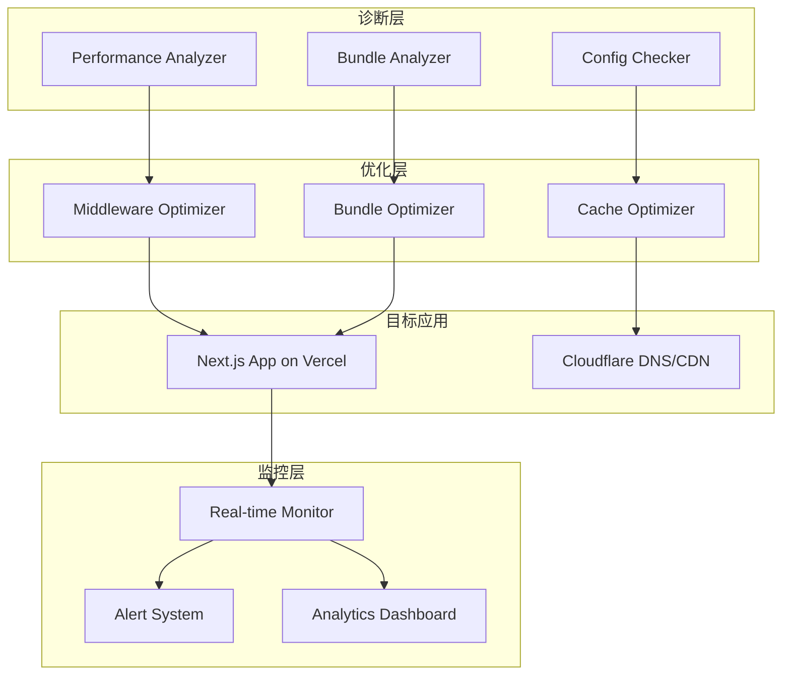

# Design Document

## Overview

本设计文档描述了诊断和修复 Vercel + Cloudflare 部署的 Next.js 16 应用性能问题的完整解决方案。该方案包括：

1. **诊断工具集** - 自动化脚本识别性能瓶颈
2. **配置检查器** - 验证 Vercel 和 Cloudflare 配置
3. **代码优化方案** - Middleware、Bundle、翻译文件优化
4. **监控系统** - 实时性能监控和告警
5. **文档和指南** - 最佳实践和故障排查手册

该方案采用模块化设计，每个组件可独立运行，也可作为完整诊断流程的一部分。

## Architecture

### 系统架构图



### 架构层次

1. **诊断层（Diagnostic Layer）**
   - 收集性能指标和配置信息
   - 识别瓶颈和配置问题
   - 生成诊断报告

2. **优化层（Optimization Layer）**
   - 根据诊断结果应用优化
   - 修改代码和配置
   - 验证优化效果

3. **监控层（Monitoring Layer）**
   - 持续监控性能指标
   - 检测异常和性能回退
   - 提供可视化仪表板

4. **目标应用层（Target Application Layer）**
   - Next.js 16 应用
   - Vercel 部署环境
   - Cloudflare DNS/CDN

## Components and Interfaces

### 1. Performance Analyzer（性能分析器）

**职责**: 收集和分析应用性能指标

**接口**:
```typescript
interface PerformanceAnalyzer {
  // 分析 Core Web Vitals
  analyzeCoreWebVitals(url: string, options?: AnalysisOptions): Promise<WebVitalsReport>
  
  // 分析 Middleware 性能
  analyzeMiddleware(middlewarePath: string): Promise<MiddlewareReport>
  
  // 分析翻译文件加载
  analyzeTranslations(locales: string[]): Promise<TranslationReport>
  
  // 生成综合报告
  generateReport(reports: Report[]): DiagnosticReport
}

interface WebVitalsReport {
  ttfb: number
  lcp: number
  inp: number
  cls: number
  fcp: number
  recommendations: string[]
}

interface MiddlewareReport {
  executionTime: number
  localeDetectionTime: number
  geoLookupTime: number
  rewriteTime: number
  codeSize: number
  bottlenecks: Bottleneck[]
}


interface TranslationReport {
  totalSize: number
  loadTime: number
  filesAnalyzed: number
  largeFiles: Array<{path: string, size: number}>
  recommendations: string[]
}
```

**实现策略**:
- 使用 Lighthouse API 收集 Core Web Vitals
- 使用 Node.js 性能钩子测量 Middleware 执行时间
- 分析翻译文件大小和加载时间
- 使用 Chrome DevTools Protocol 进行深度分析

### 2. Config Checker（配置检查器）

**职责**: 验证 Vercel 和 Cloudflare 配置

**接口**:
```typescript
interface ConfigChecker {
  // 检查 Vercel 配置
  checkVercelConfig(projectId: string): Promise<VercelConfigReport>
  
  // 检查 Cloudflare 配置
  checkCloudflareConfig(domain: string): Promise<CloudflareConfigReport>
  
  // 检查配置兼容性
  checkCompatibility(vercelConfig: VercelConfig, cfConfig: CloudflareConfig): CompatibilityReport
}

interface VercelConfigReport {
  edgeFunctionTimeout: number
  edgeFunctionSize: number
  regions: string[]
  cacheHeaders: Record<string, string>
  environmentVariables: string[]
  issues: ConfigIssue[]
  recommendations: string[]
}

interface CloudflareConfigReport {
  dnsRecords: DNSRecord[]
  proxyStatus: boolean
  sslMode: string
  cacheRules: CacheRule[]
  firewallRules: FirewallRule[]
  issues: ConfigIssue[]
  recommendations: string[]
}


interface CompatibilityReport {
  compatible: boolean
  conflicts: Conflict[]
  recommendations: string[]
}
```

**实现策略**:
- 使用 Vercel API 获取项目配置
- 使用 Cloudflare API 获取域名配置
- 对比配置项识别冲突和不兼容问题
- 提供具体的修复建议

### 3. Bundle Analyzer（打包分析器）

**职责**: 分析 JavaScript Bundle 大小和组成

**接口**:
```typescript
interface BundleAnalyzer {
  // 分析 Bundle 大小
  analyzeBundleSize(buildDir: string): Promise<BundleSizeReport>
  
  // 识别大型依赖
  identifyLargeDependencies(threshold: number): Promise<DependencyReport>
  
  // 分析代码分割
  analyzeCodeSplitting(): Promise<CodeSplitReport>
  
  // 生成优化建议
  generateOptimizations(reports: Report[]): OptimizationPlan
}

interface BundleSizeReport {
  totalSize: number
  gzipSize: number
  chunks: Array<{name: string, size: number}>
  largestChunks: Array<{name: string, size: number}>
  recommendations: string[]
}

interface DependencyReport {
  largeDependencies: Array<{
    name: string
    size: number
    usedIn: string[]
    alternatives: string[]
  }>
  unusedDependencies: string[]
  duplicateDependencies: Array<{name: string, versions: string[]}>
}
```

**实现策略**:
- 使用 webpack-bundle-analyzer 或 @next/bundle-analyzer
- 解析 .next/build-manifest.json 和 stats.json
- 识别可以动态导入的大型库
- 检测重复依赖和未使用的代码


### 4. Middleware Optimizer（中间件优化器）

**职责**: 优化 Next.js Middleware 性能

**接口**:
```typescript
interface MiddlewareOptimizer {
  // 优化 locale 检测
  optimizeLocaleDetection(middlewarePath: string): Promise<OptimizationResult>
  
  // 优化 IP 地理位置查询
  optimizeGeoLookup(middlewarePath: string): Promise<OptimizationResult>
  
  // 添加性能监控
  addPerformanceMonitoring(middlewarePath: string): Promise<void>
  
  // 验证优化效果
  validateOptimization(before: MiddlewareReport, after: MiddlewareReport): ValidationReport
}

interface OptimizationResult {
  success: boolean
  changes: string[]
  estimatedImprovement: number
  warnings: string[]
}
```

**优化策略**:

1. **Locale 检测优化**:
   ```typescript
   // 优化前：每次请求都解析 Accept-Language
   const locale = negotiateLanguages(
     acceptLanguage.split(','),
     locales,
     { defaultLocale: 'en' }
   )
   
   // 优化后：使用简化的快速路径
   const locale = getLocaleFromCookie(request) || 
                  getLocaleFromPath(pathname) ||
                  getSimpleLocaleFromHeader(acceptLanguage) ||
                  'en'
   ```

2. **IP 地理位置优化**:
   ```typescript
   // 优化前：调用第三方 API
   const geo = await fetch(`https://api.ipgeolocation.io/ipgeo?apiKey=${key}&ip=${ip}`)
   
   // 优化后：使用 Vercel 提供的 geo 头
   const country = request.geo?.country || 
                   request.headers.get('x-vercel-ip-country') ||
                   'US'
   ```

3. **缓存机制**:
   ```typescript
   // 添加内存缓存减少重复计算
   const localeCache = new Map<string, string>()
   
   function getCachedLocale(key: string): string | undefined {
     return localeCache.get(key)
   }
   ```


### 5. Translation Optimizer（翻译优化器）

**职责**: 优化翻译文件加载策略

**接口**:
```typescript
interface TranslationOptimizer {
  // 分析翻译文件结构
  analyzeTranslationStructure(messagesDir: string): Promise<TranslationStructureReport>
  
  // 优化翻译文件拆分
  optimizeSplitting(locale: string): Promise<OptimizationResult>
  
  // 添加预加载策略
  addPreloadStrategy(layout: string): Promise<void>
  
  // 压缩翻译文件
  compressTranslations(locale: string): Promise<CompressionResult>
}

interface TranslationStructureReport {
  locales: string[]
  totalFiles: number
  totalSize: number
  largeFiles: Array<{path: string, size: number}>
  loadingStrategy: string
  recommendations: string[]
}
```

**优化策略**:

1. **按需加载**:
   ```typescript
   // 优化前：加载完整翻译文件
   const messages = await import(`@/messages/${locale}.json`)
   
   // 优化后：仅加载基础翻译
   const baseMessages = await import(`@/messages/${locale}/base.json`)
   // 工具特定翻译按需加载
   const toolMessages = await import(`@/messages/${locale}/tools/${slug}.json`)
   ```

2. **预加载关键翻译**:
   ```typescript
   // 在布局层预加载基础翻译
   export async function generateMetadata({ params }: Props) {
     const messages = await loadBaseMessages(params.locale)
     // 仅加载 base.json，不加载工具翻译
   }
   ```

3. **压缩和缓存**:
   ```typescript
   // 启用 Brotli 压缩
   // next.config.js
   compress: true,
   
   // 设置长期缓存
   headers: [
     {
       source: '/messages/:locale/:path*',
       headers: [
         {
           key: 'Cache-Control',
           value: 'public, max-age=31536000, immutable'
         }
       ]
     }
   ]
   ```


### 6. Real-time Monitor（实时监控器）

**职责**: 监控应用性能和错误

**接口**:
```typescript
interface RealTimeMonitor {
  // 收集 Web Vitals
  collectWebVitals(metric: Metric): void
  
  // 记录错误
  logError(error: Error, context: ErrorContext): void
  
  // 记录性能事件
  logPerformanceEvent(event: PerformanceEvent): void
  
  // 发送到分析服务
  sendToAnalytics(data: AnalyticsData): Promise<void>
}

interface Metric {
  name: 'TTFB' | 'LCP' | 'INP' | 'CLS' | 'FCP'
  value: number
  rating: 'good' | 'needs-improvement' | 'poor'
  delta: number
  id: string
}

interface PerformanceEvent {
  type: 'middleware' | 'api' | 'render' | 'load'
  duration: number
  path: string
  timestamp: number
  metadata?: Record<string, any>
}
```

**实现策略**:

1. **Web Vitals 收集**:
   ```typescript
   // app/layout.tsx
   import { Analytics } from '@vercel/analytics/react'
   import { SpeedInsights } from '@vercel/speed-insights/next'
   
   export default function RootLayout({ children }) {
     return (
       <html>
         <body>
           {children}
           <Analytics />
           <SpeedInsights />
         </body>
       </html>
     )
   }
   ```

2. **自定义性能监控**:
   ```typescript
   // lib/monitoring.ts
   export function reportWebVitals(metric: Metric) {
     // 发送到自定义分析服务
     if (metric.rating === 'poor') {
       console.warn(`Poor ${metric.name}:`, metric.value)
       sendAlert({
         type: 'performance',
         metric: metric.name,
         value: metric.value,
         threshold: getThreshold(metric.name)
       })
     }
   }
   ```

3. **Middleware 性能监控**:
   ```typescript
   // middleware.ts
   export function middleware(request: NextRequest) {
     const start = performance.now()
     
     try {
       // 中间件逻辑
       const response = handleRequest(request)
       
       const duration = performance.now() - start
       if (duration > 50) {
         console.warn(`Slow middleware: ${duration}ms`)
       }
       
       return response
     } catch (error) {
       logError(error, { path: request.nextUrl.pathname })
       throw error
     }
   }
   ```


### 7. Cache Optimizer（缓存优化器）

**职责**: 优化缓存策略

**接口**:
```typescript
interface CacheOptimizer {
  // 分析当前缓存配置
  analyzeCacheConfig(): Promise<CacheConfigReport>
  
  // 生成优化的缓存头
  generateCacheHeaders(resourceType: ResourceType): CacheHeaders
  
  // 配置 Vercel 缓存
  configureVercelCache(config: VercelCacheConfig): Promise<void>
  
  // 配置 Cloudflare 缓存
  configureCloudflareCache(config: CloudflareCacheConfig): Promise<void>
}

interface CacheHeaders {
  'Cache-Control': string
  'CDN-Cache-Control'?: string
  'Vercel-CDN-Cache-Control'?: string
  'ETag'?: string
  'Last-Modified'?: string
}

type ResourceType = 'static' | 'html' | 'api' | 'translation' | 'image'
```

**缓存策略**:

1. **静态资源（JS、CSS、图片）**:
   ```typescript
   // 长期缓存，使用内容哈希
   {
     'Cache-Control': 'public, max-age=31536000, immutable',
     'CDN-Cache-Control': 'public, max-age=31536000'
   }
   ```

2. **HTML 页面**:
   ```typescript
   // 短期缓存 + stale-while-revalidate
   {
     'Cache-Control': 'public, s-maxage=3600, stale-while-revalidate=86400',
     'CDN-Cache-Control': 'public, s-maxage=3600'
   }
   ```

3. **API 响应**:
   ```typescript
   // 根据数据更新频率设置
   {
     'Cache-Control': 'public, s-maxage=60, stale-while-revalidate=300',
     'CDN-Cache-Control': 'public, s-maxage=60'
   }
   ```

4. **翻译文件**:
   ```typescript
   // 长期缓存，使用版本号
   {
     'Cache-Control': 'public, max-age=31536000, immutable',
     'CDN-Cache-Control': 'public, max-age=31536000'
   }
   ```

**Next.js 配置**:
```typescript
// next.config.js
export default {
  async headers() {
    return [
      {
        source: '/:locale/tools/:slug',
        headers: [
          {
            key: 'Cache-Control',
            value: 'public, s-maxage=3600, stale-while-revalidate=86400'
          }
        ]
      },
      {
        source: '/messages/:path*',
        headers: [
          {
            key: 'Cache-Control',
            value: 'public, max-age=31536000, immutable'
          }
        ]
      }
    ]
  }
}
```


## Data Models

### 诊断报告数据模型

```typescript
interface DiagnosticReport {
  id: string
  timestamp: Date
  domain: string
  
  // 性能指标
  performance: {
    webVitals: WebVitalsReport
    middleware: MiddlewareReport
    bundle: BundleSizeReport
    translations: TranslationReport
  }
  
  // 配置检查
  configuration: {
    vercel: VercelConfigReport
    cloudflare: CloudflareConfigReport
    compatibility: CompatibilityReport
  }
  
  // 问题和建议
  issues: Issue[]
  recommendations: Recommendation[]
  
  // 优先级评分
  priorityScore: number
  estimatedImpact: 'high' | 'medium' | 'low'
}

interface Issue {
  id: string
  category: 'performance' | 'configuration' | 'compatibility'
  severity: 'critical' | 'high' | 'medium' | 'low'
  title: string
  description: string
  affectedArea: string
  detectedAt: Date
}

interface Recommendation {
  id: string
  relatedIssues: string[]
  priority: number
  title: string
  description: string
  implementation: string
  estimatedEffort: 'low' | 'medium' | 'high'
  estimatedImpact: 'low' | 'medium' | 'high'
  codeExample?: string
}
```

### 监控数据模型

```typescript
interface MonitoringData {
  timestamp: Date
  sessionId: string
  
  // 用户信息
  user: {
    country?: string
    region?: string
    device: 'mobile' | 'tablet' | 'desktop'
    browser: string
  }
  
  // 页面信息
  page: {
    path: string
    locale: string
    referrer?: string
  }
  
  // 性能指标
  metrics: {
    ttfb: number
    lcp: number
    inp: number
    cls: number
    fcp: number
  }
  
  // 自定义事件
  events: PerformanceEvent[]
  
  // 错误信息
  errors: ErrorLog[]
}

interface ErrorLog {
  timestamp: Date
  type: 'javascript' | 'network' | 'middleware' | 'api'
  message: string
  stack?: string
  context: Record<string, any>
}
```


## Correctness Properties

*属性（Property）是一个特征或行为，应该在系统的所有有效执行中保持为真——本质上是关于系统应该做什么的正式声明。属性作为人类可读规范和机器可验证正确性保证之间的桥梁。*

### Property Reflection（属性反思）

在编写正式属性之前，我对 prework 中识别的可测试标准进行了反思，以消除冗余：

**识别的冗余和合并**:

1. **配置检查属性合并**:
   - 2.1-2.5（Vercel 各项配置检查）可以合并为一个综合属性
   - 3.1-3.5（Cloudflare 各项配置检查）可以合并为一个综合属性
   - 原因：它们都是检查配置项是否符合最佳实践，可以用一个通用属性覆盖

2. **优化器属性合并**:
   - 4.1-4.3（Middleware 各项优化）可以合并为一个性能改进属性
   - 5.1-5.2（依赖分析和动态导入）可以合并为一个 Bundle 优化属性
   - 原因：它们都验证优化后性能有改进，可以用一个通用的"优化前后对比"属性

3. **缓存策略属性合并**:
   - 9.1-9.3（不同资源类型的缓存头）可以合并为一个属性
   - 原因：它们都验证缓存头设置正确，可以用一个参数化属性覆盖所有资源类型

4. **错误处理属性合并**:
   - 10.1-10.4（各种失败场景的降级）可以合并为一个降级策略属性
   - 原因：它们都验证系统在失败时能优雅降级

5. **文档属性不需要单独测试**:
   - 11.1-11.6 都是检查文档存在性，这些是示例而非属性
   - 可以用一个简单的文件存在性检查覆盖

**保留的独立属性**:
- 性能指标收集（1.1-1.6）：每个都验证不同类型的分析功能
- 监控和告警（8.1-8.4）：每个都验证不同的监控场景
- 自动化测试（12.1, 12.3, 12.6）：验证 CI/CD 集成的关键功能

### 正式属性定义

#### 性能分析属性

**Property 1: Web Vitals 指标完整性**

*对于任何* 有效的 URL，当运行性能分析时，返回的报告应该包含所有必需的 Core Web Vitals 指标（TTFB、LCP、INP、CLS、FCP），且每个指标值都在合理范围内（0-60000ms）。

**Validates: Requirements 1.1**

**Property 2: Middleware 性能分析完整性**

*对于任何* Middleware 文件，当运行性能分析时，返回的报告应该包含 locale 检测时间、IP 地理位置查询时间、路由重写时间和总执行时间，且各部分时间之和等于总执行时间。

**Validates: Requirements 1.2**

**Property 3: Bundle 大小阈值检测**

*对于任何* 构建输出目录，当分析 Bundle 大小时，所有大小超过指定阈值（如 500KB）的依赖包都应该被识别并包含在报告中。

**Validates: Requirements 1.3**

**Property 4: 翻译文件分析覆盖性**

*对于所有* 10 种支持的语言，当分析翻译文件时，每种语言都应该有对应的加载时间和文件大小数据。

**Validates: Requirements 1.4**

**Property 5: 动态导入配置验证**

*对于所有* 工具组件，当验证动态导入配置时，每个组件都应该使用 `dynamic()` 函数导入，且配置中不包含阻塞性导入。

**Validates: Requirements 1.5**

**Property 6: 诊断报告结构完整性**

*对于任何* 诊断数据集合，生成的报告应该包含性能瓶颈列表、优化建议列表和优先级评分，且建议数量应该大于等于识别的瓶颈数量。

**Validates: Requirements 1.6**

#### 配置检查属性

**Property 7: Vercel 配置合规性**

*对于任何* Vercel 项目配置，当运行配置检查时，所有不符合最佳实践的配置项（如超时 < 10s、函数大小超限、缺少必需环境变量）都应该被识别并包含在问题列表中。

**Validates: Requirements 2.1, 2.2, 2.3, 2.4, 2.5**

**Property 8: Cloudflare 配置合规性**

*对于任何* Cloudflare 域名配置，当运行配置检查时，所有不符合最佳实践的配置项（如 DNS 记录错误、SSL 模式不安全、缓存规则冲突）都应该被识别并包含在问题列表中。

**Validates: Requirements 3.1, 3.3, 3.4, 3.5**

#### 优化器属性

**Property 9: Middleware 优化性能改进**

*对于任何* Middleware 文件，当应用优化后，执行时间应该减少至少 20%，且优化后的代码大小应该不超过 1MB。

**Validates: Requirements 4.1, 4.2, 4.3, 4.5**

**Property 10: Middleware 性能监控**

*对于任何* 执行时间超过 50ms 的 Middleware 执行，系统应该记录警告日志，且日志包含执行时间和请求路径。

**Validates: Requirements 4.4**

**Property 11: Middleware 代码质量**

*对于任何* 优化后的 Middleware 代码，不应该包含阻塞性 I/O 操作（如 `fs.readFileSync`、`child_process.execSync`）。

**Validates: Requirements 4.6**

**Property 12: Bundle 优化效果**

*对于任何* 包含大型依赖的项目，当应用 Bundle 优化后，首页 JavaScript 大小（gzip 后）应该不超过 200KB，且所有大型库（echarts、pdf-lib、xlsx）都应该使用动态导入。

**Validates: Requirements 5.2, 5.4**

**Property 13: 代码分割正确性**

*对于任何* 构建输出，第三方库代码应该在独立的 vendor chunk 中，且 vendor chunk 的大小应该大于任何单个页面 chunk。

**Validates: Requirements 5.5**

#### 翻译优化属性

**Property 14: 翻译文件按需加载**

*对于任何* 页面访问，只应该加载当前语言的 base.json 文件，不应该加载其他语言的翻译文件。

**Validates: Requirements 6.1**

**Property 15: 工具翻译懒加载**

*对于任何* 工具页面访问，只应该加载该工具特定的翻译文件，不应该加载其他工具的翻译文件。

**Validates: Requirements 6.2**

**Property 16: 翻译文件大小限制**

*对于所有* 翻译文件，每个文件的大小都应该不超过 100KB，如果原始文件超过此限制，应该被拆分为多个更小的文件。

**Validates: Requirements 6.3**

**Property 17: 翻译文件缓存一致性**

*对于任何* 翻译文件，当第二次请求相同文件时，应该从缓存加载（返回 304 或从浏览器缓存），不应该重新下载。

**Validates: Requirements 6.6**

#### 资源加载优化属性

**Property 18: 第三方脚本非阻塞加载**

*对于所有* 第三方脚本标签，都应该包含 `async` 或 `defer` 属性，不应该有阻塞渲染的同步脚本。

**Validates: Requirements 7.1**

**Property 19: 预连接数量限制**

*对于任何* HTML 页面，预连接（`<link rel="preconnect">`）的外部域名数量应该不超过 3 个。

**Validates: Requirements 7.2**

**Property 20: 字体加载优化**

*对于所有* 字体声明，都应该包含 `font-display: swap` 属性，避免文本不可见期（FOIT）。

**Validates: Requirements 7.3**

**Property 21: 图片组件使用**

*对于所有* 图片元素，都应该使用 Next.js `Image` 组件而非原生 `` 标签，且包含 `width` 和 `height` 属性。

**Validates: Requirements 7.4**

#### 监控和告警属性

**Property 22: TTFB 告警触发**

*对于任何* TTFB 超过 1000ms 的页面请求，系统应该发送告警通知，且告警包含页面路径和实际 TTFB 值。

**Validates: Requirements 8.1**

**Property 23: Edge Function 超时日志**

*对于任何* 执行时间超过 5000ms 的 Edge Function，系统应该记录详细日志，且日志包含函数名称、执行时间和请求上下文。

**Validates: Requirements 8.2**

**Property 24: 错误率告警触发**

*对于任何* 时间窗口（如 5 分钟），当错误率超过 1% 时，系统应该触发告警，且告警包含错误类型分布和受影响的路径。

**Validates: Requirements 8.3**

**Property 25: Web Vitals 数据收集**

*对于任何* 页面访问，系统应该收集并发送 Core Web Vitals 数据（TTFB、LCP、INP、CLS、FCP）到分析服务。

**Validates: Requirements 8.4**

#### 缓存策略属性

**Property 26: 资源缓存头正确性**

*对于任何* 资源类型（静态资源、HTML、API、翻译文件），响应应该包含正确的 `Cache-Control` 头，且缓存时间符合资源类型的最佳实践（静态资源 1 年，HTML 1 小时，API 根据更新频率）。

**Validates: Requirements 9.1, 9.2, 9.3**

**Property 27: 条件请求支持**

*对于任何* 支持缓存的资源，响应应该包含 `ETag` 或 `Last-Modified` 头，且当客户端发送 `If-None-Match` 或 `If-Modified-Since` 请求时，应该返回 304 状态码（如果资源未修改）。

**Validates: Requirements 9.4**

**Property 28: 翻译文件缓存策略**

*对于所有* 翻译文件，响应应该包含长期缓存头（max-age=31536000），且文件名应该包含内容哈希或版本号以支持缓存失效。

**Validates: Requirements 9.5**

#### 错误处理和降级属性

**Property 29: 系统降级策略**

*对于任何* 组件失败场景（Middleware 失败、翻译加载失败、第三方服务不可用、Edge Function 超时），系统应该优雅降级（使用默认值、缓存数据或友好错误信息），而不是完全崩溃。

**Validates: Requirements 10.1, 10.2, 10.3, 10.4**

**Property 30: 错误日志完整性**

*对于任何* 系统错误，都应该被记录到日志系统，且日志包含错误类型、错误消息、堆栈跟踪和请求上下文。

**Validates: Requirements 10.5**

**Property 31: 重试机制**

*对于任何* 关键功能的临时失败，系统应该自动重试最多 3 次，且重试之间有指数退避延迟。

**Validates: Requirements 10.6**

#### 自动化测试属性

**Property 32: Lighthouse CI 集成**

*对于任何* 性能测试运行，应该调用 Lighthouse CI 并返回 Core Web Vitals 评分，且评分包含所有必需指标。

**Validates: Requirements 12.1**

**Property 33: 性能质量门控**

*对于任何* 部署尝试，如果性能指标（LCP、INP、TTFB）低于设定阈值，部署应该被阻止，且应该生成包含失败原因的报告。

**Validates: Requirements 12.3**

**Property 34: 性能对比报告**

*对于任何* 优化前后的测试运行，应该生成对比报告，且报告包含所有关键指标的改进百分比和绝对值变化。

**Validates: Requirements 12.6**


## Error Handling

### 错误分类

系统将错误分为以下类别：

1. **配置错误（Configuration Errors）**
   - Vercel API 认证失败
   - Cloudflare API 认证失败
   - 缺少必需的环境变量
   - 无效的配置文件格式

2. **分析错误（Analysis Errors）**
   - Lighthouse 分析失败
   - Bundle 分析失败
   - 文件系统访问错误
   - 网络请求超时

3. **优化错误（Optimization Errors）**
   - 代码转换失败
   - 文件写入失败
   - 备份创建失败
   - 验证失败

4. **运行时错误（Runtime Errors）**
   - Middleware 执行异常
   - 翻译加载失败
   - 第三方服务不可用
   - 内存不足

### 错误处理策略

#### 1. 配置错误处理

```typescript
async function checkVercelConfig(projectId: string): Promise<VercelConfigReport> {
  try {
    const config = await fetchVercelConfig(projectId)
    return analyzeConfig(config)
  } catch (error) {
    if (error instanceof AuthenticationError) {
      throw new ConfigError(
        'Vercel API authentication failed. Please check your VERCEL_TOKEN.',
        { cause: error }
      )
    }
    if (error instanceof NetworkError) {
      console.warn('Network error, using cached config if available')
      return getCachedConfig(projectId) || getDefaultConfig()
    }
    throw error
  }
}
```

#### 2. 分析错误处理

```typescript
async function analyzeCoreWebVitals(url: string): Promise<WebVitalsReport> {
  const maxRetries = 3
  let lastError: Error
  
  for (let attempt = 1; attempt <= maxRetries; attempt++) {
    try {
      return await runLighthouse(url)
    } catch (error) {
      lastError = error
      if (attempt < maxRetries) {
        const delay = Math.pow(2, attempt) * 1000 // 指数退避
        await sleep(delay)
        console.log(`Retry ${attempt}/${maxRetries} after ${delay}ms`)
      }
    }
  }
  
  throw new AnalysisError(
    `Failed to analyze ${url} after ${maxRetries} attempts`,
    { cause: lastError }
  )
}
```

#### 3. 优化错误处理

```typescript
async function optimizeMiddleware(path: string): Promise<OptimizationResult> {
  // 创建备份
  const backupPath = `${path}.backup`
  await fs.copyFile(path, backupPath)
  
  try {
    const originalCode = await fs.readFile(path, 'utf-8')
    const optimizedCode = applyOptimizations(originalCode)
    
    // 验证优化后的代码
    await validateCode(optimizedCode)
    
    // 写入优化后的代码
    await fs.writeFile(path, optimizedCode)
    
    return {
      success: true,
      changes: getChanges(originalCode, optimizedCode),
      estimatedImprovement: estimateImprovement(originalCode, optimizedCode)
    }
  } catch (error) {
    // 恢复备份
    await fs.copyFile(backupPath, path)
    console.error('Optimization failed, restored from backup')
    
    return {
      success: false,
      changes: [],
      estimatedImprovement: 0,
      warnings: [error.message]
    }
  } finally {
    // 清理备份
    await fs.unlink(backupPath).catch(() => {})
  }
}
```

#### 4. 运行时错误处理

```typescript
// Middleware 错误处理
export function middleware(request: NextRequest) {
  try {
    const locale = detectLocale(request)
    return handleRequest(request, locale)
  } catch (error) {
    console.error('Middleware error:', error)
    logError(error, {
      path: request.nextUrl.pathname,
      headers: Object.fromEntries(request.headers)
    })
    
    // 使用默认 locale 继续处理
    return handleRequest(request, 'en')
  }
}

// 翻译加载错误处理
async function loadTranslations(locale: string): Promise<Messages> {
  try {
    return await import(`@/messages/${locale}.json`)
  } catch (error) {
    console.warn(`Failed to load ${locale} translations, falling back to English`)
    return await import('@/messages/en.json')
  }
}

// 第三方服务错误处理
async function fetchExternalData(url: string): Promise<Data> {
  try {
    const response = await fetch(url, { timeout: 5000 })
    if (!response.ok) {
      throw new Error(`HTTP ${response.status}`)
    }
    return await response.json()
  } catch (error) {
    console.warn('External service unavailable, using cached data')
    const cached = await getCachedData(url)
    if (cached) {
      return cached
    }
    throw new ServiceUnavailableError('External service unavailable and no cache available')
  }
}
```

### 错误日志格式

```typescript
interface ErrorLog {
  timestamp: Date
  level: 'error' | 'warn' | 'info'
  category: 'configuration' | 'analysis' | 'optimization' | 'runtime'
  message: string
  error?: {
    name: string
    message: string
    stack?: string
  }
  context: {
    path?: string
    function?: string
    user?: string
    [key: string]: any
  }
}

function logError(error: Error, context: Record<string, any>) {
  const log: ErrorLog = {
    timestamp: new Date(),
    level: 'error',
    category: categorizeError(error),
    message: error.message,
    error: {
      name: error.name,
      message: error.message,
      stack: error.stack
    },
    context
  }
  
  // 发送到日志服务
  sendToLogService(log)
  
  // 如果是严重错误，发送告警
  if (isCritical(error)) {
    sendAlert(log)
  }
}
```

### 用户友好的错误消息

```typescript
function getUserFriendlyMessage(error: Error): string {
  const messages: Record<string, string> = {
    'AuthenticationError': '认证失败，请检查 API 令牌是否正确配置。',
    'NetworkError': '网络连接失败，请检查网络连接后重试。',
    'AnalysisError': '性能分析失败，请稍后重试或联系支持团队。',
    'OptimizationError': '代码优化失败，原始文件已恢复。',
    'ServiceUnavailableError': '外部服务暂时不可用，系统已使用缓存数据。'
  }
  
  return messages[error.name] || '发生未知错误，请联系支持团队。'
}
```


## Testing Strategy

### 测试方法概述

本项目采用**双重测试方法**，结合单元测试和属性测试以确保全面覆盖：

1. **单元测试（Unit Tests）**: 验证特定示例、边缘情况和错误条件
2. **属性测试（Property-Based Tests）**: 验证通用属性在所有输入下都成立

这两种测试方法是互补的：
- 单元测试捕获具体的 bug 和已知的边缘情况
- 属性测试通过随机化验证通用正确性，发现未预料的问题

### 属性测试配置

**测试库选择**: 使用 `fast-check` 库（JavaScript/TypeScript 的属性测试库）

**配置要求**:
- 每个属性测试最少运行 **100 次迭代**（由于随机化）
- 每个测试必须引用设计文档中的属性
- 标签格式: `Feature: vercel-cloudflare-performance-fix, Property {number}: {property_text}`

**示例配置**:
```typescript
import fc from 'fast-check'

describe('Performance Analyzer', () => {
  it('Property 1: Web Vitals 指标完整性', () => {
    fc.assert(
      fc.asyncProperty(
        fc.webUrl(), // 生成随机 URL
        async (url) => {
          const report = await analyzeWebVitals(url)
          
          // 验证所有必需指标存在
          expect(report).toHaveProperty('ttfb')
          expect(report).toHaveProperty('lcp')
          expect(report).toHaveProperty('inp')
          expect(report).toHaveProperty('cls')
          expect(report).toHaveProperty('fcp')
          
          // 验证值在合理范围内
          expect(report.ttfb).toBeGreaterThanOrEqual(0)
          expect(report.ttfb).toBeLessThan(60000)
          expect(report.lcp).toBeGreaterThanOrEqual(0)
          expect(report.lcp).toBeLessThan(60000)
        }
      ),
      { numRuns: 100 } // 最少 100 次迭代
    )
  })
})
```

### 测试组织结构

```
tests/
├── unit/                           # 单元测试
│   ├── analyzers/
│   │   ├── performance-analyzer.test.ts
│   │   ├── bundle-analyzer.test.ts
│   │   └── config-checker.test.ts
│   ├── optimizers/
│   │   ├── middleware-optimizer.test.ts
│   │   ├── bundle-optimizer.test.ts
│   │   └── translation-optimizer.test.ts
│   └── monitoring/
│       ├── real-time-monitor.test.ts
│       └── alert-system.test.ts
├── property/                       # 属性测试
│   ├── performance-properties.test.ts
│   ├── configuration-properties.test.ts
│   ├── optimization-properties.test.ts
│   └── monitoring-properties.test.ts
├── integration/                    # 集成测试
│   ├── end-to-end-diagnostic.test.ts
│   ├── vercel-integration.test.ts
│   └── cloudflare-integration.test.ts
└── fixtures/                       # 测试数据
    ├── sample-configs/
    ├── sample-middleware/
    └── sample-bundles/
```

### 单元测试策略

#### 1. 性能分析器测试

```typescript
describe('PerformanceAnalyzer', () => {
  describe('analyzeCoreWebVitals', () => {
    it('should collect all Core Web Vitals metrics', async () => {
      const report = await analyzer.analyzeCoreWebVitals('https://example.com')
      
      expect(report.ttfb).toBeDefined()
      expect(report.lcp).toBeDefined()
      expect(report.inp).toBeDefined()
      expect(report.cls).toBeDefined()
      expect(report.fcp).toBeDefined()
    })
    
    it('should handle network errors gracefully', async () => {
      await expect(
        analyzer.analyzeCoreWebVitals('https://invalid-domain-12345.com')
      ).rejects.toThrow(AnalysisError)
    })
    
    it('should retry on temporary failures', async () => {
      const mockFetch = jest.fn()
        .mockRejectedValueOnce(new Error('Temporary failure'))
        .mockResolvedValueOnce({ ok: true, json: async () => mockData })
      
      const report = await analyzer.analyzeCoreWebVitals('https://example.com')
      expect(mockFetch).toHaveBeenCalledTimes(2)
      expect(report).toBeDefined()
    })
  })
})
```

#### 2. 配置检查器测试

```typescript
describe('ConfigChecker', () => {
  describe('checkVercelConfig', () => {
    it('should identify timeout below threshold', async () => {
      const config = { edgeFunctionTimeout: 5 }
      const report = await checker.checkVercelConfig(config)
      
      expect(report.issues).toContainEqual(
        expect.objectContaining({
          severity: 'high',
          title: expect.stringContaining('timeout')
        })
      )
    })
    
    it('should validate environment variables', async () => {
      const config = { environmentVariables: [] }
      const report = await checker.checkVercelConfig(config)
      
      expect(report.issues).toContainEqual(
        expect.objectContaining({
          category: 'configuration',
          affectedArea: 'environment variables'
        })
      )
    })
  })
})
```

#### 3. 优化器测试

```typescript
describe('MiddlewareOptimizer', () => {
  describe('optimizeLocaleDetection', () => {
    it('should reduce execution time by at least 20%', async () => {
      const originalCode = await fs.readFile('fixtures/middleware-slow.ts', 'utf-8')
      const result = await optimizer.optimizeLocaleDetection(originalCode)
      
      expect(result.success).toBe(true)
      expect(result.estimatedImprovement).toBeGreaterThanOrEqual(0.2)
    })
    
    it('should preserve functionality after optimization', async () => {
      const originalCode = await fs.readFile('fixtures/middleware.ts', 'utf-8')
      const result = await optimizer.optimizeLocaleDetection(originalCode)
      
      // 运行功能测试验证行为一致
      const originalBehavior = await testMiddleware(originalCode)
      const optimizedBehavior = await testMiddleware(result.optimizedCode)
      
      expect(optimizedBehavior).toEqual(originalBehavior)
    })
  })
})
```

### 属性测试策略

#### 1. 配置检查属性

```typescript
describe('Configuration Properties', () => {
  it('Property 7: Vercel 配置合规性', () => {
    fc.assert(
      fc.asyncProperty(
        fc.record({
          edgeFunctionTimeout: fc.integer({ min: 0, max: 60 }),
          edgeFunctionSize: fc.integer({ min: 0, max: 10000000 }),
          regions: fc.array(fc.constantFrom('iad1', 'sfo1', 'fra1')),
          environmentVariables: fc.array(fc.string())
        }),
        async (config) => {
          const report = await checker.checkVercelConfig(config)
          
          // 验证所有不合规项都被识别
          if (config.edgeFunctionTimeout < 10) {
            expect(report.issues).toContainEqual(
              expect.objectContaining({ affectedArea: 'timeout' })
            )
          }
          
          if (config.edgeFunctionSize > 5000000) {
            expect(report.issues).toContainEqual(
              expect.objectContaining({ affectedArea: 'function size' })
            )
          }
        }
      ),
      { numRuns: 100 }
    )
  })
})
```

#### 2. 优化效果属性

```typescript
describe('Optimization Properties', () => {
  it('Property 9: Middleware 优化性能改进', () => {
    fc.assert(
      fc.asyncProperty(
        fc.string({ minLength: 100, maxLength: 10000 }), // 生成随机 Middleware 代码
        async (middlewareCode) => {
          const before = await measurePerformance(middlewareCode)
          const result = await optimizer.optimizeMiddleware(middlewareCode)
          
          if (result.success) {
            const after = await measurePerformance(result.optimizedCode)
            
            // 验证性能改进至少 20%
            const improvement = (before - after) / before
            expect(improvement).toBeGreaterThanOrEqual(0.2)
            
            // 验证代码大小限制
            const codeSize = Buffer.byteLength(result.optimizedCode, 'utf-8')
            expect(codeSize).toBeLessThanOrEqual(1024 * 1024) // 1MB
          }
        }
      ),
      { numRuns: 100 }
    )
  })
})
```

#### 3. 缓存策略属性

```typescript
describe('Cache Properties', () => {
  it('Property 26: 资源缓存头正确性', () => {
    fc.assert(
      fc.property(
        fc.constantFrom('static', 'html', 'api', 'translation', 'image'),
        (resourceType) => {
          const headers = cacheOptimizer.generateCacheHeaders(resourceType)
          
          expect(headers).toHaveProperty('Cache-Control')
          
          // 验证不同资源类型的缓存策略
          switch (resourceType) {
            case 'static':
              expect(headers['Cache-Control']).toContain('max-age=31536000')
              expect(headers['Cache-Control']).toContain('immutable')
              break
            case 'html':
              expect(headers['Cache-Control']).toContain('s-maxage=3600')
              expect(headers['Cache-Control']).toContain('stale-while-revalidate')
              break
            case 'translation':
              expect(headers['Cache-Control']).toContain('max-age=31536000')
              break
          }
        }
      ),
      { numRuns: 100 }
    )
  })
})
```

### 集成测试策略

```typescript
describe('End-to-End Diagnostic', () => {
  it('should complete full diagnostic workflow', async () => {
    // 1. 运行性能分析
    const perfReport = await performanceAnalyzer.analyze('https://www.u2tool.com')
    expect(perfReport).toBeDefined()
    
    // 2. 检查配置
    const vercelReport = await configChecker.checkVercelConfig(projectId)
    const cfReport = await configChecker.checkCloudflareConfig(domain)
    expect(vercelReport.issues.length).toBeGreaterThanOrEqual(0)
    expect(cfReport.issues.length).toBeGreaterThanOrEqual(0)
    
    // 3. 生成综合报告
    const diagnosticReport = await generateDiagnosticReport({
      performance: perfReport,
      vercel: vercelReport,
      cloudflare: cfReport
    })
    
    expect(diagnosticReport.issues).toBeDefined()
    expect(diagnosticReport.recommendations).toBeDefined()
    expect(diagnosticReport.priorityScore).toBeGreaterThan(0)
  })
})
```

### 测试覆盖率目标

- **代码覆盖率**: 最低 80%
- **分支覆盖率**: 最低 75%
- **属性测试覆盖**: 所有设计文档中的属性都必须有对应的属性测试
- **关键路径覆盖**: 100%（诊断、优化、监控的主要流程）

### CI/CD 集成

```yaml
# .github/workflows/test.yml
name: Test

on: [push, pull_request]

jobs:
  test:
    runs-on: ubuntu-latest
    steps:
      - uses: actions/checkout@v3
      - uses: actions/setup-node@v3
        with:
          node-version: '18'
      
      - name: Install dependencies
        run: npm ci
      
      - name: Run unit tests
        run: npm run test:unit
      
      - name: Run property tests
        run: npm run test:property
      
      - name: Run integration tests
        run: npm run test:integration
      
      - name: Check coverage
        run: npm run test:coverage
      
      - name: Upload coverage
        uses: codecov/codecov-action@v3
```

### 性能基准测试

```typescript
describe('Performance Benchmarks', () => {
  it('should analyze web vitals within 30 seconds', async () => {
    const start = Date.now()
    await performanceAnalyzer.analyzeCoreWebVitals('https://www.u2tool.com')
    const duration = Date.now() - start
    
    expect(duration).toBeLessThan(30000)
  })
  
  it('should optimize middleware within 5 seconds', async () => {
    const code = await fs.readFile('fixtures/middleware.ts', 'utf-8')
    const start = Date.now()
    await middlewareOptimizer.optimizeMiddleware(code)
    const duration = Date.now() - start
    
    expect(duration).toBeLessThan(5000)
  })
})
```
