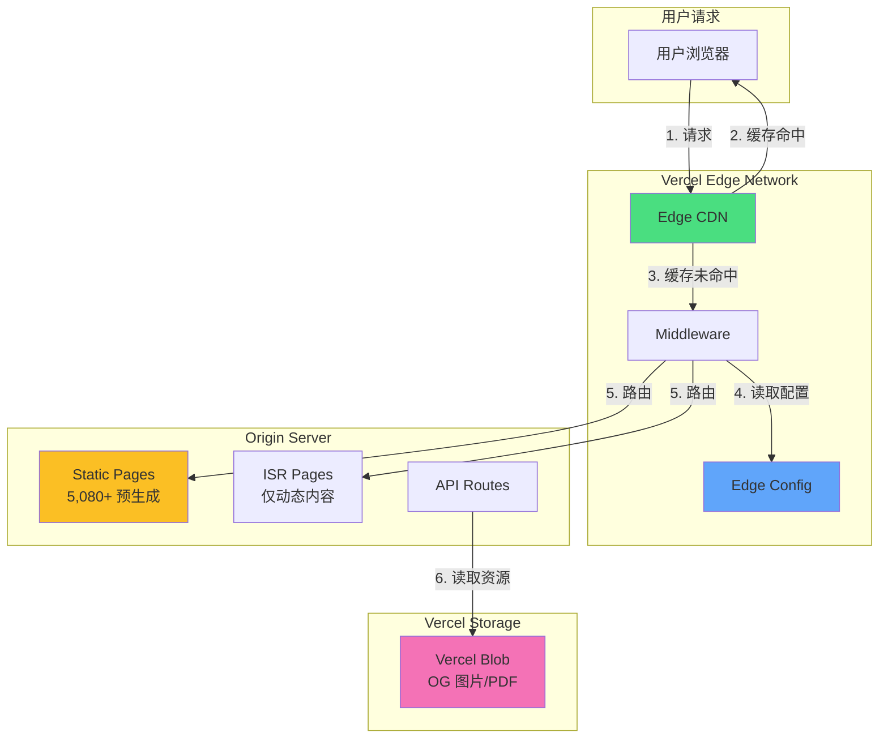
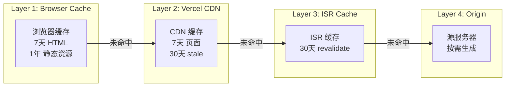

# Design Document: Vercel Resource Optimization

## Overview

本设计文档描述了全面优化 Vercel 资源消耗的技术方案，目标是将 Fast Origin Transfer 减少 80%、Fast Data Transfer 减少 50%、ISR Writes 减少 90%，同时充分利用 Vercel 免费存储功能（Edge Config、Blob）。

### 当前架构分析

**页面规模**：
- 508 个工具 × 10 种语言 = 5,080+ 页面
- 当前仅预渲染热门工具（约 50 个 × 10 语言 = 500 页面）
- 其余 4,580+ 页面通过 ISR 按需生成

**资源消耗来源**：
1. **Fast Origin Transfer**（源到边缘）：
   - ISR 页面重新生成
   - 翻译文件加载（~18MB 总计）
   - OG 图片动态生成

2. **Fast Data Transfer**（边缘到用户）：
   - JavaScript Bundle（大型依赖）
   - HTML 页面传输
   - 翻译文件传输

3. **ISR Writes**：
   - 首次访问非预渲染页面
   - 页面过期后重新生成

## Architecture

### 优化架构图



### 缓存层次结构



## Components and Interfaces

### 1. ISR 配置优化组件

**文件**: `src/app/[locale]/tools/[slug]/page.tsx`

```typescript
// 优化后的 ISR 配置
export const revalidate = 2592000; // 30 天
export const dynamicParams = true;

// 扩展静态生成范围
export function generateStaticParams() {
  const params: { locale: string; slug: string }[] = [];
  
  // 预生成所有工具页面（前 3 种语言）
  const priorityLocales = ['en', 'zh', 'ja'];
  for (const locale of priorityLocales) {
    for (const tool of tools) {
      params.push({ locale, slug: tool.slug });
    }
  }
  
  // 预生成热门工具（所有语言）
  const popularTools = tools.filter(t => t.popular);
  for (const locale of routing.locales) {
    if (!priorityLocales.includes(locale)) {
      for (const tool of popularTools) {
        params.push({ locale, slug: tool.slug });
      }
    }
  }
  
  return params;
}
```

### 2. HTTP 缓存头配置

**文件**: `next.config.js`

```typescript
async headers() {
  return [
    {
      // HTML 页面 - 7天缓存，30天 stale
      source: '/:locale(en|zh|es|pt|ja|ko|fr|de|ru|ar)/:path*',
      headers: [
        {
          key: 'Cache-Control',
          value: 'public, max-age=604800, stale-while-revalidate=2592000',
        },
        {
          key: 'Vercel-CDN-Cache-Control',
          value: 'public, max-age=604800, stale-while-revalidate=2592000',
        },
      ],
    },
    {
      // 静态资源 - 1年缓存
      source: '/_next/static/:path*',
      headers: [
        {
          key: 'Cache-Control',
          value: 'public, max-age=31536000, immutable',
        },
      ],
    },
    {
      // API 路由 - 1小时缓存，24小时 stale
      source: '/api/:path*',
      headers: [
        {
          key: 'Cache-Control',
          value: 'public, max-age=3600, stale-while-revalidate=86400',
        },
      ],
    },
  ];
}
```

### 3. Edge Config 配置管理

**文件**: `src/lib/edge-config.ts`

```typescript
import { get } from '@vercel/edge-config';

// Edge Config 数据结构
interface EdgeConfigData {
  localeRules: {
    countryToLocale: Record<string, string>;
    defaultLocale: string;
  };
  featureFlags: {
    enableNewFeature: boolean;
    enableAnalytics: boolean;
  };
  redirects: Array<{
    source: string;
    destination: string;
    permanent: boolean;
  }>;
}

// 从 Edge Config 读取配置
export async function getLocaleRules() {
  try {
    const rules = await get<EdgeConfigData['localeRules']>('localeRules');
    return rules || getDefaultLocaleRules();
  } catch {
    return getDefaultLocaleRules();
  }
}

export async function getFeatureFlags() {
  try {
    const flags = await get<EdgeConfigData['featureFlags']>('featureFlags');
    return flags || getDefaultFeatureFlags();
  } catch {
    return getDefaultFeatureFlags();
  }
}

export async function getRedirects() {
  try {
    const redirects = await get<EdgeConfigData['redirects']>('redirects');
    return redirects || [];
  } catch {
    return [];
  }
}

// 默认值（Edge Config 不可用时的回退）
function getDefaultLocaleRules() {
  return {
    countryToLocale: {
      CN: 'zh', TW: 'zh', HK: 'zh',
      JP: 'ja', KR: 'ko',
      // ... 其他映射
    },
    defaultLocale: 'en',
  };
}

function getDefaultFeatureFlags() {
  return {
    enableNewFeature: false,
    enableAnalytics: true,
  };
}
```

### 4. Vercel Blob 存储管理

**文件**: `src/lib/blob-storage.ts`

```typescript
import { put, list, del } from '@vercel/blob';

// OG 图片存储
export async function storeOGImage(
  key: string,
  imageBuffer: Buffer
): Promise<string> {
  const blob = await put(`og-images/${key}.png`, imageBuffer, {
    access: 'public',
    contentType: 'image/png',
    cacheControlMaxAge: 60 * 60 * 24 * 30, // 30 天
  });
  return blob.url;
}

// 获取 OG 图片 URL
export async function getOGImageUrl(key: string): Promise<string | null> {
  try {
    const { blobs } = await list({ prefix: `og-images/${key}` });
    return blobs[0]?.url || null;
  } catch {
    return null;
  }
}

// 存储 PDF 模板
export async function storePDFTemplate(
  name: string,
  pdfBuffer: Buffer
): Promise<string> {
  const blob = await put(`pdf-templates/${name}.pdf`, pdfBuffer, {
    access: 'public',
    contentType: 'application/pdf',
    cacheControlMaxAge: 60 * 60 * 24 * 365, // 1 年
  });
  return blob.url;
}

// 存储 JSON 数据
export async function storeJSONData(
  name: string,
  data: unknown
): Promise<string> {
  const blob = await put(
    `data/${name}.json`,
    JSON.stringify(data),
    {
      access: 'public',
      contentType: 'application/json',
      cacheControlMaxAge: 60 * 60 * 24, // 1 天
    }
  );
  return blob.url;
}
```

### 5. 优化的 Middleware

**文件**: `src/middleware.ts`

```typescript
import { NextRequest, NextResponse } from 'next/server';
import { get } from '@vercel/edge-config';

// Middleware 配置 - 使用 matcher 跳过静态资源
export const config = {
  matcher: [
    // 只匹配需要处理的路径
    '/((?!api|_next/static|_next/image|favicon.ico|.*\\..*).*)' 
  ],
};

export default async function middleware(request: NextRequest) {
  const { pathname } = request.nextUrl;
  
  // 检查 locale cookie（早期返回）
  const savedLocale = request.cookies.get('NEXT_LOCALE')?.value;
  if (savedLocale && hasLocalePrefix(pathname)) {
    return NextResponse.next();
  }
  
  // 从 Edge Config 读取配置（低延迟）
  let localeRules;
  try {
    localeRules = await get('localeRules');
  } catch {
    localeRules = null;
  }
  
  // 检测 locale
  const detectedLocale = detectLocale(request, localeRules);
  
  // 设置 cookie 并重定向
  const response = NextResponse.redirect(
    new URL(`/${detectedLocale}${pathname}`, request.url)
  );
  
  response.cookies.set('NEXT_LOCALE', detectedLocale, {
    maxAge: 60 * 60 * 24 * 30, // 30 天
    path: '/',
  });
  
  return response;
}
```

### 6. 翻译文件优化加载器

**文件**: `src/lib/translations-optimized.ts`

```typescript
// 翻译缓存（内存 + localStorage）
const memoryCache = new Map<string, Messages>();

// 加载基础翻译（仅当前 locale）
export async function loadBaseMessages(locale: string): Promise<Messages> {
  const cacheKey = `base-${locale}`;
  
  // 检查内存缓存
  if (memoryCache.has(cacheKey)) {
    return memoryCache.get(cacheKey)!;
  }
  
  // 检查 localStorage（客户端）
  if (typeof window !== 'undefined') {
    const cached = localStorage.getItem(cacheKey);
    if (cached) {
      const parsed = JSON.parse(cached);
      memoryCache.set(cacheKey, parsed);
      return parsed;
    }
  }
  
  // 加载翻译
  const messages = await import(`@/messages/${locale}/base.json`);
  
  // 缓存到内存
  memoryCache.set(cacheKey, messages.default);
  
  // 缓存到 localStorage（客户端）
  if (typeof window !== 'undefined') {
    try {
      localStorage.setItem(cacheKey, JSON.stringify(messages.default));
    } catch {
      // localStorage 满了，忽略
    }
  }
  
  return messages.default;
}

// 懒加载工具翻译
export async function loadToolMessages(
  locale: string,
  toolSlug: string
): Promise<Messages> {
  const cacheKey = `tool-${locale}-${toolSlug}`;
  
  if (memoryCache.has(cacheKey)) {
    return memoryCache.get(cacheKey)!;
  }
  
  const messages = await import(`@/messages/${locale}/tools/${toolSlug}.json`);
  memoryCache.set(cacheKey, messages.default);
  
  return messages.default;
}
```

### 7. 智能预取组件

**文件**: `src/components/SmartLink.tsx`

```typescript
'use client';

import Link from 'next/link';
import { useRouter } from 'next/navigation';
import { useCallback, useRef, useState } from 'react';

interface SmartLinkProps {
  href: string;
  children: React.ReactNode;
  prefetch?: boolean;
  className?: string;
}

export function SmartLink({ 
  href, 
  children, 
  prefetch = false,
  className 
}: SmartLinkProps) {
  const router = useRouter();
  const [isPrefetched, setIsPrefetched] = useState(false);
  const hoverTimeoutRef = useRef<NodeJS.Timeout>();
  
  // 检查网络状况
  const shouldPrefetch = useCallback(() => {
    if (typeof navigator === 'undefined') return true;
    
    const connection = (navigator as Navigator & {
      connection?: { effectiveType?: string; saveData?: boolean };
    }).connection;
    
    if (connection?.saveData) return false;
    if (connection?.effectiveType === '2g') return false;
    
    return true;
  }, []);
  
  // 悬停预取
  const handleMouseEnter = useCallback(() => {
    if (isPrefetched || !shouldPrefetch()) return;
    
    hoverTimeoutRef.current = setTimeout(() => {
      router.prefetch(href);
      setIsPrefetched(true);
    }, 100); // 100ms 延迟
  }, [href, isPrefetched, router, shouldPrefetch]);
  
  const handleMouseLeave = useCallback(() => {
    if (hoverTimeoutRef.current) {
      clearTimeout(hoverTimeoutRef.current);
    }
  }, []);
  
  return (
    <Link
      href={href}
      prefetch={prefetch}
      className={className}
      onMouseEnter={handleMouseEnter}
      onMouseLeave={handleMouseLeave}
    >
      {children}
    </Link>
  );
}
```

### 8. 资源监控服务

**文件**: `src/lib/resource-monitor.ts`

```typescript
// 资源使用监控
interface ResourceUsage {
  fastOriginTransfer: number;
  fastDataTransfer: number;
  isrWrites: number;
  isrReads: number;
  edgeRequests: number;
  timestamp: Date;
}

// 记录 ISR 重新生成事件
export function logISRRegeneration(pagePath: string) {
  const event = {
    type: 'isr_regeneration',
    path: pagePath,
    timestamp: new Date().toISOString(),
  };
  
  // 发送到监控服务
  if (process.env.MONITORING_ENDPOINT) {
    fetch(process.env.MONITORING_ENDPOINT, {
      method: 'POST',
      headers: { 'Content-Type': 'application/json' },
      body: JSON.stringify(event),
    }).catch(() => {});
  }
  
  // 本地日志
  console.log('[ISR]', event);
}

// 检查资源使用阈值
export async function checkResourceThresholds(): Promise<{
  warnings: string[];
  critical: string[];
}> {
  const warnings: string[] = [];
  const critical: string[] = [];
  
  // 从 Vercel API 获取使用数据（需要 API Token）
  // 这里是示例逻辑
  const usage = await getVercelUsage();
  
  // Fast Origin Transfer 检查
  if (usage.fastOriginTransfer > 8 * 1024 * 1024 * 1024) { // 8GB
    critical.push('Fast Origin Transfer 超过 80% 限制');
  } else if (usage.fastOriginTransfer > 5 * 1024 * 1024 * 1024) { // 5GB
    warnings.push('Fast Origin Transfer 超过 50% 限制');
  }
  
  // ISR Writes 检查
  if (usage.isrWrites > 160000) { // 80%
    critical.push('ISR Writes 超过 80% 限制');
  } else if (usage.isrWrites > 100000) { // 50%
    warnings.push('ISR Writes 超过 50% 限制');
  }
  
  return { warnings, critical };
}

async function getVercelUsage(): Promise<ResourceUsage> {
  // 实际实现需要调用 Vercel API
  // https://vercel.com/docs/rest-api/endpoints#get-usage
  return {
    fastOriginTransfer: 0,
    fastDataTransfer: 0,
    isrWrites: 0,
    isrReads: 0,
    edgeRequests: 0,
    timestamp: new Date(),
  };
}
```

## Data Models

### Edge Config 数据模型

```typescript
// Edge Config 存储的数据结构（最大 64KB）
interface EdgeConfigSchema {
  // Locale 检测规则
  localeRules: {
    countryToLocale: Record<string, string>;
    defaultLocale: string;
    version: number;
  };
  
  // Feature Flags
  featureFlags: {
    [key: string]: boolean | string | number;
  };
  
  // 重定向规则（最多 1000 条）
  redirects: Array<{
    source: string;
    destination: string;
    permanent: boolean;
  }>;
  
  // 工具别名映射
  toolAliases: Record<string, string>;
}
```

### Blob 存储数据模型

```typescript
// Blob 存储的文件结构
interface BlobStorageStructure {
  // OG 图片
  'og-images/': {
    pattern: '{locale}-{toolSlug}.png';
    maxSize: '500KB';
    cacheControl: '30 days';
  };
  
  // PDF 模板
  'pdf-templates/': {
    pattern: '{templateName}.pdf';
    maxSize: '5MB';
    cacheControl: '1 year';
  };
  
  // JSON 数据
  'data/': {
    pattern: '{dataName}.json';
    maxSize: '1MB';
    cacheControl: '1 day';
  };
}
```

### 缓存策略数据模型

```typescript
// 缓存策略配置
interface CacheStrategy {
  // 页面类型
  pageType: 'static' | 'isr' | 'dynamic';
  
  // 浏览器缓存
  browserCache: {
    maxAge: number;
    staleWhileRevalidate: number;
  };
  
  // CDN 缓存
  cdnCache: {
    maxAge: number;
    staleWhileRevalidate: number;
  };
  
  // ISR 配置
  isr?: {
    revalidate: number;
  };
}

// 各页面类型的缓存策略
const cacheStrategies: Record<string, CacheStrategy> = {
  toolPage: {
    pageType: 'static',
    browserCache: { maxAge: 604800, staleWhileRevalidate: 2592000 },
    cdnCache: { maxAge: 604800, staleWhileRevalidate: 2592000 },
  },
  categoryPage: {
    pageType: 'static',
    browserCache: { maxAge: 604800, staleWhileRevalidate: 2592000 },
    cdnCache: { maxAge: 604800, staleWhileRevalidate: 2592000 },
  },
  homePage: {
    pageType: 'static',
    browserCache: { maxAge: 86400, staleWhileRevalidate: 604800 },
    cdnCache: { maxAge: 86400, staleWhileRevalidate: 604800 },
  },
  apiRoute: {
    pageType: 'dynamic',
    browserCache: { maxAge: 3600, staleWhileRevalidate: 86400 },
    cdnCache: { maxAge: 3600, staleWhileRevalidate: 86400 },
  },
};
```


## Correctness Properties

*A property is a characteristic or behavior that should hold true across all valid executions of a system—essentially, a formal statement about what the system should do. Properties serve as the bridge between human-readable specifications and machine-verifiable correctness guarantees.*

### Property 1: Static Params Generation Coverage

*For any* tool in the tools list and any locale in the priority locales (en, zh, ja), the generateStaticParams function should return a param object containing that tool slug and locale combination.

**Validates: Requirements 2.1, 2.2, 2.3**

### Property 2: Cache Header Consistency

*For any* HTTP response from a cacheable route (HTML pages, static assets, API routes), the Cache-Control header should match the configured cache strategy for that route type.

**Validates: Requirements 3.1, 3.2, 3.3**

### Property 3: ETag Conditional Response

*For any* request with an If-None-Match header matching the current ETag, the system should return a 304 Not Modified response without body content.

**Validates: Requirements 3.4, 3.6**

### Property 4: Translation Loading Isolation

*For any* locale and tool slug combination, loading translations should only fetch files for that specific locale, never loading translations for other locales.

**Validates: Requirements 5.1, 5.3**

### Property 5: Translation Caching Round-Trip

*For any* translation that has been loaded once, subsequent loads for the same locale and tool should return the cached version without making additional network requests.

**Validates: Requirements 5.5, 5.6**

### Property 6: Middleware Static Asset Bypass

*For any* request path matching a static asset pattern (images, fonts, JS, CSS), the middleware should return NextResponse.next() without performing locale detection or redirects.

**Validates: Requirements 6.1, 6.6**

### Property 7: Middleware Locale Cookie Persistence

*For any* request that triggers locale detection, the response should set a NEXT_LOCALE cookie with the detected locale value and a max-age of at least 30 days.

**Validates: Requirements 6.3, 19.2**

### Property 8: Edge Config Fallback

*For any* Edge Config read operation that fails (network error, timeout, missing key), the system should return the default fallback value without throwing an error.

**Validates: Requirements 13.7**

### Property 9: Blob Storage URL Validity

*For any* file stored in Vercel Blob, the returned URL should be a valid HTTPS URL that can be used to retrieve the file content.

**Validates: Requirements 14.5, 14.6**

### Property 10: Resource Threshold Alerting

*For any* resource usage value that exceeds 50% of its monthly limit, the checkResourceThresholds function should include a warning message for that resource.

**Validates: Requirements 20.2, 20.3**

### Property 11: Request Deduplication

*For any* set of concurrent identical API requests, the system should make only one origin request and serve all concurrent requests from the same response.

**Validates: Requirements 18.1, 18.6**

### Property 12: ISR Regeneration Logging

*For any* ISR page regeneration event, the system should log the event with the page path and timestamp.

**Validates: Requirements 1.4, 9.1**

### Property 13: Smart Prefetch Network Awareness

*For any* prefetch request on a slow connection (2G or save-data mode), the system should skip the prefetch operation.

**Validates: Requirements 7.5**

### Property 14: Dynamic Import Lazy Loading

*For any* large library (ECharts, PDF.js, jspdf), the library should only be loaded when a tool that uses it is accessed, not on initial page load.

**Validates: Requirements 4.2, 4.3, 4.4**

## Error Handling

### Edge Config Errors

```typescript
// Edge Config 读取失败处理
async function safeEdgeConfigRead<T>(key: string, fallback: T): Promise<T> {
  try {
    const value = await get<T>(key);
    return value ?? fallback;
  } catch (error) {
    console.error(`[Edge Config] Failed to read ${key}:`, error);
    return fallback;
  }
}
```

### Blob Storage Errors

```typescript
// Blob 存储操作失败处理
async function safeBlobOperation<T>(
  operation: () => Promise<T>,
  fallback: T
): Promise<T> {
  try {
    return await operation();
  } catch (error) {
    console.error('[Blob Storage] Operation failed:', error);
    return fallback;
  }
}
```

### Translation Loading Errors

```typescript
// 翻译加载失败处理
async function safeLoadTranslation(
  locale: string,
  namespace: string
): Promise<Messages> {
  try {
    return await import(`@/messages/${locale}/${namespace}.json`);
  } catch {
    // 回退到英文
    if (locale !== 'en') {
      console.warn(`[i18n] Falling back to English for ${namespace}`);
      return safeLoadTranslation('en', namespace);
    }
    // 返回空对象
    return {};
  }
}
```

### Resource Monitoring Errors

```typescript
// 监控服务不可用时的处理
function safeLogEvent(event: MonitoringEvent): void {
  try {
    if (process.env.MONITORING_ENDPOINT) {
      fetch(process.env.MONITORING_ENDPOINT, {
        method: 'POST',
        body: JSON.stringify(event),
      }).catch(() => {
        // 静默失败，不影响主流程
      });
    }
  } catch {
    // 静默失败
  }
  
  // 始终记录到控制台
  console.log('[Monitor]', event);
}
```

## Testing Strategy

### Unit Tests

1. **Configuration Tests**
   - 验证 revalidate 常量值
   - 验证 dynamicParams 设置
   - 验证 Cache-Control 头配置

2. **Function Tests**
   - generateStaticParams 输出验证
   - Edge Config 读取和回退逻辑
   - Blob 存储操作
   - 翻译加载和缓存

3. **Middleware Tests**
   - 静态资源跳过逻辑
   - Locale 检测逻辑
   - Cookie 设置逻辑

### Property-Based Tests

使用 fast-check 库进行属性测试：

```typescript
import fc from 'fast-check';

// Property 1: Static Params Coverage
describe('generateStaticParams', () => {
  it('should include all tools for priority locales', () => {
    fc.assert(
      fc.property(
        fc.constantFrom(...tools.map(t => t.slug)),
        fc.constantFrom('en', 'zh', 'ja'),
        (toolSlug, locale) => {
          const params = generateStaticParams();
          return params.some(
            p => p.slug === toolSlug && p.locale === locale
          );
        }
      ),
      { numRuns: 100 }
    );
  });
});

// Property 5: Translation Caching
describe('Translation Caching', () => {
  it('should return cached translations on subsequent loads', () => {
    fc.assert(
      fc.property(
        fc.constantFrom(...supportedLocales),
        fc.constantFrom(...tools.map(t => t.slug)),
        async (locale, toolSlug) => {
          // First load
          const first = await loadToolMessages(locale, toolSlug);
          // Second load (should be cached)
          const second = await loadToolMessages(locale, toolSlug);
          // Should be the same reference (from cache)
          return first === second;
        }
      ),
      { numRuns: 100 }
    );
  });
});

// Property 6: Middleware Static Asset Bypass
describe('Middleware', () => {
  it('should bypass static assets', () => {
    fc.assert(
      fc.property(
        fc.constantFrom('.js', '.css', '.png', '.jpg', '.woff2'),
        (extension) => {
          const path = `/some/path/file${extension}`;
          return shouldSkip(path) === true;
        }
      ),
      { numRuns: 100 }
    );
  });
});
```

### Integration Tests

1. **End-to-End Cache Tests**
   - 验证完整的缓存流程
   - 验证 304 响应

2. **Build Tests**
   - 验证静态生成页面数量
   - 验证 bundle 大小

### Performance Tests

1. **Bundle Size Monitoring**
   - CI/CD 中检查 bundle 大小
   - 超过阈值时失败

2. **Build Time Monitoring**
   - 记录构建时间
   - 超过 30 分钟时告警

### Test Configuration

```typescript
// vitest.config.ts
export default defineConfig({
  test: {
    // 属性测试配置
    testTimeout: 30000, // 属性测试可能需要更长时间
    
    // 覆盖率配置
    coverage: {
      include: [
        'src/lib/edge-config.ts',
        'src/lib/blob-storage.ts',
        'src/lib/translations-optimized.ts',
        'src/lib/resource-monitor.ts',
        'src/middleware.ts',
      ],
      thresholds: {
        lines: 80,
        functions: 80,
        branches: 80,
      },
    },
  },
});
```
