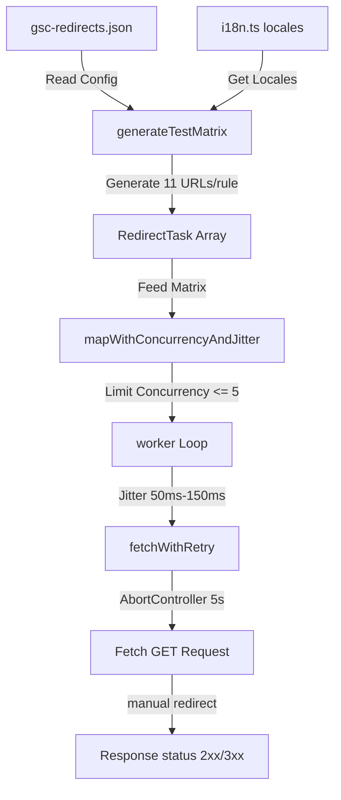

# Phase 74: Redirection Matrix Expansion & Fetch Pool - Plan

This phase builds a high-concurrency redirection link verification script `scripts/validation/validate-live-redirects.ts` that maps redirects configuration with 10 locales and default non-locale prefixes. It manages outbound request rates using a promise worker queue with randomized jitter delays, supports Cloudflare bypass headers, and mocks a Chrome browser User-Agent to avoid bypass routing exclusions.

## Core Architecture & Components



---

## Tasks

### Task 1: Create Validation Script with Core Matrix and Network Logic

**Files:**
- Create: `scripts/validation/validate-live-redirects.ts`
- Read: `src/config/gsc-redirects.json`
- Read: `src/lib/i18n.ts`

<read_first>
- `src/config/gsc-redirects.json`
- `src/lib/i18n.ts`
- `scripts/validation/validate-sitemap-url-health.ts` (for coding style and reference concurrency model)
</read_first>

<acceptance_criteria>
- `scripts/validation/validate-live-redirects.ts` exists on disk.
- It defines and exports the following core functions and types:
  - `interface RedirectTask`
  - `interface ProbeResult`
  - `function generateTestMatrix(...)`
  - `function fetchWithRetry(...)`
  - `function mapWithConcurrencyAndJitter(...)`
  - `function probeUrl(...)`
</acceptance_criteria>

<action>
Create the `scripts/validation/validate-live-redirects.ts` file and implement the core utility functions. Do not use external libraries (like `axios` or `p-limit`) for HTTP or concurrency. Use native Node 22 `fetch` and ESM imports.

1. **Interface Definitions**:
   ```typescript
   export interface RedirectTask {
     sourceUrl: string;
     expectedTarget: string;
   }

   export interface ProbeResult {
     url: string;
     success: boolean;
     status?: number;
     location?: string | null;
     error?: string;
     durationMs: number;
   }
   ```

2. **Matrix Generation**:
   Implement `generateTestMatrix(configPath: string, baseUrl: string, localesList: readonly string[]): Promise<RedirectTask[]>`
   - Use `fs/promises` to read `configPath`.
   - Parse the JSON object mapping source paths to target paths.
   - For each redirect rule:
     - Ensure the source path starts with `/` (e.g. `const cleanPath = path.startsWith('/') ? path : '/' + path`).
     - Generate a base task without locale prefix: `${baseUrl}${cleanPath}`.
     - For each locale in `localesList` (10 locales: `en, zh, ja, ko, es, pt, fr, de, ru, ar`), generate: `${baseUrl}/${locale}${cleanPath}`.
     - Return the list of generated `RedirectTask`s.

3. **HTTP Fetch Client with Retry & Exponential Backoff**:
   Implement `fetchWithRetry(url: string, headers: Record<string, string>, maxAttempts = 4, timeoutMs = 5000): Promise<Response>`
   - Loop `attempt` from 1 to `maxAttempts`.
   - In each loop:
     - Instantiate a new `AbortController`.
     - Set a timeout via `setTimeout` to call `controller.abort()` after `timeoutMs` milliseconds.
     - Perform native `fetch(url, { method: 'GET', headers, redirect: 'manual', signal: controller.signal })`.
     - In the success block: call `clearTimeout(timeoutId)` and return the `Response`.
     - In the catch block: call `clearTimeout(timeoutId)`. If `attempt < maxAttempts`, wait for `500 * attempt` milliseconds using a promise-based delay, then retry. If it is the last attempt, re-throw the network/abort error.

4. **Promise Pool Scheduler with Concurrency and Jitter**:
   Implement `mapWithConcurrencyAndJitter<T, R>(items: T[], mapper: (item: T) => Promise<R>, concurrency: number, jitterRange: [number, number]): Promise<R[]>`
   - Initialize an empty results array `const results: R[] = []` of length `items.length`.
   - Set a tracking index `let nextIndex = 0`.
   - Create a worker generator `async function worker()`:
     - Loop while `nextIndex < items.length`.
     - Take a snapshot of `const index = nextIndex` and increment `nextIndex++`.
     - Apply jitter if `index > 0` and `jitterMax > jitterMin`:
       `const [min, max] = jitterRange;`
       `const jitter = Math.random() * (max - min) + min;`
       `await new Promise((resolve) => setTimeout(resolve, jitter));`
     - Call `results[index] = await mapper(items[index]);`
   - Run `Promise.all` with `Math.min(concurrency, items.length)` worker functions executing concurrently.
   - Return `results`.

5. **Individual Probe Handler**:
   Implement `probeUrl(url: string, bypassToken?: string, maxAttempts = 4, timeoutMs = 5000): Promise<ProbeResult>`
   - Track request start time using `Date.now()`.
   - Setup custom headers:
     - `"User-Agent"`: `"Mozilla/5.0 (Macintosh; Intel Mac OS X 10_15_7) AppleWebKit/537.36 (KHTML, like Gecko) Chrome/124.0.0.0 Safari/537.36"` (mimic real Desktop Chrome to pass loopback middleware checks).
     - If `bypassToken` is non-empty, add `"x-waf-bypass-token"` header with its value.
   - Run `fetchWithRetry`.
   - On response: return `ProbeResult` with `success: response.status >= 200 && response.status < 400` (which flags redirects like 301/302 as success since they are manual redirects), `status: response.status`, `location: response.headers.get('location')`, and `durationMs`.
   - On catch: return `ProbeResult` with `success: false`, `error: error.message`, and `durationMs`.
</action>

---

### Task 2: Implement CLI Controller and Execution Entrypoint

**Files:**
- Modify: `scripts/validation/validate-live-redirects.ts`

<read_first>
- `scripts/validation/validate-live-redirects.ts`
- `scripts/validation/validate-sitemap-url-health.ts` (for the logging structure and exit code handling)
</read_first>

<acceptance_criteria>
- Running `node --import tsx/esm scripts/validation/validate-live-redirects.ts` executes successfully.
- It displays diagnostic console output logging the matrix generation size, concurrency bounds, and individual probe results (using ANSI escape colors for PASS/FAIL).
- The script exit code is non-zero (i.e. `process.exitCode = 1`) if any HTTP probe fails or throws an unhandled error.
</acceptance_criteria>

<action>
Implement the main driver logic at the bottom of `scripts/validation/validate-live-redirects.ts`.

1. **Config & Environment Constants**:
   - `PROD_BASE_URL`: Read `process.env.PROD_BASE_URL` or default to `'https://www.u2tool.com'`. Strip trailing slash.
   - `WAF_BYPASS_TOKEN`: Read `process.env.WAF_BYPASS_TOKEN`.
   - `CONCURRENCY`: Read `process.env.LIVE_REDIRECT_CONCURRENCY` or default to `5`.
   - `JITTER_RANGE`: Read `process.env.LIVE_REDIRECT_JITTER_RANGE` (e.g. `'50-150'`) and parse it into `[number, number]`. Defaults to `[50, 150]`.
   - `CONFIG_PATH`: Resolve path to `src/config/gsc-redirects.json` relative to the project root.

2. **Main Function Loop**:
   - Import `locales` from `src/lib/i18n.ts`.
   - Call `generateTestMatrix` to build the testing matrix from the JSON config.
   - Print banner: `[INFO] Starting live redirection checks. Target domain: ${PROD_BASE_URL}, URLs: ${matrix.length}, Concurrency: ${CONCURRENCY}`.
   - Run the validation matrix using `mapWithConcurrencyAndJitter` with `probeUrl` mapper.
   - Track pass/fail statistics.
   - Iterate through results and print each probe:
     - If success: print using green text: `[PASS] ${result.url} (Status: ${result.status}, Duration: ${result.durationMs}ms)`
     - If failed: print using red text: `[FAIL] ${result.url} (Status: ${result.status ?? 'N/A'}, Error: ${result.error ?? 'None'}, Duration: ${result.durationMs}ms)`
   - Print summary: Total checked, Successes, Failures, and Total Time taken.
   - If failures > 0: set `process.exitCode = 1`.
   - Wrap `main()` with standard promise error catcher, printing error and setting `process.exitCode = 1`.
</action>

---

### Task 3: Integrate Script in package.json

**Files:**
- Modify: `package.json`

<read_first>
- `package.json`
</read_first>

<acceptance_criteria>
- `package.json` contains the `"validate:live-redirects"` script definition.
- Running `npm run validate:live-redirects` executes the validator file.
</acceptance_criteria>

<action>
Add a new command to the `scripts` object in `package.json`:
```json
"validate:live-redirects": "node --import tsx/esm scripts/validation/validate-live-redirects.ts"
```
Ensure it matches the existing validation command patterns.
</action>

---

### Task 4: Add Comprehensive Unit Tests for Utility Functions

**Files:**
- Create: `scripts/validation/validate-live-redirects.test.ts`

<read_first>
- `scripts/validation/validate-live-redirects.ts`
</read_first>

<acceptance_criteria>
- Running `npx vitest run scripts/validation/validate-live-redirects.test.ts` reports 100% success.
- Mocking is used to isolate network requests and ensure tests are fast, self-contained, and do not make active outbound network calls.
</acceptance_criteria>

<action>
Create `scripts/validation/validate-live-redirects.test.ts` and verify the internal logic of the validator.

1. **Test `generateTestMatrix`**:
   - Mock reading of `gsc-redirects.json` using Vitest's mocking or custom structure.
   - Verify that for each redirect source path, it generates exactly 11 tasks (1 default non-prefixed path + 10 locale-prefixed paths: `/en`, `/zh`, `/ja`, `/ko`, `/es`, `/pt`, `/fr`, `/de`, `/ru`, `/ar`).
   - Validate URL normalization (e.g. paths missing leading slash).

2. **Test `fetchWithRetry` and Exponential Backoff**:
   - Mock global `fetch`.
   - Verify it retries up to `maxAttempts` times on network failures and throws on final attempt failure.
   - Verify that timers are correctly created, cleared (via `clearTimeout`), and abort signals are sent properly.
   - Test exponential delay timing calculation (`500 * attempt`).

3. **Test `mapWithConcurrencyAndJitter`**:
   - Verify that concurrency limits are respected by tracking the peak active mapper count.
   - Validate that randomized Jitter delay falls within the specified bounds (`[min, max]`).
</action>

---

## Verification Criteria

Once the Executor runs the steps, we will verify the phase is complete using the following checklists.

### Automated Verification
```bash
# 1. Run the unit test suite to verify code logic
npx vitest run scripts/validation/validate-live-redirects.test.ts

# 2. Dry run redirection check on a local simulation or dry-run target (using mock base or mock endpoint if offline)
PROD_BASE_URL="https://httpbin.org" node --import tsx/esm scripts/validation/validate-live-redirects.ts || true
```

### Manual Audit Verification
1. Check that `scripts/validation/validate-live-redirects.ts` correctly imports `locales` from `src/lib/i18n.ts`.
2. Inspect the custom headers definition in `probeUrl` and verify it sends `x-waf-bypass-token` only when the env var is defined.
3. Validate that `clearTimeout` is called in both `try` and `catch` paths inside `fetchWithRetry` to prevent Event Loop hangs.

---

## Goal-Backward Must Haves

The phase goal is successfully met if all of the following conditions are true:

- [ ] **Must Have 1**: The test matrix correctly expands each static redirect rule to 11 configurations (1 raw + 10 locale paths).
- [ ] **Must Have 2**: The Promise worker queue limits active concurrent fetches to `LIVE_REDIRECT_CONCURRENCY` (defaults to 5) and randomizes request pacing using 50ms-150ms Jitter.
- [ ] **Must Have 3**: Every request uses a manual redirect handling strategy (`redirect: 'manual'`) and GET method, ensuring we get 3xx redirect status code mappings successfully without automatic follow-through.
- [ ] **Must Have 4**: System timeouts are managed cleanly with `AbortController` (5s limit), proper retries (3 retries with `500 * attempt` ms backoff), and no dangling timers.
- [ ] **Must Have 5**: Integrates safely as `validate:live-redirects` under `package.json`.
