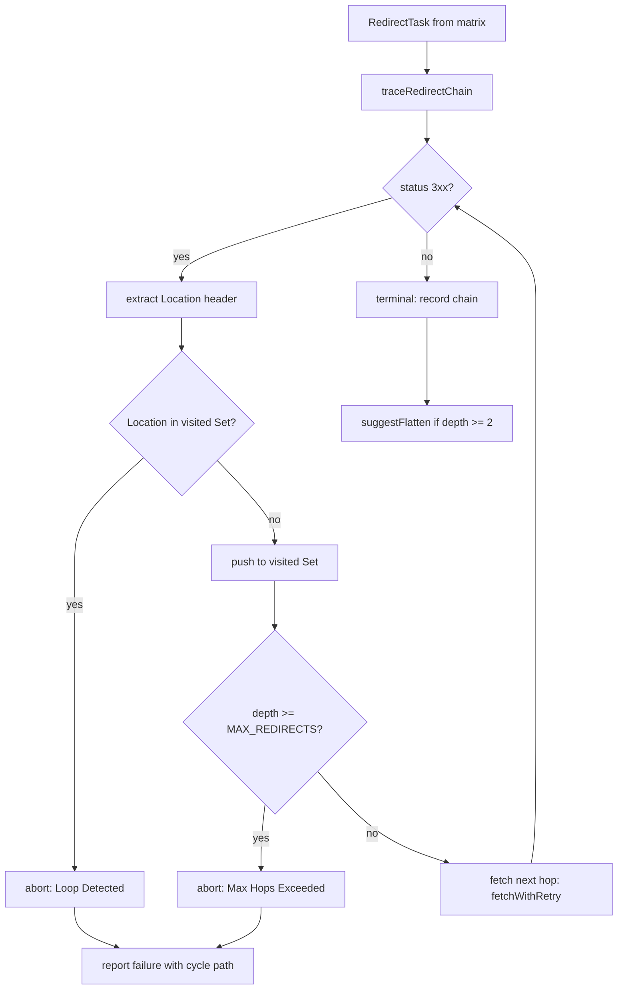

# Phase 75: Redirection Hop Tracer & Loop Blocker - Plan

This phase extends the Phase 74 probe primitive into a multi-hop redirect
chain tracer. Instead of capturing only the first 3xx response, the probe
now follows the `Location` header up to `MAX_REDIRECTS` hops, recording
each intermediate URL, while a per-chain `Set<string>` guarantees that
redirect loops (A -> B -> A) are detected and reported rather than
crashing the crawler. Query-parameter order drift between hops is
neutralized by normalizing URLs via `new URL()` and comparing sorted
key-value pairs, preventing false alerts when the edge reorders params.

## Scope Boundaries

In scope:
- Hop tracing loop with a hard depth cap (`MAX_REDIRECTS = 5`).
- Per-chain visited `Set<string>` loop detection with explicit cycle path.
- Query-parameter normalization (sorted, locale-aware comparison).
- Hop-flattening suggestion generator for chains with depth >= 2.
- Extended `ProbeResult` to carry the full hop chain.

Out of scope (deferred to Phase 76):
- HTML body availability checks (soft 404 / 500 scanning).
- Reasoning-trace leakage scanning.
- Wiring `--online` into `qa:production` as a release gate.

## Core Architecture & Components



---

## Tasks

### Task 1: Extend ProbeResult and add URL normalization helpers

**Files:**
- Modify: `scripts/validation/validate-live-redirects.ts`

<read_first>
- `scripts/validation/validate-live-redirects.ts`
- `.planning/research/PITFALLS.md` (Pitfall 2 loop detection, Pitfall 3 param drift)
</read_first>

<acceptance_criteria>
- `ProbeResult` gains optional chain fields without breaking existing Phase 74 tests.
- A `normalizeUrlForComparison(raw: string): string` helper exists and sorts query params deterministically.
</acceptance_criteria>

<action>
1. Extend the `ProbeResult` interface with chain metadata:
   ```typescript
   export interface HopInfo {
     url: string;
     status?: number;
     location?: string | null;
   }

   export interface ProbeResult {
     url: string;
     success: boolean;
     status?: number;
     location?: string | null;
     error?: string;
     durationMs: number;
     chain?: HopInfo[];          // full hop sequence, length === hop depth
     loopDetected?: boolean;     // true when a cycle was found
     maxHopsExceeded?: boolean;  // true when depth cap hit
   }
   ```
   New fields are optional so existing single-hop probe tests stay green.

2. Implement query-parameter normalization that survives param reordering:
   ```typescript
   export function normalizeUrlForComparison(raw: string): string {
     const u = new URL(raw);
     const sortedKeys = [...u.searchParams.keys()].sort();
     const normalized = new URL(u.origin + u.pathname);
     for (const key of sortedKeys) {
       // preserve multi-value semantics by sorting each key's values too
       const values = u.searchParams.getAll(key).sort();
       for (const value of values) {
         normalized.searchParams.append(key, value);
       }
     }
     // ignore trailing-slash and hash noise for comparison
     return normalized.toString().replace(/\/$/, '');
   }
   ```
   This collapses `?b=2&a=1` and `?a=1&b=2` to the same canonical string,
   directly addressing Pitfall 3 (Query Parameter Order Drift).
</action>

---

### Task 2: Implement `traceRedirectChain` with loop blocker and depth cap

**Files:**
- Modify: `scripts/validation/validate-live-redirects.ts`

<read_first>
- `scripts/validation/validate-live-redirects.ts`
</read_first>

<acceptance_criteria>
- `traceRedirectChain(task, opts)` follows 3xx redirects up to `MAX_REDIRECTS` (default 5).
- A loop (A->B->A) is detected before the third fetch and reported with the cycle path; no further requests are issued after detection.
- Hitting the depth cap sets `maxHopsExceeded: true` and `success: false`.
- The chain array records every hop visited, including the terminal one.
</acceptance_criteria>

<action>
1. Define the cap and option type:
   ```typescript
   const MAX_REDIRECTS = 5;

   export interface TraceOptions {
     bypassToken?: string;
     maxRedirects?: number;
     maxAttempts?: number;
     timeoutMs?: number;
   }
   ```

2. Implement the tracer as a `while` loop around `fetchWithRetry`. Per-chain
   `visited` Set uses `normalizeUrlForComparison` as the membership key so
   param reordering does not mask a real loop:
   ```typescript
   export async function traceRedirectChain(
     task: RedirectTask,
     opts: TraceOptions = {}
   ): Promise<ProbeResult> {
     const maxRedirects = opts.maxRedirects ?? MAX_REDIRECTS;
     const startTime = Date.now();
     const chain: HopInfo[] = [];
     const visited = new Set<string>();

     let currentUrl = task.sourceUrl;

     for (let depth = 0; depth <= maxRedirects; depth++) {
       const key = normalizeUrlForComparison(currentUrl);
       if (visited.has(key)) {
         return {
           url: task.sourceUrl,
           success: false,
           durationMs: Date.now() - startTime,
           chain,
           loopDetected: true,
           error: `Loop detected at hop ${depth}: ${currentUrl} already visited`,
         };
       }
       visited.add(key);

       const response = await fetchWithRetry(
         currentUrl,
         buildProbeHeaders(opts.bypassToken),
         opts.maxAttempts,
         opts.timeoutMs
       );
       const location = response.headers.get('location');
       chain.push({ url: currentUrl, status: response.status, location });

       // terminal: not a redirect, or no usable Location
       if (response.status < 300 || response.status >= 400 || !location) {
         return {
           url: task.sourceUrl,
           success: response.status >= 200 && response.status < 400,
           status: response.status,
           location: null,
           durationMs: Date.now() - startTime,
           chain,
         };
       }

       // resolve relative Location against the current URL
       currentUrl = new URL(location, currentUrl).toString();

       if (depth === maxRedirects) {
         return {
           url: task.sourceUrl,
           success: false,
           status: response.status,
           location,
           durationMs: Date.now() - startTime,
           chain,
           maxHopsExceeded: true,
           error: `Max redirects (${maxRedirects}) exceeded`,
         };
       }
     }
     // unreachable; loop returns on every path
     throw new Error('traceRedirectChain: unreachable');
   }
   ```

3. Extract the existing `probeUrl` header construction into a shared
   `buildProbeHeaders(bypassToken?)` helper so both `probeUrl` and
   `traceRedirectChain` agree on the Chrome UA + optional WAF token.
   `probeUrl` continues to work unchanged for backward compatibility.
</action>

---

### Task 3: Add hop-flattening suggestion generator

**Files:**
- Modify: `scripts/validation/validate-live-redirects.ts`

<read_first>
- `scripts/validation/validate-live-redirects.ts`
</read_first>

<acceptance_criteria>
- `suggestFlatten(chain)` returns `null` for chains with depth < 2.
- For depth >= 2, it returns a suggestion object naming the source, the final target, and the number of hops saved.
</acceptance_criteria>

<action>
Implement a pure function that consumes a `HopInfo[]` chain and proposes a
flat rule pointing the first hop directly at the last hop's resolved target.
This mirrors the FEATURES.md differentiator "Auto-analyzes chains and
suggests flat JSON redirects" without ever mutating `gsc-redirects.json`
(the Anti-Feature in FEATURES.md explicitly forbids auto-rewriting config):
```typescript
export interface FlattenSuggestion {
  from: string;
  to: string;
  hopsEliminated: number;
}

export function suggestFlatten(chain: HopInfo[]): FlattenSuggestion | null {
  if (chain.length < 3) return null; // depth 0 or 1 = nothing to flatten

  const from = chain[0].url;
  const last = chain[chain.length - 1];
  const to = last.location ?? last.url;

  return {
    from,
    to,
    hopsEliminated: chain.length - 2,
  };
}
```
The CLI driver (Task 4) prints these suggestions for any passing chain
with depth >= 2, so operators get copy-paste-ready flatten advice without
the tool touching config files.
</action>

---

### Task 4: Wire the tracer into the CLI driver and print chain diagnostics

**Files:**
- Modify: `scripts/validation/validate-live-redirects.ts`

<read_first>
- `scripts/validation/validate-live-redirects.ts`
</read_first>

<acceptance_criteria>
- The CLI uses `traceRedirectChain` instead of the single-hop `probeUrl` mapper.
- PASS lines for multi-hop chains print the hop count; FAIL lines for loops / max-hops print the chain and the cycle reason.
- Flattening suggestions are emitted for passing chains with depth >= 2.
- Exit code is non-zero if any chain fails, loops, or exceeds max hops.
</acceptance_criteria>

<action>
Update `main()`:
1. Replace the mapper:
   ```typescript
   const mapper = (task: RedirectTask) =>
     traceRedirectChain(task, {
       bypassToken: WAF_BYPASS_TOKEN,
       maxRedirects: MAX_REDIRECTS,
       maxAttempts: 4,
       timeoutMs: 5000,
     });
   ```
2. In the results loop, when `res.success` is true and `res.chain` has
   length >= 3, call `suggestFlatten(res.chain)` and print a cyan
   `[FLATTEN]` line with the `from -> to` advice and `hopsEliminated`.
3. When `res.loopDetected` or `res.maxHopsExceeded` is true, print the
   full chain (one `[HOP]` line per entry) plus the cycle reason in red,
   and count it as a failure.
4. Extend the summary block to report loop count and max-hops count
   separately from generic failures, so operators can triage edge KV
   misconfiguration (loops) vs over-deep rules (max-hops).
</action>

---

## Verification Criteria

### Automated Verification
```bash
# 1. Unit tests (Phase 74 regressions + Phase 75 new cases)
npx vitest run scripts/validation/validate-live-redirects.test.ts

# 2. Offline dry run against a redirect-capable test target
PROD_BASE_URL="https://httpbin.org" node --import tsx/esm scripts/validation/validate-live-redirects.ts || true
```

### Manual Audit Verification
1. Inspect `traceRedirectChain` and confirm the `visited.has(key)` check
   runs *before* each fetch, so a loop is caught without an extra request.
2. Confirm `normalizeUrlForComparison` is the only membership key used for
   the visited Set, never the raw URL string.
3. Confirm `suggestFlatten` never writes to disk or imports `fs` — it is
   a pure reporter, honoring the FEATURES.md Anti-Feature boundary.

---

## Goal-Backward Must Haves

The phase goal is successfully met if all of the following conditions are true:

- [ ] **Must Have 1**: `traceRedirectChain` follows 3xx `Location` headers
      up to `MAX_REDIRECTS` (5) and returns the full hop chain in `ProbeResult.chain`.
- [ ] **Must Have 2**: A redirect loop (A -> B -> A) is detected via the
      per-chain `visited` Set before it repeats, sets `loopDetected: true`,
      and halts further requests with the cycle path in the error message.
- [ ] **Must Have 3**: Hitting the depth cap sets `maxHopsExceeded: true`
      and `success: false`, and never throws an uncaught error.
- [ ] **Must Have 4**: Query-parameter order drift is neutralized — two
      Locations that differ only by param order compare as equal, so
      param reordering never produces a false loop or false mismatch.
- [ ] **Must Have 5**: `suggestFlatten` returns `null` for depth < 2 and a
      concrete `from -> to` suggestion for depth >= 2, without writing to
      `gsc-redirects.json`.
- [ ] **Must Have 6**: All Phase 74 tests still pass unchanged (backward
      compatibility for `ProbeResult` new optional fields and `probeUrl`).

## Pitfall Coverage (from PITFALLS.md)

- **Pitfall 2 (Infinite Redirect Loops)**: covered by Must Have 2.
- **Pitfall 3 (Query Parameter Order Drift)**: covered by Must Have 4.
- **Pitfall 1 (WAF Blocking)**: inherited from Phase 74 — the tracer
  reuses `fetchWithRetry` + concurrency + jitter, so no new rate-limit
  exposure is introduced by multi-hop tracing.
