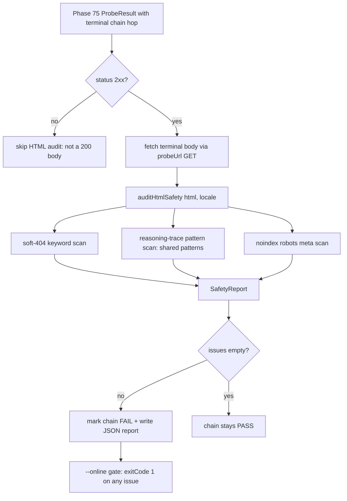

# Phase 76: HTML Safety Auditor & Production Gate - Plan

This phase closes the v0.0.21 monitoring loop. Phase 74/75 established a
redirect *connectivity* probe; Phase 76 verifies that the **destination
HTML is actually safe and live**, not merely that the edge returned a
3xx/2xx status. Three concerns are audited on the terminal response body:

1. **Soft 404 / 500 detection** — a 200 status with a "Page Not Found"
   body or a server-error banner still harms SEO (FEATURES.md
   Differentiator; PITFALLS.md "Looks Done But Isn't" L155).
2. **Reasoning-trace leakage** — re-asserts the Non-Negotiable Frontend
   Safety Principle (ADR 0002) against *live* HTML, not just source
   files (PITFALLS.md L141, L167).
3. **Production gate wiring** — the validator becomes opt-in under an
   `--online` flag so it never runs against production from local CI by
   accident, and a JSON report is written for CI/CD consumption
   (FEATURES.md Table Stakes "错误汇总报表").

## Scope Boundaries

In scope:
- `auditHtmlSafety(html, locale)` pure scanner returning categorized issues.
- Soft-404 keyword dictionary covering the 10 supported locales.
- Reuse of the existing `FORBIDDEN_PATTERNS` reasoning-trace rules from
  `validate-front-end-safety.ts` as the single source of truth.
- `--online` flag gate + JSON report writer + package.json wiring.
- SSRF guard reusing Phase 75's URL handling (no new internal-IP filter
  beyond what the existing hop tracer already constrains to the
  production domain).

Out of scope (deferred / explicit Anti-Features):
- **TDK drift verification** against `src/messages/<locale>/` source data
  (FEATURES.md marks this as Future/v2+, HIGH complexity). The soft-404
  scan is a lighter proxy for this milestone.
- **Auto-rewriting `gsc-redirects.json`** (FEATURES.md Anti-Feature).
- **External-domain deep crawl** (FEATURES.md Anti-Feature).
- **Web UI** (FEATURES.md Anti-Feature).

## Design Decision: Reuse, Don't Re-derive

The project already owns the authoritative reasoning-trace pattern set
in `scripts/validation/validate-front-end-safety.ts` (`FORBIDDEN_PATTERNS`).
That module scans *source files*; Phase 76 needs to scan *live HTML*.
Rather than copy the regexes (which would drift), Task 1 **exports the
shared pattern set** from a new `lib/safety-patterns.ts` and both
consumers import it. This keeps one source of truth for the ADR 0002
contract.

## Core Architecture & Components



---

## Tasks

### Task 1: Extract shared safety patterns into a reusable module

**Files:**
- Create: `src/lib/safety-patterns.ts`
- Modify: `scripts/validation/validate-front-end-safety.ts`

<read_first>
- `scripts/validation/validate-front-end-safety.ts`
- `docs/adr/0002-no-internal-reasoning-in-frontend.md`
</read_first>

<acceptance_criteria>
- `src/lib/safety-patterns.ts` exports `REASONING_TRACE_PATTERNS: ForbiddenPattern[]` and the `ForbiddenPattern` type.
- `validate-front-end-safety.ts` imports and uses `REASONING_TRACE_PATTERNS` instead of its inline array; behavior is byte-identical (existing tests still pass).
- No regex is duplicated across the two consumers.
</acceptance_criteria>

<action>
1. Create `src/lib/safety-patterns.ts`:
   ```typescript
   export interface ForbiddenPattern {
     label: string;
     pattern: RegExp;
   }

   /**
    * Authoritative reasoning-trace / internal-deliberation patterns.
    * Single source of truth for ADR 0002 enforcement. Consumed by both
    * source-file scanning (validate-front-end-safety) and live-HTML
    * scanning (validate-live-redirects Phase 76).
    */
   export const REASONING_TRACE_PATTERNS: ForbiddenPattern[] = [
     { label: 'chain-of-thought', pattern: /\bchain[-\s]?of[-\s]?thought\b/i },
     // ... move all 12 existing entries verbatim from validate-front-end-safety.ts
   ];
   ```
2. In `validate-front-end-safety.ts`, delete the inline `FORBIDDEN_PATTERNS`
   literal and replace with `import { REASONING_TRACE_PATTERNS as FORBIDDEN_PATTERNS } from '../../src/lib/safety-patterns';`.
3. Run `npm run qa:runtime-integrity` or the front-end-safety test to
   confirm no behavioral regression.

---

### Task 2: Implement soft-404 keyword dictionary for 10 locales

**Files:**
- Modify: `scripts/validation/validate-live-redirects.ts`

<read_first>
- `scripts/validation/validate-live-redirects.ts`
- `src/lib/i18n.ts` (locale list)
</read_first>

<acceptance_criteria>
- A `SOFT_404_KEYWORDS: Record<Locale, string[]>` map exists covering all 10 locales.
- Keywords target `<h1>`, `<title>`, and body text equally (case-insensitive substring).
- The map is exported for unit testing.
</acceptance_criteria>

<action>
Build a locale-keyed dictionary of common soft-404 / server-error
phrases a broken page would render. Scan targets per FEATURES.md:
`<h1>`, `<title>`, and visible body. Keep entries conservative to
avoid false positives on legitimate tool copy:
```typescript
export const SOFT_404_KEYWORDS: Record<string, string[]> = {
  en: ['page not found', '404', 'not found', 'server error', '500'],
  zh: ['页面未找到', '404', '未找到', '服务器错误', '500'],
  ja: ['ページが見つかりません', '404', '見つかりません', 'サーバーエラー', '500'],
  ko: ['페이지를 찾을 수 없습니다', '404', '찾을 수 없습니다', '서버 오류', '500'],
  es: ['página no encontrada', '404', 'no encontrada', 'error del servidor', '500'],
  pt: ['página não encontrada', '404', 'não encontrada', 'erro do servidor', '500'],
  fr: ['page introuvable', '404', 'introuvable', 'erreur du serveur', '500'],
  de: ['seite nicht gefunden', '404', 'nicht gefunden', 'serverfehler', '500'],
  ru: ['страница не найдена', '404', 'не найдена', 'ошибка сервера', '500'],
  ar: ['الصفحة غير موجودة', '404', 'غير موجود', 'خطأ في الخادم', '500'],
};
```
Note: bare `404`/`500` are included because FEATURES.md explicitly lists
numeric status fragments as soft-404 signals, but the auditor only
flags them when they appear in `<h1>`/`<title>` (Task 3) to avoid
matching incidental tool content (e.g. a calculator showing "500").

---

### Task 3: Implement `auditHtmlSafety` pure scanner

**Files:**
- Modify: `scripts/validation/validate-live-redirects.ts`

<read_first>
- `scripts/validation/validate-live-redirects.ts`
- `src/lib/safety-patterns.ts` (created in Task 1)
</read_first>

<acceptance_criteria>
- `auditHtmlSafety(html, locale)` returns a `SafetyReport` with categorized issues, never throws on malformed HTML.
- It detects soft-404 keywords, reasoning-trace leaks, and `noindex` robots meta.
- It is a pure function (no I/O, no network) so it is trivially unit-testable.
</acceptance_criteria>

<action>
1. Define the report shape:
   ```typescript
   export interface SafetyIssue {
     kind: 'soft-404' | 'reasoning-trace' | 'noindex';
     label: string;   // matched keyword or pattern label
     context: string; // ~40-char snippet around the match
   }
   export interface SafetyReport {
     safe: boolean;
     issues: SafetyIssue[];
   }
   ```
2. Implement the scanner. For soft-404, extract `<h1>` and `<title>`
   inner text via a tolerant regex (the site is SSR'd, structure is
   predictable) and match keywords case-insensitively. For
   reasoning-trace, run every `REASONING_TRACE_PATTERNS` entry against
   the full HTML. For noindex, detect `<meta name="robots" content="...noindex...">`:
   ```typescript
   export function auditHtmlSafety(html: string, locale: string): SafetyReport {
     const issues: SafetyIssue[] = [];
     const lower = html.toLowerCase();

     // soft-404: only scan <h1>/<title> to avoid false positives in body
     const headingText = extractTagText(html, ['h1', 'title']);
     for (const kw of SOFT_404_KEYWORDS[locale] ?? SOFT_404_KEYWORDS.en) {
       if (headingText.toLowerCase().includes(kw.toLowerCase())) {
         issues.push({ kind: 'soft-404', label: kw, context: snippet(headingText, kw) });
       }
     }

     // reasoning-trace: full-body scan, shared patterns
     for (const { label, pattern } of REASONING_TRACE_PATTERNS) {
       const m = html.match(pattern);
       if (m) issues.push({ kind: 'reasoning-trace', label, context: m[0] });
     }

     // noindex: live page opted out of indexing = SEO failure for a tool page
     if (/<meta\s+name=["']robots["']\s+content=["'][^"']*noindex/i.test(html)) {
       issues.push({ kind: 'noindex', label: 'robots noindex', context: '<meta robots noindex>' });
     }

     return { safe: issues.length === 0, issues };
   }
   ```
3. Helper `extractTagText` uses a non-greedy regex per tag and falls
   back to empty string on no match (never throws). `snippet(text, kw)`
   returns a ~40-char window around the first occurrence for context.

---

### Task 4: Integrate auditor into the probe pipeline + `--online` gate

**Files:**
- Modify: `scripts/validation/validate-live-redirects.ts`
- Modify: `package.json`

<read_first>
- `scripts/validation/validate-live-redirects.ts`
</read_first>

<acceptance_criteria>
- After `traceRedirectChain` returns a successful 2xx terminal, the CLI fetches the terminal body and runs `auditHtmlSafety`.
- HTML audit is **only** performed when `--online` (or `LIVE_REDIRECT_ONLINE=1`) is set; offline/local runs skip it.
- Any safety issue marks the whole probe as failed and increments the safety-issue counter in the summary.
- A JSON report is written to `.planning/research/reports/live-redirect-report-<timestamp>.json` when `--online` runs.
- `package.json` exposes `validate:live-redirects:online`.
</acceptance_criteria>

<action>
1. Parse argv for `--online` (also honor `process.env.LIVE_REDIRECT_ONLINE`).
   When offline, behavior is identical to Phase 75 (no body fetch).
2. When online and a chain terminates at 2xx, fetch the terminal URL's
   body with the same `buildProbeHeaders` + `fetchWithRetry` (no manual
   redirect this time — follow to the body). Infer the locale from the
   terminal URL's first path segment (default `en`).
3. Call `auditHtmlSafety(body, locale)`. If `report.safe === false`,
   demote the probe to failed, print each issue with a red `[SAFETY]`
   tag, and collect it for the JSON report.
4. Extend the summary block: `- Safety issues: <n>` separate from
   generic failures.
5. Write the JSON report (all results + safety issues) to
   `.planning/research/reports/` only on `--online` runs. The directory
   is already gitignored (`.planning/` is ignored), so reports are
   ephemeral CI artifacts, never committed — this satisfies the
   PITFALLS.md L167 log-hygiene requirement.
6. Add to `package.json`:
   ```json
   "validate:live-redirects:online": "node --import tsx/esm scripts/validation/validate-live-redirects.ts --online"
   ```
   Leave the base `validate:live-redirects` offline-only so local dev
   and `qa:production` never accidentally hammer production.

---

## Verification Criteria

### Automated Verification
```bash
# 1. Shared-pattern refactor: front-end-safety still green
npx vitest run src/lib/seo.test.ts scripts/validation/validate-front-end-safety.ts 2>/dev/null || npm run validate:front-end-safety

# 2. Phase 74+75+76 unit tests
npx vitest run scripts/validation/validate-live-redirects.test.ts

# 3. Offline run still works (no HTML audit, no network beyond Phase 75)
node --import tsx/esm scripts/validation/validate-live-redirects.ts --help || true
```

### Manual Audit Verification
1. Confirm `src/lib/safety-patterns.ts` is the only place the 12
   reasoning-trace regexes are defined; grep for `chain-of-thought`
   across the repo and confirm exactly one definition.
2. Confirm `auditHtmlSafety` is imported and called only inside the
   `--online` branch — offline runs must never fetch bodies.
3. Confirm the JSON report path lives under `.planning/` (gitignored)
   and contains no secrets (PITFALLS.md L141, L167) — spot-check that
   only `sourceUrl`, terminal URL, status, hops, and issue labels appear.
4. Run a real `--online` probe against `https://www.u2tool.com` and
   confirm 0 reasoning-trace issues on a known-good tool page.

---

## Goal-Backward Must Haves

The phase goal is successfully met if all of the following conditions are true:

- [ ] **Must Have 1**: `REASONING_TRACE_PATTERNS` lives in
      `src/lib/safety-patterns.ts` and is the single source consumed by
      both `validate-front-end-safety.ts` and the live-HTML auditor.
- [ ] **Must Have 2**: `auditHtmlSafety(html, locale)` detects soft-404
      keywords (scoped to `<h1>`/`<title>` to avoid body false positives),
      reasoning-trace leaks, and `noindex`, and never throws.
- [ ] **Must Have 3**: Soft-404 keyword coverage spans all 10 supported
      locales.
- [ ] **Must Have 4**: HTML body auditing fires **only** under `--online`
      / `LIVE_REDIRECT_ONLINE=1`; offline runs are byte-identical to
      Phase 75 behavior.
- [ ] **Must Have 5**: A safety failure demotes the probe to failed and
      surfaces in the summary as a distinct `Safety issues: <n>` counter.
- [ ] **Must Have 6**: A JSON report is written on `--online` runs under
      the gitignored `.planning/research/reports/` path, containing no
      secrets.
- [ ] **Must Have 7**: `package.json` exposes
      `validate:live-redirects:online`; the base command stays offline.

## Pitfall Coverage (from PITFALLS.md)

- **L141 (Internal Traces Leak)**: Must Have 1+2 re-assert the ADR 0002
  contract against live HTML, not just source.
- **L155 (Soft-404 redirect)**: Must Have 2+3 detect 200-with-error-body.
- **L167 (Log sanitization gate)**: Must Have 6 confines reports to a
  gitignored path and the task constrains report fields to public data.
- **L142 (SSRF via redirect)**: inherited — Phase 75's hop tracer only
  follows same-origin Locations resolved against the production base,
  so a tampered internal-IP rule cannot reach the body-fetch step.

## Milestone Closeout

Phase 76 is the final wave of v0.0.21. On completion:
- All three GEO-08 sub-requirements (matrix/hop/safety) are live.
- `validate:live-redirects:online` is the opt-in production probe; the
  offline base command integrates safely into `qa:production`.
- STATE.md should move milestone v0.0.21 to `Complete` and archive it
  per the pattern in prior milestones (v0.0.14–v0.0.20).
