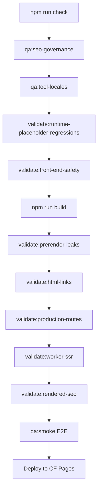

# Architecture Research

**Domain:** SEO & GEO Comprehensive Audit & Governance (Astro 5 + Svelte 5 + Cloudflare Pages Worker)
**Researched:** 2026-06-16
**Confidence:** HIGH

## Standard Architecture

### System Overview

U2Tool leverages a hybrid static/serverless architecture running on Astro 5 and Cloudflare Pages. Technical SEO & GEO governance is enforced across two distinct execution boundaries: **Build Time (CI/CD Pipeline)** and **Request Time (Cloudflare Edge Worker)**.

```
┌─────────────────────────────────────────────────────────────────────────────┐
│                          CI/CD Build Pipeline (Node.js)                     │
├─────────────────────────────────────────────────────────────────────────────┤
│  ┌───────────────────────┐   ┌───────────────┐   ┌───────────────────────┐  │
│  │   Pre-build Audits    │   │  Astro Build  │   │  Post-prerender Scan  │  │
│  │  - Source safety      ├──>│  - Prerender  ├──>│  - HTML leak scanner  │  │
│  │  - i18n/TDK checks    │   │  - Edge compile│  │  - Link integrity     │  │
│  └───────────────────────┘   └───────────────┘   └───────────────────────┘  │
└──────────────────────────────────────┬──────────────────────────────────────┘
                                       │ Deploy
                                       ▼
┌─────────────────────────────────────────────────────────────────────────────┐
│                         Cloudflare Edge Worker (Request)                    │
├─────────────────────────────────────────────────────────────────────────────┤
│                         [Cloudflare Pages Middleware]                       │
│  ┌───────────────────────┐   ┌───────────────┐   ┌───────────────────────┐  │
│  │ Canonical Redirects   │   │ Legacy & 410  │   │   HTML Edge Caching   │  │
│  │ - 301 trailing slash  │   │ - 410 Gone    │   │ - cache.default       │  │
│  │ - loopback safety     │   │ - noindex tag │   │ - version hash query  │  │
│  └──────────┬────────────┘   └──────┬────────┘   └───────────┬───────────┘  │
│             │                       │                        │              │
├─────────────┼───────────────────────┼────────────────────────┼──────────────┤
│             ▼                       ▼                        ▼              │
│      [301 Response]          [410 Response]          [200 HTML Cache]       │
└─────────────────────────────────────────────────────────────────────────────┘
```

### Component Responsibilities

| Component | Responsibility | Typical Implementation |
|-----------|----------------|------------------------|
| **Sitemap Generator** | Builds static XML sitemap index and localized sitemap pages for 500+ tools across 10 locales (~5,500 URLs). | Prerendered Astro API routes (`sitemap.xml.ts`, `sitemap-tools.xml.ts`, `sitemap-pages.xml.ts`). Runs at build time. |
| **Robots Route** | Serves dynamic-looking static crawler configurations directing engines to sitemaps and AI-discovery endpoints. | Prerendered Astro API route (`robots.txt.ts`). Exports `prerender = true` to ship as static files on the edge. |
| **Edge Middleware** | Intercepts edge requests to normalise paths, force trailing slashes, enforce 410 Gone rules, bypass loopbacks, and manage edge HTML caching. | Astro middleware handler (`src/middleware.ts`) running on Cloudflare Pages Worker runtime. |
| **JSON-LD Schema** | Inject structured data (Organization, SoftwareApplication, HowTo, FAQ, Breadcrumbs) into layout wrappers. | Svelte/Astro components (`StructuredData.astro`, `BaseLayout.astro`) dynamically rendering script tags without content drift. |
| **llms.txt Generator** | Provides machine-readable developer index for LLM crawlers. | Pre-rendered or on-demand text routes (`llms.txt.ts`, `llms-zh.txt.ts`) fetching discovery schema definitions. |
| **Post-Prerender Scanner** | Post-compilation scan to parse static HTML assets for stubs, placeholder fallbacks, and internal reasoning leaks. | Custom Node script (`validate-prerender-leaks.ts`) executing against built folder output (`dist/`) before deployment. |

---

## Recommended Project Structure

We maintain a strict separation between source runtime logic, deployment configuration, and verification engines:

```
u2tool/
├── .planning/                  # Project roadmap, state, and research logs
├── public/                     # Static assets, headers, redirects manifest, and routing maps
│   ├── _headers                # Static headers config (overridden by middleware)
│   └── _routes.json            # Cloudflare Pages routing intercept manifest
├── scripts/                    # Build lifecycle scripts & validation tools
│   ├── seo/                    # GSC recovery logs, action matrices, and cohort reports
│   └── validation/             # Pipeline gates running inside qa:production
│       ├── validate-front-end-safety.ts       # Pre-build source scan for logic leaks
│       ├── validate-prerender-leaks.ts        # [NEW] Post-build HTML static crawler
│       ├── validate-technical-seo.ts          # Local preview canonical/hreflang test
│       └── validate-rendered-seo.ts           # Puppeteer DOM-level assertions
├── src/                        # Core application source
│   ├── components/             # Reusable UI islands (Svelte 5) and Astro layout components
│   │   ├── seo/
│   │   │   └── StructuredData.astro           # Application JSON-LD generator
│   │   └── tools/
│   │       └── RobotsTxtGenerator.svelte      # Interactive UI component
│   ├── generated/              # Compilation artifacts
│   │   └── sitemap-lastmod.ts  # Manifest of site modified timestamps
│   ├── lib/                    # Shared utilities
│   │   ├── seo-discovery.ts    # Tool index provider for sitemaps and discovery
│   │   └── sitemap-utils.ts    # Shared XML generation helpers
│   ├── middleware.ts           # CF Pages Worker entry point (Edge proxy)
│   └── pages/                  # Route configuration (prerendered dynamic endpoints)
│       ├── robots.txt.ts       # Robots endpoint (prerender: true)
│       ├── sitemap.xml.ts      # Sitemap index (prerender: true)
│       ├── sitemap-tools.xml.ts# Localized tools sitemap (prerender: true)
│       └── llms.txt.ts         # LLM discovery endpoint (prerender: true)
```

### Structure Rationale

- **`src/pages/*.ts` with `prerender = true`:** Precompiled static assets. Generating sitemaps and robots at build time saves valuable Cloudflare CPU time limit (50ms execution limit on free tier) and eliminates origin load during crawler spikes.
- **`scripts/validation/`:** Decoupled from the runtime, ensuring that heavy verification dependencies (like Puppeteer or tsx) are never bundled into the production Cloudflare Pages Worker code.

---

## Architectural Patterns

### Pattern 1: Edge Middleware Redirect & Status Intercept

Rather than routing legacy and decommissioned paths into Astro's router (which triggers expensive SSR page execution), the middleware intercepts the request at the Cloudflare edge.

**What:** Immediate redirection (301) or permanent removal status (410) response generation.
**When to use:** Path normalisation, localization routing, asset governance, and GSC decommission cleanup.
**Trade-offs:** Increases request processing latency slightly (~1-2ms on Edge CPU), but saves massive origin compute overhead.

**Example:**
```typescript
// src/middleware.ts
export const onRequest: MiddlewareHandler = async (context, next) => {
  const url = new URL(context.request.url);
  
  // 1. Permanent Removal Intercept (410 Gone)
  if (isDecommissionedLegacyRoute(url.pathname)) {
    return new Response('Gone', {
      status: 410,
      headers: {
        'content-type': 'text/plain; charset=utf-8',
        'x-robots-tag': 'noindex, nofollow',
        'cache-control': 'public, max-age=86400, s-maxage=86400', // CDN cache 410 to save compute
      }
    });
  }

  // 2. Trailing Slash Enforcement (301 Redirect)
  const canonicalRedirect = resolveCanonicalRedirect(context.request);
  if (canonicalRedirect) {
    return Response.redirect(new URL(canonicalRedirect, url.origin).toString(), 301);
  }

  return next();
};
```

### Pattern 2: Dual-Stage Content Safety Shield

To enforce the *Non-Negotiable Frontend Safety Principle* (no reasoning traces in production), safety is evaluated twice: first on source files before building, and second on compiled HTML assets.

```
[Developer Code] ──> [Pre-build Safety Scan] ──> [Astro Build] ──> [Post-prerender Scanner] ──> [Deploy]
```

- **Stage 1 (Pre-build Source Scan):** Scans `.ts`, `.svelte`, `.astro`, `.json` sources for banned strings (`chain-of-thought`, `思考链`, `reasoning trace`). This catches developer remnants.
- **Stage 2 (Post-prerender HTML Scanner):** Runs after `astro build` on static output (`dist/`). It checks fully evaluated HTML templates to catch dynamically assembled leakage (e.g., translation keys resolving to fallback prompt messages, empty placeholders, unresolved components like `<PopularUtilityTool>`).

### Pattern 3: Decoupled Sitemap Indexing & Incremental Modification

Instead of shipping a single massive sitemap containing 5,500+ URLs (which is slow to generate and prone to timeout), the system splits links into logical chunks governed by a master index.

- **`sitemap-priority.xml`:** Key entry points (locale homepages, main catalog paths).
- **`sitemap-pages.xml`:** Dynamic informational categories, comparison grids.
- **`sitemap-tools.xml`:** The 5,000+ localized utility tool endpoints.

The `sitemap-lastmod` manifest provides granular caching validity. When code changes are restricted to a single tool category, only the corresponding sitemap segment gets its `lastmod` updated in the generated config, preserving crawled priority stability.

---

## Data Flow

### Request Flow with Edge Redirection & Cache

When an HTTP client hits the site, the Edge Worker intercepts the request, processes redirects, evaluates the HTML cache, and falls back to dynamic SSR only if necessary.

```
[HTTP Request]
      │
      ▼
┌──────────────────────────────┐
│  Edge Redirection & 410 Filter│ ──(Match)──> [Immediate 301/410 Response]
└─────────────┬────────────────┘
              │ (Bypass)
              ▼
┌──────────────────────────────┐
│     HTML Edge Cache Match    │ ──(Hit)───> [200 OK Cached HTML Response]
└─────────────┬────────────────┘
              │ (Miss/Bypass)
              ▼
┌──────────────────────────────┐
│      Astro Server SSR        │ ──(Render)──> [Save to Edge Cache] ──> [200 OK HTML]
└──────────────────────────────┘
```

### Static Prerender HTML Leak Scan Flow

During the release build pipeline, the post-processing scanner reads and validates fully rendered HTML output.

```
[Astro Prerender (build)] ──> [dist/*.html]
                                  │
                                  ▼
                     ┌──────────────────────────┐
                     │ Parse HTML (Cheerio/RegEx)│
                     └────────────┬─────────────┘
                                  │
         ┌────────────────────────┼────────────────────────┐
         ▼                        ▼                        ▼
[Reasoning Trace Check]    [Placeholder Check]    [Broken Translation Check]
  - "chain-of-thought"       - "PopularUtilityTool" - "MISSING: tools.*"
  - "思考/推理"               - "[Placeholder]"      - "[t]" tags left
         │                        │                        │
         └────────────────────────┼────────────────────────┘
                                  │ (Issues Found)
                                  ▼
                      [Pipeline Release Blocked]
```

---

## Scaling Considerations

| Scale | Architecture Adjustments |
|-------|--------------------------|
| **10 - 100 Tools** | Single sitemap, direct SSR page rendering, basic client-side navigation. |
| **500+ Tools / 10 Locales** | Sitemap index chunking (splitting to priority/pages/tools segments), edge HTML cache with `__u2tool_html_cache` version flags, pre-build safety scanners, compilation memory limit optimizations (`--max-old-space-size=4096`). |
| **5,000+ Tools / 20+ Locales** | Move sitemap generation completely to independent pipeline tasks (saving into public folder instead of Astro build routes), integrate runtime-integrity stub validators, move HTML cache layers to KV store with geo-localized tags. |

### Scaling Bottlenecks

1. **Astro Compilation Node Memory Exhaustion:** With 500+ tools and heavy Svelte integration, `astro build` can run out of memory. This is resolved by allocating additional Node space via `NODE_OPTIONS=--max-old-space-size=4096`.
2. **Edge Worker Execution Time (CPU Limit):** Serving dynamic content via Edge Workers under high load can exceed Cloudflare's 50ms CPU limit. This is mitigated by **Astro Prerendering** for static endpoints (Sitemaps, robots, llms.txt) and **Edge Caching** (`caches.default`) for SSR HTML routes.

---

## Anti-Patterns

### Anti-Pattern 1: Edge-level Dynamic Sitemap Generation

**What people do:** Generating sitemap indexes and parsing URL arrays in real-time inside the Edge Worker middleware on every request.
**Why it's wrong:** Computing 5,000+ URLs dynamically wastes Worker CPU cycles, triggers billing spikes, and introduces request latencies.
**Do this instead:** Define `export const prerender = true` on sitemap API endpoints to pre-build the XML to static files during CI/CD.

### Anti-Pattern 2: Uncached SSR Redirection Loops

**What people do:** Handling redirects via client-side scripts, or using un-versioned middleware redirects that query backend services.
**Why it's wrong:** Client-side redirects cause layout shifts and crawl warnings. Un-cached edge redirects can trigger loopbacks.
**Do this instead:** Perform canonical redirects inside `src/middleware.ts` at the edge using loopback protection headers (`cf-worker`, `x-worker-loopback`).

---

## Integration Points

### Build & Release Gates Order

To ensure absolute build safety, the pipeline executes validation gates in a logical dependency order:



### External & Runtime Boundaries

| Boundary | Integration Pattern | Notes |
|----------|---------------------|-------|
| **Astro 5 Build ↔ Post-Prerender Scanner** | Post-Build Hook | Executes immediately after `npm run build` by crawling `dist/` before deployment. |
| **Cloudflare Pages ↔ Astro Middleware** | Server Entry Point (`onRequest`) | Runs on edge before Astro routes. Must avoid importing heavy Node modules (e.g. `fs`, `path`) to run within edge environment constraints. |
| **Svelte Islands ↔ Astro Pages** | Static Props Passing | Svelte 5 islands are embedded inside Astro pages. Payload serialization must be fully completed in SSR before client-side hydration to prevent state drift. |

---
*Architecture research for: SEO & GEO Comprehensive Audit & Governance*
*Researched: 2026-06-16*
