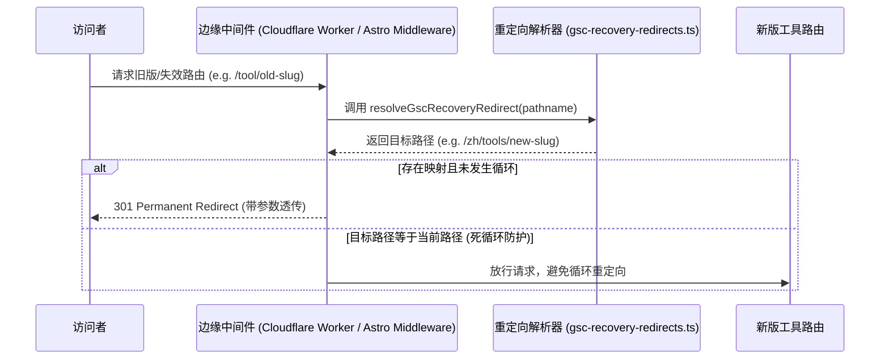

# GSC Recovery Pipeline Design (GEO-03)

本文档描述了 U2Tool 用于收复 Google Search Console (GSC) 排除的（如 404 或已改变路径的旧工具页面）URL 流量的自动化重定向与管道设计。

## 1. 背景与目标

由于工具结构调整或路由优化，部分已被 GSC 索引或在外部有外链的旧 URL 返回 404 或被标记为 Excluded。这导致了流量流失与 SEO 权重受损。本设计的目的是：
- **流量收复**：使用边缘 301 重定向，将旧路由高保真映射到新路由，保留查询参数并合并权重。
- **循环防护**：防止重定向配置错误引起的无限重定向循环（Edge redirect loops）。
- **本地沙盒测试**：通过完全的本地 Mock 数据和单元测试，验证中间件逻辑。

## 2. 系统架构



## 3. 重定向解析器设计 (`src/lib/gsc-recovery-redirects.ts`)

为了确保逻辑高内聚、易测试，重定向解析逻辑被抽取到独立模块中：

- **重定向映射字典**：在本地存储高频需要收复的路由映射。例如：
  - `/typing-test` -> `/tools/typing-speed-test`
  - `/wpm-calculator` -> `/tools/typing-speed-test`
  - `/calculator/calorie` -> `/tools/calorie-calculator`
  - `/calculator/mortgage` -> `/tools/mortgage-calculator`
- **解析函数**：
  ```typescript
  export function resolveGscRecoveryRedirect(pathname: string): string | null;
  ```
  该函数输入当前未包含 Locale 前缀的相对路径（或绝对路径），并在匹配到旧路由时，返回重定向目标路径。返回的重定向目标由中间件自动附加适当的 Locale 前缀。

## 4. 中间件集成与防爆盾 (Loopback Protection)

在 `src/middleware.ts` 中，我们做以下增强：
1. **优先拦截**：在 canonical redirect 等其他复杂重定向之前，首先执行 GSC 恢复重定向逻辑。
2. **Locale 感知**：透传访问者的 Locale 信息，自动将 `/typing-test` 重定向至 `/{locale}/tools/typing-speed-test`。
3. **防爆盾检测**：
   - 检查重定向目标路径是否与当前请求 the pathname 一致（忽略前导斜杠和 locale 前缀）。
   - 如果发生环路（目标等于当前），直接放行请求，不进行重定向。

## 5. 沙盒测试验证

我们在 `src/middleware.test.ts` 中编写完整的 Vitest 测试来确保：
- 正确的 301 状态码。
- 请求查询参数（如 `?ref=gsc`）在重定向时完美保留和透传。
- 德语 `/de/...`、日语 `/ja/...` 等多语言前缀下的重定向行为完全正确。
- 无限重定向循环防护生效（例如人为构造一个闭环时，能够被安全放行）。
